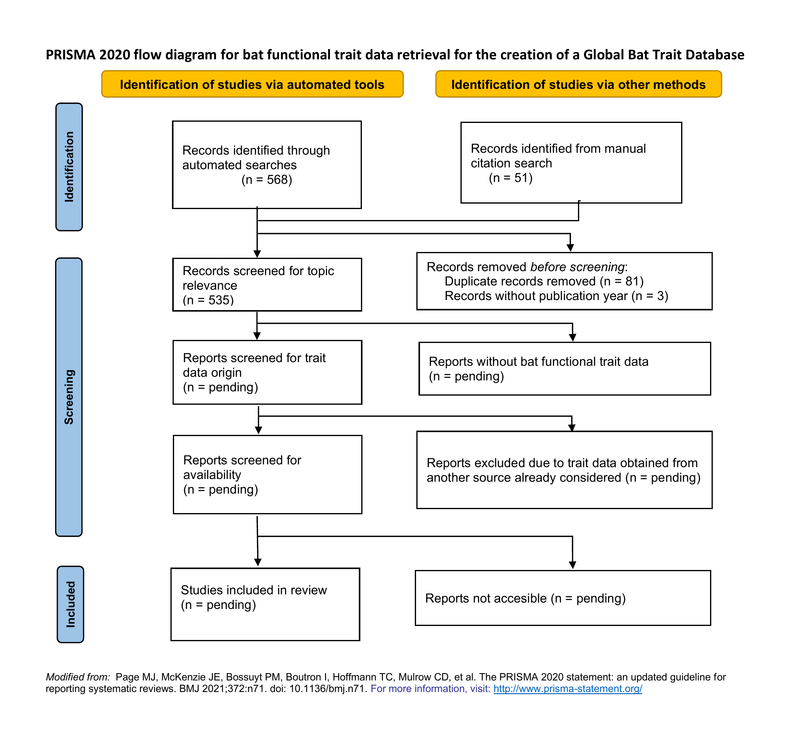
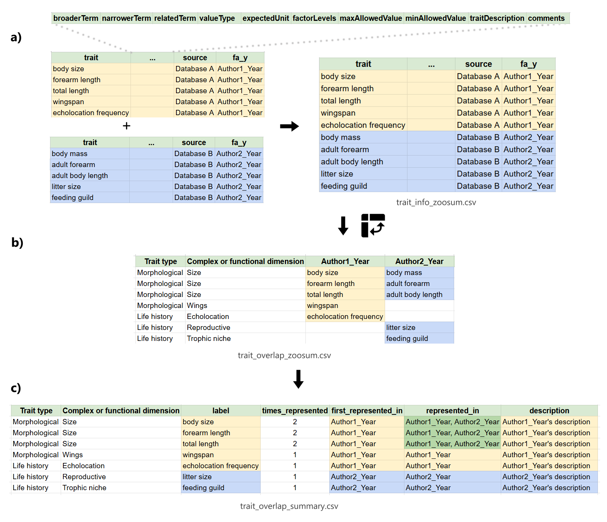

- [Configuration](#configuration)
- [Introduction](#introduction)
- [Methodology](#methodology)
  - [Literature review](#literature-review)
  - [Functional trait selection
    process](#functional-trait-selection-process)
- [Preliminary results](#preliminary-results)
  - [Literature review](#literature-review-1)
  - [Functional traits selection
    process](#functional-traits-selection-process)
- [Points to discuss](#points-to-discuss)
- [References](#references)
- [File organization](#file-organization)
  - [Data](#data)
  - [Metadata](#metadata)
  - [Output](#output)
  - [Scripts](#scripts)
  - [References](#references-1)

# Configuration

# Introduction

Functional traits (FT) – well-defined, measurable, morphophysiological
and ecological characteristics that influence the fitness of individuals
– have been used to model numerous ecological processes, as well as
responses to environmental changes in diverse organisms and biological
communities (Funk et al., 2017; Zakharova et al., 2019; Etard et al.,
2020; Dawson et al., 2021). Thanks to their utility, their use has been
extended to numerous taxonomic groups, unfortunately, the available
information about species’ functional traits is incomplete (Rauenkerian
shortfall; Hortal et al. 2015). Mainly, there are geographical biases
(e.g. towards easily accessible areas) and taxonomic biases
(e.g. towards abundant, easy-to-catch, or charismatic species)
(Verde-Arregoitia, 2016; Troudet et al., 2017; dos Santos et al., 2020;
Etard et al., 2020; García-Roselló et al., 2023). The lack of available
information and existing biases limit the interpretation of results
about the importance of FTs in a region or taxon studied, as well as the
extrapolation and generalization to other regions or species not
considered, therefore, the quantity and quality of the information must
be evaluated (Zakharova et al., 2019; Etard et al., 2020). As in other
organisms, a FT approach has recently been promoted for the study of
bats and their responses to changes in their environment
(Castillo-Figueroa & Pérez-Torres, 2021). However, despite their
importance, to date there is no robust assessment of the completeness
and geographic and taxonomic representativeness of functional traits for
the order Chiroptera at a global level. Therefore, we ask the following
question: Which are the most important gaps and biases in knowledge of
the functional traits of the order Chiroptera at a global level? Given
the available evidence on the gaps and biases found in trait assessments
for several taxa, as well as in previous assessments made for specific
dimensions of bat functional traits, we hypothesize that taxonomic and
geographic biases will be found in the study of the bat functional
traits towards taxa which are more easily captured and widely
distributed, as well as towards the most accessible and studied areas.

The specific objectives of this chapter are: 1) to identify the gaps and
biases in the knowledge of the functional traits of the order Chiroptera
at a global level, and 2) to create a global bat functional trait
database.

   

# Methodology

## Literature review

A literature search of the Web of Science and Scopus databases, and also
the Google Scholar search engine, was conducted on December 1st, 2024,
with Harzing’s Publish or Perish software using the following keywords:
“bat review” OR “bat dataset” OR “bat global assessment” OR “bat traits”
OR “bat functional traits” OR “bat meta-analysis” OR “bat data paper”.
The inclusion criteria for entries considered was:

1.  Multi-taxa or specific studies that included information on bat
    functional traits

2.  Secondary studies (e.g. databases and review articles). No
    publications from grey literature were considered..

3.  Studies with data taken from biological collections and long-term
    studies,.

4.  Studies published in the english or spanish languages.

5.  Studies published in a scientific journal with an assigned impact
    factor.

 

The next series of steps were implemented in order to clean the citation
data for the first phase of literature review (Figure 1):

1.  The three files obtained in the first literature search (found in
    data/raw/literature_review/ as scholar.csv, scopus.csv, and wos.csv)
    were combined in the R environment (n left = 538).
2.  Duplicate entries were removed (n left = 514).
3.  Entries without any Source, Year, or Publisher information were
    removed (n left = 325).
4.  Entries not related to bats (e.g. brown adipose tissue) were removed
    (n left = 163).
    - Keywords removed from the Source field: *Conference, Forum,
      Universe, Astrophysical, Astronomy, X-ray, X-Ray, bioRxiv,
      BioRxiv, arXiv, Medical, Authorea, Electronics, Industrial,
      Addiction, Law, Children, Patent, Fuel, Epiphany, Legal,
      Available, Congress, magnetic, EURASIP, Technology, IEEE,
      Neurocomputing, EPA, Engineering, Theological, Poet, Future, Drug,
      Energies, policy, Experientia, Nutrients, Intelligence, Physician,
      Network, Reform, Expert, Administration, Briefings, Pentagon,
      Computational, Entropy.*
    - Keywords removed from the Title field: *adipose, fat, poetry,
      GABA, Basophil, galaxies, gamma-ray, Combustion, UAV, Dances,
      cigarette, Cigarette, industrial, Brownian, President, magnetic,
      director, Children, carbon, CO2, Smoking, Court, package, cloning,
      Twitter, X-ray, Judges, archaeal, engagement, amnesic, adiposity,
      economic, benzene, policy, Internet, Education, stance, WAN,
      Diffusion, PasswordsVirtual, TECHNOLOGIES, eyetracking,
      Eye-Tracking, CCS, cluster*.
    - Keywords removed from the Publisher field: *donepetro, ebooks*.
5.  Entries in a language other than english or spanish were removed (n
    left = 161).

A second phase of literature review was conducted from the 2nd of
December to December 15, 2024, undefinedby searching the Web of Science
database using the following string search: (bat OR bats OR chiroptera)
AND (review OR traits OR functional traits OR meta-analysis) NOT
(vaccines OR biomaterial OR bio-medical OR brown adipose tissue OR
therapeutics OR biosynthesis). The entries were reviewed up until page
number 30. The databases included in the supplementary tables available
in Cosentino et al., (2023) and Froidevaux et al., (2023) were also
included at this point in the Bats_Data

1.  259 entries were obtained
2.  Duplicate entries were removed (n left = 233).
3.  This dataset (second_phase) was combined with the previous dataset
    (first_phase) and duplicates were removed (n left = 379).
4.  Entries were screened manually to discard any irrelevant publication
    (i.e. not related to bats) that was left behind by previous steps.
    (n left = 223).
    - *includes_bats_in_title*: Does the publication have the “bat” or
      any variation of the word in the title?
    - *includes_traits_in_title*: Does the publication have the “trait”
      or any variation of the word in the title?
    - *to_keep*: The publication is kept if it is a database, review, or
      a study which takes its data from biological collections or long
      term studies?
5.  Each entry was manually screened in order to retain only entries
    with information on bat functional traits. (n left = 171).
    - *includes_trait_info*: Does the publication include bat functional
      trait data?
6.  Each entry whose data comes from any other study considered in this
    literature search was discarded (n left = 158).
    - *fully_included_in_another_source*: Is the trait data fully
      obtained from any other study already included in the literature
      review?

Figure 1. PRISMA 2020 flow diagram for bat functional trait data
retrieval for the creation of a Global Bat Trait Database

   

## Functional trait selection process

A total of 12 studies were screened for the selection of the functional
traits to be evaluated (Table 1). The proposal for a trait-based
approach for the study of bats (Castillo-Figueroa & Pérez-Torres 2021)
was used as a baseline to define the trait types, complex or functional
dimensions, and traits to be evaluated. Full citation data is contained
in the bib/trait_categories folder as .bib, .csv and .docx files.
Studies were included if they were:

- A multi-taxa global compilation of functional trait data which
  includes bats.
- A bat-specific global compilation of functional trait data.
- A dimension-specific global compilation of bat functional trait data.

In addition to wing morphology traits, echolocation traits are also
highly relevant for the study of bat ecology and conservation (Zamora et
al., 2016; Zamora et al., 2020). However, the databases specialized for
bat echolocation calls (e.g. ChiroVox; Görföl et al., 2022) usually
contain the .wav files instead of the extracted parameters reported in
other databases (e.g. frequency of the call, interpulse duration, pulse
duration, among others). For this reason, such databases are not
included in the studies screened for the trait selection process.

The trait description information (e.g. trait name, type of variable,
description) was obtained from each study when available. Names and
definitions for the trait descriptors were obtained from the Ecological
Trait-data Standard (Schneider et al., 2019). For a detailed glossary of
terms view metadata/trait_categories/trait_categories_glossary.xlsx.

 

<table class="table" style="font-size: 16px; color: black; font-family: Calibri; width: auto !important; margin-left: auto; margin-right: auto;">
<caption style="font-size: initial !important;">
Table 1. Studies used for the selection of bat functional traits
</caption>
<thead>
<tr>
<th style="text-align:left;position: sticky; top:0; background-color: #FFFFFF;">
Citation
</th>
<th style="text-align:left;position: sticky; top:0; background-color: #FFFFFF;">
Title
</th>
<th style="text-align:left;position: sticky; top:0; background-color: #FFFFFF;">
Published in
</th>
</tr>
</thead>
<tbody>
<tr>
<td style="text-align:left;">
Castillo-Figueroa & Pérez-Torres, 2021
</td>
<td style="text-align:left;">
On the development of a trait-based approach for studying Neotropical
bats
</td>
<td style="text-align:left;">
Papéis Avulsos de Zoologia
</td>
</tr>
<tr>
<td style="text-align:left;">
Gonçalves-Souza et al., 2024
</td>
<td style="text-align:left;">
ZooTraits: An R shiny app for exploring animal trait data for ecological
and evolutionary research
</td>
<td style="text-align:left;">
Ecology and Evolution
</td>
</tr>
<tr>
<td style="text-align:left;">
Soria et al., 2021
</td>
<td style="text-align:left;">
COMBINE: a coalesced mammal database of intrinsic and extrinsic traits
</td>
<td style="text-align:left;">
Ecology
</td>
</tr>
<tr>
<td style="text-align:left;">
Cosentino et al., 2023
</td>
<td style="text-align:left;">
A dataset on African bats’ functional traits
</td>
<td style="text-align:left;">
Scientific Data
</td>
</tr>
<tr>
<td style="text-align:left;">
Froidevaux et al., 2023
</td>
<td style="text-align:left;">
A species-level trait dataset of bats in Europe and beyond
</td>
<td style="text-align:left;">
Scientific Data
</td>
</tr>
<tr>
<td style="text-align:left;">
Crane et al., 2021
</td>
<td style="text-align:left;">
Limitations and gaps in global bat wing morphology trait data
</td>
<td style="text-align:left;">
Mammal Review
</td>
</tr>
<tr>
<td style="text-align:left;">
Myhrvold et al., 2015
</td>
<td style="text-align:left;">
An amniote life‐history database to perform comparative analyses with
birds, mammals, and reptiles: Ecological Archives E096‐269
</td>
<td style="text-align:left;">
Ecology
</td>
</tr>
<tr>
<td style="text-align:left;">
Gonçalves et al., 2018
</td>
<td style="text-align:left;">
ATLANTIC MAMMAL TRAITS: a data set of morphological traits of mammals in
the Atlantic Forest of South America
</td>
<td style="text-align:left;">
Ecology
</td>
</tr>
<tr>
<td style="text-align:left;">
Tanalgo et al., 2022
</td>
<td style="text-align:left;">
DarkCideS 1.0, a global database for bats in karsts and caves
</td>
<td style="text-align:left;">
Scientific Data
</td>
</tr>
<tr>
<td style="text-align:left;">
Wilkinson & South, 2002
</td>
<td style="text-align:left;">
Life history, ecology and longevity in bats
</td>
<td style="text-align:left;">
Aging Cell
</td>
</tr>
<tr>
<td style="text-align:left;">
Herberstein et al., 2022
</td>
<td style="text-align:left;">
AnimalTraits - a curated animal trait database for body mass, metabolic
rate and brain size
</td>
<td style="text-align:left;">
Scientific Data
</td>
</tr>
<tr>
<td style="text-align:left;">
Geiselman & Ember, 2024
</td>
<td style="text-align:left;">
Bat Eco-Interactions — batbase.org
</td>
<td style="text-align:left;">
batbase.org
</td>
</tr>
</tbody>
</table>

   

Once the trait descriptors from each study were obtained, the data
sheets were combined by stacking the data on top of each other using the
column names specified previously (Figure 2a). A new data sheet was
generated where each row is a different functional trait and each column
is a study (Figure 2b). If any given functional trait is included in two
or more studies, they occupy the same row in a different column, each
with the name assigned by the study indicated in the column header
(Figure 2b). If any given trait is present in a study (Database A), but
absent in another (Database B), the respective row in the Database B was
left empty. Following this methodology, any additional functional trait
reported in a study included afterwards will generate a new row without
affecting the studies already included. The number of times in which any
given trait was represented in all the studies was counted, and the
descriptors of each trait were obtained from the first publication in
which it was identified (Figure 2c).

Figure 2. Workflow for the screening and selection of bat functional
traits to be evaluated. The first two columns in b) and c) correspond to
trait type and the trait complex or functional dimension following
Castillo-Figueroa & Pérez-Torres (2021).

   

# Preliminary results

## Literature review

After the removal of duplicated and non-relevant entries, a total of 158
studies were obtained from the literature search.Of the total of studies
obtained, 27 were databases or data papers, 105 were review articles,
and 26 were studies which obtained their data from long-term sampling
efforts or biological collections

<table class="table" style="font-size: 16px; color: black; font-family: Calibri; width: auto !important; margin-left: auto; margin-right: auto;">
<caption style="font-size: initial !important;">
Table 2. List of studies obtained from the literature review carried out
for the extraction of bat functional trait data.
</caption>
<thead>
<tr>
<th style="text-align:left;position: sticky; top:0; background-color: #FFFFFF;position: sticky; top:0; background-color: #FFFFFF;">
Title
</th>
<th style="text-align:right;position: sticky; top:0; background-color: #FFFFFF;position: sticky; top:0; background-color: #FFFFFF;">
Year
</th>
<th style="text-align:left;position: sticky; top:0; background-color: #FFFFFF;position: sticky; top:0; background-color: #FFFFFF;">
Study
</th>
<th style="text-align:left;position: sticky; top:0; background-color: #FFFFFF;position: sticky; top:0; background-color: #FFFFFF;">
DOI
</th>
<th style="text-align:left;position: sticky; top:0; background-color: #FFFFFF;position: sticky; top:0; background-color: #FFFFFF;">
Trait data directly available
</th>
</tr>
</thead>
<tbody>
<tr>
<td style="text-align:left;">
A dataset on African bats’ functional traits
</td>
<td style="text-align:right;">
2023
</td>
<td style="text-align:left;">
Scientific Data
</td>
<td style="text-align:left;">
10.1038/s41597-023-02472-w
</td>
<td style="text-align:left;">
yes
</td>
</tr>
<tr>
<td style="text-align:left;">
Trait-dependent tolerance of bats to urbanization: a global
meta-analysis
</td>
<td style="text-align:right;">
2018
</td>
<td style="text-align:left;">
Proceedings of the Royal Society …
</td>
<td style="text-align:left;">
10.1098/rspb.2018.1222
</td>
<td style="text-align:left;">
yes
</td>
</tr>
<tr>
<td style="text-align:left;">
Urban affinity and its associated traits: A global analysis of bats
</td>
<td style="text-align:right;">
2022
</td>
<td style="text-align:left;">
Global Change …
</td>
<td style="text-align:left;">
10.1111/gcb.16320
</td>
<td style="text-align:left;">
yes
</td>
</tr>
<tr>
<td style="text-align:left;">
Global patterns of functional trait variation along aridity gradients in
bats
</td>
<td style="text-align:right;">
2021
</td>
<td style="text-align:left;">
Global Ecology and …
</td>
<td style="text-align:left;">
10.1111/geb.13278
</td>
<td style="text-align:left;">
yes
</td>
</tr>
<tr>
<td style="text-align:left;">
Why bats matters: A critical assessment of bat-mediated ecological
processes in the Neotropics
</td>
<td style="text-align:right;">
2020
</td>
<td style="text-align:left;">
european Journal of ecology
</td>
<td style="text-align:left;">
10.17161/eurojecol.v6i1.13824
</td>
<td style="text-align:left;">
no
</td>
</tr>
<tr>
<td style="text-align:left;">
African bat database: curated data of occurrences, distributions and
conservation metrics for sub-Saharan bats
</td>
<td style="text-align:right;">
2024
</td>
<td style="text-align:left;">
Scientific Data
</td>
<td style="text-align:left;">
10.1038/s41597-024-04170-7
</td>
<td style="text-align:left;">
yes
</td>
</tr>
<tr>
<td style="text-align:left;">
A meta-analysis exploring associations between habitat degradation and
Neotropical bat virus prevalence and seroprevalence
</td>
<td style="text-align:right;">
2023
</td>
<td style="text-align:left;">
Ecography
</td>
<td style="text-align:left;">
10.1111/ecog.07041
</td>
<td style="text-align:left;">
yes
</td>
</tr>
<tr>
<td style="text-align:left;">
Drivers of bat roles in Neotropical seed dispersal networks: abundance
is more important than functional traits
</td>
<td style="text-align:right;">
2020
</td>
<td style="text-align:left;">
Oecologia
</td>
<td style="text-align:left;">
10.1007/s00442-020-04662-4
</td>
<td style="text-align:left;">
yes
</td>
</tr>
<tr>
<td style="text-align:left;">
A global synthesis of survival estimates for microbats
</td>
<td style="text-align:right;">
2015
</td>
<td style="text-align:left;">
Biology …
</td>
<td style="text-align:left;">
10.1098/rsbl.2015.0371
</td>
<td style="text-align:left;">
yes
</td>
</tr>
<tr>
<td style="text-align:left;">
Does seed ingestion by bats enhance germination? A new meta-analysis 15
years later
</td>
<td style="text-align:right;">
2019
</td>
<td style="text-align:left;">
Mammal …
</td>
<td style="text-align:left;">
10.1111/mam.12153
</td>
<td style="text-align:left;">
yes
</td>
</tr>
<tr>
<td style="text-align:left;">
Cerrado bat community assembly is determined by both present day and
historical factors
</td>
<td style="text-align:right;">
2024
</td>
<td style="text-align:left;">
Journal of Biogeography
</td>
<td style="text-align:left;">
10.1111/jbi.14798
</td>
<td style="text-align:left;">
yes
</td>
</tr>
<tr>
<td style="text-align:left;">
Six reference-quality genomes reveal evolution of bat adaptations
</td>
<td style="text-align:right;">
2020
</td>
<td style="text-align:left;">
Nature
</td>
<td style="text-align:left;">
10.1038/s41586-020-2486-3
</td>
<td style="text-align:left;">
yes
</td>
</tr>
<tr>
<td style="text-align:left;">
Drivers of European bat population change: a review reveals evidence
gaps
</td>
<td style="text-align:right;">
2021
</td>
<td style="text-align:left;">
Mammal …
</td>
<td style="text-align:left;">
10.1111/mam.12239
</td>
<td style="text-align:left;">
yes
</td>
</tr>
<tr>
<td style="text-align:left;">
Design and applicability of DNA arrays and DNA barcodes in biodiversity
monitoring
</td>
<td style="text-align:right;">
2007
</td>
<td style="text-align:left;">
BMC biology
</td>
<td style="text-align:left;">
10.1186/1741-7007-5-24
</td>
<td style="text-align:left;">
yes
</td>
</tr>
<tr>
<td style="text-align:left;">
The influence of bat ecology on viral diversity and reservoir status
</td>
<td style="text-align:right;">
2020
</td>
<td style="text-align:left;">
Ecology and Evolution
</td>
<td style="text-align:left;">
10.1002/ece3.6315
</td>
<td style="text-align:left;">
yes
</td>
</tr>
<tr>
<td style="text-align:left;">
The role of forest structure and composition in driving the distribution
of bats in Mediterranean regions
</td>
<td style="text-align:right;">
2022
</td>
<td style="text-align:left;">
Scientific Reports
</td>
<td style="text-align:left;">
10.1038/s41598-022-07229-w
</td>
<td style="text-align:left;">
yes
</td>
</tr>
<tr>
<td style="text-align:left;">
Vulnerability of bat-plant pollination interactions due to environmental
change
</td>
<td style="text-align:right;">
2021
</td>
<td style="text-align:left;">
Global Change …
</td>
<td style="text-align:left;">
10.1111/gcb.15611
</td>
<td style="text-align:left;">
yes
</td>
</tr>
<tr>
<td style="text-align:left;">
Do gastrointestinal microbiomes play a role in bats’ unique viral
hosting capacity?
</td>
<td style="text-align:right;">
2022
</td>
<td style="text-align:left;">
Trends in …
</td>
<td style="text-align:left;">
10.1016/j.tim.2021.12.009
</td>
<td style="text-align:left;">
no
</td>
</tr>
<tr>
<td style="text-align:left;">
Evolutionary history and precipitation seasonality shape niche overlap
in Neotropical bat-plant pollination networks
</td>
<td style="text-align:right;">
2023
</td>
<td style="text-align:left;">
Biotropica
</td>
<td style="text-align:left;">
10.1111/btp.13181
</td>
<td style="text-align:left;">
yes
</td>
</tr>
<tr>
<td style="text-align:left;">
An integrative approach to understanding diversity patterns and
assemblage rules in Neotropical bats
</td>
<td style="text-align:right;">
2023
</td>
<td style="text-align:left;">
Scientific Reports
</td>
<td style="text-align:left;">
10.1038/s41598-023-35100-z
</td>
<td style="text-align:left;">
yes
</td>
</tr>
<tr>
<td style="text-align:left;">
Sensory adaptations reshaped intrinsic factors underlying morphological
diversification in bats
</td>
<td style="text-align:right;">
2021
</td>
<td style="text-align:left;">
BMC biology
</td>
<td style="text-align:left;">
10.1186/s12915-021-01022-3
</td>
<td style="text-align:left;">
yes
</td>
</tr>
<tr>
<td style="text-align:left;">
Annual precipitation predicts the phylogenetic signal in bat-fruit
interaction networks across the Neotropics
</td>
<td style="text-align:right;">
2021
</td>
<td style="text-align:left;">
Biology …
</td>
<td style="text-align:left;">
10.1098/rsbl.2021.0478
</td>
<td style="text-align:left;">
yes
</td>
</tr>
<tr>
<td style="text-align:left;">
Atmospheric humidity affects global variation of bat echolocation via
indirect effects
</td>
<td style="text-align:right;">
2022
</td>
<td style="text-align:left;">
Frontiers in Ecology …
</td>
<td style="text-align:left;">
10.3389/fevo.2022.934876
</td>
<td style="text-align:left;">
yes
</td>
</tr>
<tr>
<td style="text-align:left;">
Scale‐dependent influences of environmental, historical, and spatial
processes on taxonomic and functional beta diversity of Japanese bat
assemblages
</td>
<td style="text-align:right;">
2024
</td>
<td style="text-align:left;">
Ecology and Evolution
</td>
<td style="text-align:left;">
10.1002/ece3.11277
</td>
<td style="text-align:left;">
yes
</td>
</tr>
<tr>
<td style="text-align:left;">
Global shifts in mammalian population trends reveal key predictors of
virus spillover risk
</td>
<td style="text-align:right;">
2020
</td>
<td style="text-align:left;">
… of the Royal …
</td>
<td style="text-align:left;">
10.1098/rspb.2019.2736
</td>
<td style="text-align:left;">
yes
</td>
</tr>
<tr>
<td style="text-align:left;">
Reducing conflict between the common vampire bat Desmodus rotundus and
cattle ranching in Neotropical landscapes
</td>
<td style="text-align:right;">
2023
</td>
<td style="text-align:left;">
Mammal …
</td>
<td style="text-align:left;">
10.1111/mam.12313
</td>
<td style="text-align:left;">
yes
</td>
</tr>
<tr>
<td style="text-align:left;">
An overview of bats microbiota and its implication in transmissible
diseases
</td>
<td style="text-align:right;">
2022
</td>
<td style="text-align:left;">
Frontiers in …
</td>
<td style="text-align:left;">
10.3389/fmicb.2022.1012189
</td>
<td style="text-align:left;">
no
</td>
</tr>
<tr>
<td style="text-align:left;">
Geographical analysis for detecting high-risk areas for bovine/human
rabies transmitted by the common hematophagous bat in the Amazon region,
Brazil
</td>
<td style="text-align:right;">
2016
</td>
<td style="text-align:left;">
PLoS …
</td>
<td style="text-align:left;">
10.1371/journal.pone.0157332
</td>
<td style="text-align:left;">
no
</td>
</tr>
<tr>
<td style="text-align:left;">
DarkCideS 1.0, a global database for bats in karsts and caves
</td>
<td style="text-align:right;">
2022
</td>
<td style="text-align:left;">
Scientific Data
</td>
<td style="text-align:left;">
10.1038/s41597-022-01234-4
</td>
<td style="text-align:left;">
yes
</td>
</tr>
<tr>
<td style="text-align:left;">
A species-level trait dataset of bats in Europe and beyond
</td>
<td style="text-align:right;">
2023
</td>
<td style="text-align:left;">
Scientific Data
</td>
<td style="text-align:left;">
10.1038/s41597-023-02157-4
</td>
<td style="text-align:left;">
yes
</td>
</tr>
<tr>
<td style="text-align:left;">
A database of common vampire bat reports
</td>
<td style="text-align:right;">
2022
</td>
<td style="text-align:left;">
Scientific Data
</td>
<td style="text-align:left;">
10.1038/s41597-022-01140-9
</td>
<td style="text-align:left;">
yes
</td>
</tr>
<tr>
<td style="text-align:left;">
DBatVir: the database of bat-associated viruses
</td>
<td style="text-align:right;">
2014
</td>
<td style="text-align:left;">
Database
</td>
<td style="text-align:left;">
10.1093/database/bau021
</td>
<td style="text-align:left;">
yes
</td>
</tr>
<tr>
<td style="text-align:left;">
The Sonozotz project: Assembling an echolocation call library for bats
in a megadiverse country
</td>
<td style="text-align:right;">
2020
</td>
<td style="text-align:left;">
Ecology and Evolution
</td>
<td style="text-align:left;">
10.1002/ece3.6245
</td>
<td style="text-align:left;">
no
</td>
</tr>
<tr>
<td style="text-align:left;">
A Standardized Review of Bat Names Across Multiple Taxonomic Authorities
</td>
<td style="text-align:right;">
2024
</td>
<td style="text-align:left;">
Arizona State University
</td>
<td style="text-align:left;">
10.5281/zenodo.7915721
</td>
<td style="text-align:left;">
yes
</td>
</tr>
<tr>
<td style="text-align:left;">
BatFly: A database of Neotropical bat-fly interactions
</td>
<td style="text-align:right;">
2024
</td>
<td style="text-align:left;">
Ecology
</td>
<td style="text-align:left;">
10.1002/ecy.4249
</td>
<td style="text-align:left;">
yes
</td>
</tr>
<tr>
<td style="text-align:left;">
ChiroVox: a public library of bat calls
</td>
<td style="text-align:right;">
2022
</td>
<td style="text-align:left;">
PeerJ
</td>
<td style="text-align:left;">
10.7717/peerj.12445
</td>
<td style="text-align:left;">
yes
</td>
</tr>
<tr>
<td style="text-align:left;">
Bat Biology, Genomes, and the Bat1K Project: To Generate
Chromosome-Level Genomes for All Living Bat Species
</td>
<td style="text-align:right;">
2018
</td>
<td style="text-align:left;">
Annual Review of Animal Biosciences
</td>
<td style="text-align:left;">
10.1146/annurev-animal-022516-022811
</td>
<td style="text-align:left;">
yes
</td>
</tr>
<tr>
<td style="text-align:left;">
Updated distribution maps for neotropical bats in the superfamily
Noctilionoidea
</td>
<td style="text-align:right;">
2018
</td>
<td style="text-align:left;">
Ecology
</td>
<td style="text-align:left;">
10.1002/ecy.2404
</td>
<td style="text-align:left;">
yes
</td>
</tr>
<tr>
<td style="text-align:left;">
NeoBat Interactions: A data set of bat-plant interactions in the
Neotropics
</td>
<td style="text-align:right;">
2022
</td>
<td style="text-align:left;">
Ecology
</td>
<td style="text-align:left;">
10.1002/ecy.3640
</td>
<td style="text-align:left;">
yes
</td>
</tr>
<tr>
<td style="text-align:left;">
Climate is changing, are European bats too? A multispecies analysis of
trends in body size
</td>
<td style="text-align:right;">
2024
</td>
<td style="text-align:left;">
Ecology and Evolution
</td>
<td style="text-align:left;">
10.1002/ece3.10872
</td>
<td style="text-align:left;">
yes
</td>
</tr>
<tr>
<td style="text-align:left;">
Bats and their vital ecosystem services: a global review
</td>
<td style="text-align:right;">
2022
</td>
<td style="text-align:left;">
Integrative Zoology
</td>
<td style="text-align:left;">
10.1111/1749-4877.12552
</td>
<td style="text-align:left;">
yes
</td>
</tr>
<tr>
<td style="text-align:left;">
Migration and dispersal patterns of bats and their influence on genetic
structure
</td>
<td style="text-align:right;">
2013
</td>
<td style="text-align:left;">
Mammal Review
</td>
<td style="text-align:left;">
10.1111/j.1365-2907.2012.00218.x
</td>
<td style="text-align:left;">
no
</td>
</tr>
<tr>
<td style="text-align:left;">
Macroecological patterns of mammals across taxonomic, spatial, and
temporal scales
</td>
<td style="text-align:right;">
2019
</td>
<td style="text-align:left;">
Journal of Mammalogy
</td>
<td style="text-align:left;">
10.1093/jmammal/gyy171
</td>
<td style="text-align:left;">
no
</td>
</tr>
<tr>
<td style="text-align:left;">
Limitations and gaps in global bat wing morphology trait data
</td>
<td style="text-align:right;">
2022
</td>
<td style="text-align:left;">
Mammal Review
</td>
<td style="text-align:left;">
10.1111/mam.12270
</td>
<td style="text-align:left;">
yes
</td>
</tr>
<tr>
<td style="text-align:left;">
Global Medicinal Use of Bats: A Systematic Literature and Social Media
Review
</td>
<td style="text-align:right;">
2022
</td>
<td style="text-align:left;">
Diversity
</td>
<td style="text-align:left;">
10.3390/d14030179
</td>
<td style="text-align:left;">
yes
</td>
</tr>
<tr>
<td style="text-align:left;">
Is banning Persistent Organic Pollutants efficient? A quantitative and
qualitative systematic review in bats
</td>
<td style="text-align:right;">
2024
</td>
<td style="text-align:left;">
Perspectives in Ecology and Conservation
</td>
<td style="text-align:left;">
10.1016/j.pecon.2024.07.001
</td>
<td style="text-align:left;">
yes
</td>
</tr>
<tr>
<td style="text-align:left;">
Bat mating systems:A review and recategorisation
</td>
<td style="text-align:right;">
2024
</td>
<td style="text-align:left;">
Ecology and Evolution
</td>
<td style="text-align:left;">
10.1002/ece3.70149
</td>
<td style="text-align:left;">
yes
</td>
</tr>
<tr>
<td style="text-align:left;">
Bats and pollution: Genetic approaches in ecotoxicology
</td>
<td style="text-align:right;">
2022
</td>
<td style="text-align:left;">
Chemosphere
</td>
<td style="text-align:left;">
10.1016/j.chemosphere.2022.135934
</td>
<td style="text-align:left;">
yes
</td>
</tr>
<tr>
<td style="text-align:left;">
The state of the bats in North America
</td>
<td style="text-align:right;">
2024
</td>
<td style="text-align:left;">
Annals of the New York Academy of Sciences
</td>
<td style="text-align:left;">
10.1111/nyas.15225
</td>
<td style="text-align:left;">
no
</td>
</tr>
<tr>
<td style="text-align:left;">
Estado del arte del conocimiento de biodiversidad de los polinizadores
de Mexico
</td>
<td style="text-align:right;">
2022
</td>
<td style="text-align:left;">
Revista Mexicana de Biodiversidad
</td>
<td style="text-align:left;">
10.22201/ib.20078706e.2022.93.3948
</td>
<td style="text-align:left;">
yes
</td>
</tr>
<tr>
<td style="text-align:left;">
Multiple mortality events in bats: a global review
</td>
<td style="text-align:right;">
2016
</td>
<td style="text-align:left;">
Mammal Review
</td>
<td style="text-align:left;">
10.1111/mam.12064
</td>
<td style="text-align:left;">
yes
</td>
</tr>
<tr>
<td style="text-align:left;">
Bats as bushmeat: a global review
</td>
<td style="text-align:right;">
2009
</td>
<td style="text-align:left;">
Oryx
</td>
<td style="text-align:left;">
10.1017/S0030605308000938
</td>
<td style="text-align:left;">
yes
</td>
</tr>
<tr>
<td style="text-align:left;">
Bats as prey of diurnal birds: a global perspective
</td>
<td style="text-align:right;">
2016
</td>
<td style="text-align:left;">
Mammal Review
</td>
<td style="text-align:left;">
10.1111/mam.12060
</td>
<td style="text-align:left;">
yes
</td>
</tr>
<tr>
<td style="text-align:left;">
Interspecific competition in bats: state of knowledge and research
challenges
</td>
<td style="text-align:right;">
2020
</td>
<td style="text-align:left;">
Mammal Review
</td>
<td style="text-align:left;">
10.1111/mam.12180
</td>
<td style="text-align:left;">
yes
</td>
</tr>
<tr>
<td style="text-align:left;">
Effective conservation of subterranean-roosting bats
</td>
<td style="text-align:right;">
2024
</td>
<td style="text-align:left;">
Conservation Biology
</td>
<td style="text-align:left;">
10.1111/cobi.14157
</td>
<td style="text-align:left;">
yes
</td>
</tr>
<tr>
<td style="text-align:left;">
Roads and bats: a meta-analysis and review of the evidence on vehicle
collisions and barrier effects
</td>
<td style="text-align:right;">
2016
</td>
<td style="text-align:left;">
Mammal Review
</td>
<td style="text-align:left;">
10.1111/mam.12072
</td>
<td style="text-align:left;">
yes
</td>
</tr>
<tr>
<td style="text-align:left;">
Cats Felis catus as a threat to bats worldwide: a review of the evidence
</td>
<td style="text-align:right;">
2021
</td>
<td style="text-align:left;">
Mammal Review
</td>
<td style="text-align:left;">
10.1111/mam.12240
</td>
<td style="text-align:left;">
yes
</td>
</tr>
<tr>
<td style="text-align:left;">
We eat meat: a review of carnivory in bats
</td>
<td style="text-align:right;">
2021
</td>
<td style="text-align:left;">
Mammal Review
</td>
<td style="text-align:left;">
10.1111/mam.12254
</td>
<td style="text-align:left;">
yes
</td>
</tr>
<tr>
<td style="text-align:left;">
Trophic structure of frugivorous bats in the Neotropics: emergent
patterns in evolutionary history
</td>
<td style="text-align:right;">
2018
</td>
<td style="text-align:left;">
Mammal Review
</td>
<td style="text-align:left;">
10.1111/mam.12116
</td>
<td style="text-align:left;">
yes
</td>
</tr>
<tr>
<td style="text-align:left;">
Redefining the study of sexual dimorphism in bats: following the odour
trail
</td>
<td style="text-align:right;">
2021
</td>
<td style="text-align:left;">
Mammal Review
</td>
<td style="text-align:left;">
10.1111/mam.12232
</td>
<td style="text-align:left;">
yes
</td>
</tr>
<tr>
<td style="text-align:left;">
Does body mass restrict call peak frequency in echolocating bats?
</td>
<td style="text-align:right;">
2020
</td>
<td style="text-align:left;">
Mammal Review
</td>
<td style="text-align:left;">
10.1111/mam.12196
</td>
<td style="text-align:left;">
yes
</td>
</tr>
<tr>
<td style="text-align:left;">
Chromatic disorders in bats: a review of pigmentation anomalies and the
misuse of terms to describe them
</td>
<td style="text-align:right;">
2017
</td>
<td style="text-align:left;">
Mammal Review
</td>
<td style="text-align:left;">
10.1111/mam.12083
</td>
<td style="text-align:left;">
yes
</td>
</tr>
<tr>
<td style="text-align:left;">
The threat of invasive species to bats: a review
</td>
<td style="text-align:right;">
2017
</td>
<td style="text-align:left;">
Mammal Review
</td>
<td style="text-align:left;">
10.1111/mam.12099
</td>
<td style="text-align:left;">
yes
</td>
</tr>
<tr>
<td style="text-align:left;">
Bats and aquatic habitats: a review of habitat use and anthropogenic
impacts
</td>
<td style="text-align:right;">
2016
</td>
<td style="text-align:left;">
Mammal Review
</td>
<td style="text-align:left;">
10.1111/mam.12059
</td>
<td style="text-align:left;">
yes
</td>
</tr>
<tr>
<td style="text-align:left;">
Identifying unusual mortality events in bats: a baseline for bat
hibernation monitoring and white-nose syndrome research
</td>
<td style="text-align:right;">
2018
</td>
<td style="text-align:left;">
Mammal Review
</td>
<td style="text-align:left;">
10.1111/mam.12122
</td>
<td style="text-align:left;">
yes
</td>
</tr>
<tr>
<td style="text-align:left;">
Roost site selection by tree-dwelling bats across biogeographical
regions: an updated meta-analysis with meta-regression
</td>
<td style="text-align:right;">
2015
</td>
<td style="text-align:left;">
Mammal Review
</td>
<td style="text-align:left;">
10.1111/mam.12044
</td>
<td style="text-align:left;">
yes
</td>
</tr>
<tr>
<td style="text-align:left;">
In the shadow of the rising sun: a systematic review of Japanese bat
research and conservation
</td>
<td style="text-align:right;">
2021
</td>
<td style="text-align:left;">
Mammal Review
</td>
<td style="text-align:left;">
10.1111/mam.12226
</td>
<td style="text-align:left;">
yes
</td>
</tr>
<tr>
<td style="text-align:left;">
Bats and bat-borne diseases: a perspective on Australian megabats
</td>
<td style="text-align:right;">
2013
</td>
<td style="text-align:left;">
Australian Journal of Zoology
</td>
<td style="text-align:left;">
10.1071/ZO12126
</td>
<td style="text-align:left;">
no
</td>
</tr>
<tr>
<td style="text-align:left;">
Systematic Review of the Roost-Site Characteristics of North American
Forest Bats: Implications for Conservation
</td>
<td style="text-align:right;">
2020
</td>
<td style="text-align:left;">
Diversity
</td>
<td style="text-align:left;">
10.3390/d12020076
</td>
<td style="text-align:left;">
yes
</td>
</tr>
<tr>
<td style="text-align:left;">
Bat echolocation in continental China: a systematic review and first
acoustic identification key for the country
</td>
<td style="text-align:right;">
2021
</td>
<td style="text-align:left;">
Mammal Research
</td>
<td style="text-align:left;">
10.1007/s13364-021-00570-x
</td>
<td style="text-align:left;">
no
</td>
</tr>
<tr>
<td style="text-align:left;">
The calls of Vietnamese bats: a major step toward the acoustic
characterization of Asian bats
</td>
<td style="text-align:right;">
2024
</td>
<td style="text-align:left;">
Scientific Reports
</td>
<td style="text-align:left;">
10.1038/s41598-024-72436-6
</td>
<td style="text-align:left;">
yes
</td>
</tr>
<tr>
<td style="text-align:left;">
Economic value of bat predation services: A review and new estimates
from macadamia orchards
</td>
<td style="text-align:right;">
2018
</td>
<td style="text-align:left;">
Ecosystem Services
</td>
<td style="text-align:left;">
10.1016/j.ecoser.2017.11.015
</td>
<td style="text-align:left;">
yes
</td>
</tr>
<tr>
<td style="text-align:left;">
Effects of climate change on life-history traits in hibernating mammals
</td>
<td style="text-align:right;">
2023
</td>
<td style="text-align:left;">
Mammal Review
</td>
<td style="text-align:left;">
10.1111/mam.12308
</td>
<td style="text-align:left;">
no
</td>
</tr>
<tr>
<td style="text-align:left;">
A review of the breeding biology of Chiroptera
</td>
<td style="text-align:right;">
2021
</td>
<td style="text-align:left;">
Mammal Review
</td>
<td style="text-align:left;">
10.1111/mam.12236
</td>
<td style="text-align:left;">
yes
</td>
</tr>
<tr>
<td style="text-align:left;">
Heterothermy, body size, and locomotion as ecological predictors of
migration in mammals
</td>
<td style="text-align:right;">
2022
</td>
<td style="text-align:left;">
Mammal Review
</td>
<td style="text-align:left;">
10.1111/mam.12263
</td>
<td style="text-align:left;">
yes
</td>
</tr>
<tr>
<td style="text-align:left;">
Thinking outside the box: A review of artificial roosts for bats
</td>
<td style="text-align:right;">
2014
</td>
<td style="text-align:left;">
Wildlife Society Bulletin - Record Set Up In Error
</td>
<td style="text-align:left;">
10.1002/wsb.461
</td>
<td style="text-align:left;">
no
</td>
</tr>
<tr>
<td style="text-align:left;">
Activity following arousal in winter in North American vespertilionid
bats
</td>
<td style="text-align:right;">
2006
</td>
<td style="text-align:left;">
Mammal Review
</td>
<td style="text-align:left;">
10.1111/j.1365-2907.2006.00095.x
</td>
<td style="text-align:left;">
no
</td>
</tr>
<tr>
<td style="text-align:left;">
Interindividual communication by bats via echolocation
</td>
<td style="text-align:right;">
2023
</td>
<td style="text-align:left;">
Canadian Journal of Zoology
</td>
<td style="text-align:left;">
10.1139/cjz-2022-0121
</td>
<td style="text-align:left;">
no
</td>
</tr>
<tr>
<td style="text-align:left;">
Use of synanthropic roosts by bats in Europe and North America
</td>
<td style="text-align:right;">
2024
</td>
<td style="text-align:left;">
Mammal Review
</td>
<td style="text-align:left;">
10.1111/mam.12380
</td>
<td style="text-align:left;">
no
</td>
</tr>
<tr>
<td style="text-align:left;">
Robust evidence for bats as reservoir hosts is lacking in most African
virus studies: a review and call to optimize sampling and conserve bats
</td>
<td style="text-align:right;">
2023
</td>
<td style="text-align:left;">
Biology Letters
</td>
<td style="text-align:left;">
10.1098/rsbl.2023.0358
</td>
<td style="text-align:left;">
yes
</td>
</tr>
<tr>
<td style="text-align:left;">
Evolution of Body Mass in Bats: Insights from a Large Supermatrix
Phylogeny
</td>
<td style="text-align:right;">
2020
</td>
<td style="text-align:left;">
Journal of Mammalian Evolution
</td>
<td style="text-align:left;">
10.1007/s10914-018-9447-8
</td>
<td style="text-align:left;">
yes
</td>
</tr>
<tr>
<td style="text-align:left;">
Ecological and evolutionary characteristics of anthropogenic roosting
ability in bats of the world
</td>
<td style="text-align:right;">
2024
</td>
<td style="text-align:left;">
iScience
</td>
<td style="text-align:left;">
10.1016/j.isci.2024.110369
</td>
<td style="text-align:left;">
yes
</td>
</tr>
<tr>
<td style="text-align:left;">
A global assessment of the ‘island rule’ in bats based on functionally
distinct measures of body size
</td>
<td style="text-align:right;">
2023
</td>
<td style="text-align:left;">
Journal of Biogeography
</td>
<td style="text-align:left;">
10.1111/jbi.14624
</td>
<td style="text-align:left;">
yes
</td>
</tr>
<tr>
<td style="text-align:left;">
Exploration of the morphology and functional implications of the
forelimb in bats (Mammalia, Chiroptera) from the Neotropical region
</td>
<td style="text-align:right;">
2023
</td>
<td style="text-align:left;">
Zoomorphology
</td>
<td style="text-align:left;">
10.1007/s00435-022-00588-y
</td>
<td style="text-align:left;">
yes
</td>
</tr>
<tr>
<td style="text-align:left;">
The relationship between wing morphology and foraging guilds: exploring
the evolution of wing ecomorphs in bats
</td>
<td style="text-align:right;">
2024
</td>
<td style="text-align:left;">
Biological Journal of the Linnean Society
</td>
<td style="text-align:left;">
10.1093/biolinnean/blad157
</td>
<td style="text-align:left;">
no
</td>
</tr>
<tr>
<td style="text-align:left;">
Ecological Morphology of Neotropical Bat Wing Structures
</td>
<td style="text-align:right;">
2020
</td>
<td style="text-align:left;">
Zoological Studies
</td>
<td style="text-align:left;">
10.6620/ZS.2020.59-60
</td>
<td style="text-align:left;">
yes
</td>
</tr>
<tr>
<td style="text-align:left;">
Latitudinal gradients in the ecology of New World bats
</td>
<td style="text-align:right;">
2019
</td>
<td style="text-align:left;">
Global Ecology and Biogeography
</td>
<td style="text-align:left;">
10.1111/geb.12892
</td>
<td style="text-align:left;">
yes
</td>
</tr>
<tr>
<td style="text-align:left;">
Pest suppression by bats and management strategies to favour it: a
global review
</td>
<td style="text-align:right;">
2023
</td>
<td style="text-align:left;">
Biological Reviews
</td>
<td style="text-align:left;">
10.1111/brv.12967
</td>
<td style="text-align:left;">
yes
</td>
</tr>
<tr>
<td style="text-align:left;">
Altitudinal migration in bats: evidence, patterns, and drivers
</td>
<td style="text-align:right;">
2013
</td>
<td style="text-align:left;">
Biological Reviews
</td>
<td style="text-align:left;">
10.1111/brv.12024
</td>
<td style="text-align:left;">
no
</td>
</tr>
<tr>
<td style="text-align:left;">
Tree roost selection by bats: an empirical synthesis using meta-analysis
</td>
<td style="text-align:right;">
2005
</td>
<td style="text-align:left;">
Wildlife Society Bulletin
</td>
<td style="text-align:left;">
10.2193/0091-7648(2005)33\[1123:TRSBBA\]2.0.CO;2
</td>
<td style="text-align:left;">
no
</td>
</tr>
<tr>
<td style="text-align:left;">
Acoustic identification of Mexican bats based on taxonomic and
ecological constraints on call design
</td>
<td style="text-align:right;">
2016
</td>
<td style="text-align:left;">
Methods in Ecology and Evolution
</td>
<td style="text-align:left;">
10.1111/2041-210X.12556
</td>
<td style="text-align:left;">
yes
</td>
</tr>
<tr>
<td style="text-align:left;">
Bat-borne viruses in Africa: a critical review
</td>
<td style="text-align:right;">
2020
</td>
<td style="text-align:left;">
Journal of Zoology
</td>
<td style="text-align:left;">
10.1111/jzo.12769
</td>
<td style="text-align:left;">
no
</td>
</tr>
<tr>
<td style="text-align:left;">
Environmental drivers of body size in North American bats
</td>
<td style="text-align:right;">
2023
</td>
<td style="text-align:left;">
Functional Ecology
</td>
<td style="text-align:left;">
10.1111/1365-2435.14287
</td>
<td style="text-align:left;">
yes
</td>
</tr>
<tr>
<td style="text-align:left;">
An optimum body size for mammals? Comparative evidence from bats
</td>
<td style="text-align:right;">
1997
</td>
<td style="text-align:left;">
Functional Ecology
</td>
<td style="text-align:left;">
10.1046/j.1365-2435.1997.00149.x
</td>
<td style="text-align:left;">
no
</td>
</tr>
<tr>
<td style="text-align:left;">
The Critical Importance of Old World Fruit Bats for Healthy Ecosystems
and Economies
</td>
<td style="text-align:right;">
2021
</td>
<td style="text-align:left;">
Frontiers in Ecology and Evolution
</td>
<td style="text-align:left;">
10.3389/fevo.2021.641411
</td>
<td style="text-align:left;">
yes
</td>
</tr>
<tr>
<td style="text-align:left;">
Review and meta-analysis of correlates of home range size in bats
</td>
<td style="text-align:right;">
2024
</td>
<td style="text-align:left;">
Journal of Mammalogy
</td>
<td style="text-align:left;">
10.1093/jmammal/gyae036
</td>
<td style="text-align:left;">
no
</td>
</tr>
<tr>
<td style="text-align:left;">
Trends in Bacterial Pathogens of Bats: Global Distribution and Knowledge
Gaps
</td>
<td style="text-align:right;">
2023
</td>
<td style="text-align:left;">
Transboundary and Emerging Diseases
</td>
<td style="text-align:left;">
10.1155/2023/9285855
</td>
<td style="text-align:left;">
yes
</td>
</tr>
<tr>
<td style="text-align:left;">
Coronavirus sampling and surveillance in bats from 1996-2019: a
systematic review and meta-analysis
</td>
<td style="text-align:right;">
2023
</td>
<td style="text-align:left;">
Nature Microbiology
</td>
<td style="text-align:left;">
10.1038/s41564-023-01375-1
</td>
<td style="text-align:left;">
yes
</td>
</tr>
<tr>
<td style="text-align:left;">
The Virome of Bats Inhabiting Brazilian Biomes: Knowledge Gaps and
Biases towards Zoonotic Viruses
</td>
<td style="text-align:right;">
2023
</td>
<td style="text-align:left;">
Microbiology Spectrum
</td>
<td style="text-align:left;">
10.1128/spectrum.04077-22
</td>
<td style="text-align:left;">
yes
</td>
</tr>
<tr>
<td style="text-align:left;">
Monitoring the trade in bat taxidermy and specimens on e-commerce
platforms
</td>
<td style="text-align:right;">
2024
</td>
<td style="text-align:left;">
Biological Conservation
</td>
<td style="text-align:left;">
10.1016/j.biocon.2024.110827
</td>
<td style="text-align:left;">
yes
</td>
</tr>
<tr>
<td style="text-align:left;">
Ecomorphological and phylogenetic controls on sympatry across extant
bats
</td>
<td style="text-align:right;">
2018
</td>
<td style="text-align:left;">
Journal of Biogeography
</td>
<td style="text-align:left;">
10.1111/jbi.13353
</td>
<td style="text-align:left;">
yes
</td>
</tr>
<tr>
<td style="text-align:left;">
Presencia del virus de la rabia en murciélagos no hematófagos en México
</td>
<td style="text-align:right;">
2024
</td>
<td style="text-align:left;">
Ecosistemas y Recursos Agropecuarios
</td>
<td style="text-align:left;">
10.19136/era.a11n2.3768
</td>
<td style="text-align:left;">
yes
</td>
</tr>
<tr>
<td style="text-align:left;">
Bat Ecology and Microbiome of the Gut: A Narrative Review of Associated
Potentials in Emerging and Zoonotic Diseases
</td>
<td style="text-align:right;">
2024
</td>
<td style="text-align:left;">
Animals
</td>
<td style="text-align:left;">
10.3390/ani14203043
</td>
<td style="text-align:left;">
yes
</td>
</tr>
<tr>
<td style="text-align:left;">
How significant are bats as potential carriers of zoonotic
\<i\>Cryptosporidium\</i\> and \<i\>Giardia\</i\>?
</td>
<td style="text-align:right;">
2023
</td>
<td style="text-align:left;">
Current Research in Parasitology & Vector-Borne Diseases
</td>
<td style="text-align:left;">
10.1016/j.crpvbd.2023.100155
</td>
<td style="text-align:left;">
yes
</td>
</tr>
<tr>
<td style="text-align:left;">
Viral Co-Infection in Bats: A Systematic Review
</td>
<td style="text-align:right;">
2023
</td>
<td style="text-align:left;">
Viruses
</td>
<td style="text-align:left;">
10.3390/v15091860
</td>
<td style="text-align:left;">
yes
</td>
</tr>
<tr>
<td style="text-align:left;">
Phylogeographic Aspects of Bat Lyssaviruses in Europe: A Review
</td>
<td style="text-align:right;">
2023
</td>
<td style="text-align:left;">
Pathogens
</td>
<td style="text-align:left;">
10.3390/pathogens12091089
</td>
<td style="text-align:left;">
yes
</td>
</tr>
<tr>
<td style="text-align:left;">
\<i\>Leishmania\</i\> species infection of bats: A systematic review
</td>
<td style="text-align:right;">
2023
</td>
<td style="text-align:left;">
Acta Tropica
</td>
<td style="text-align:left;">
10.1016/j.actatropica.2023.107025
</td>
<td style="text-align:left;">
no
</td>
</tr>
<tr>
<td style="text-align:left;">
The Bats of Greece: An Updated Review of Their Distribution, Ecology and
Conservation
</td>
<td style="text-align:right;">
2023
</td>
<td style="text-align:left;">
Animals: an open access journal from MDPI
</td>
<td style="text-align:left;">
10.3390/ani13152529
</td>
<td style="text-align:left;">
yes
</td>
</tr>
<tr>
<td style="text-align:left;">
A review of the diet of the common vampire bat (Desmodus rotundus) in
the context of anthropogenic change
</td>
<td style="text-align:right;">
2023
</td>
<td style="text-align:left;">
Mammalian Biology
</td>
<td style="text-align:left;">
10.1007/s42991-023-00358-3
</td>
<td style="text-align:left;">
yes
</td>
</tr>
<tr>
<td style="text-align:left;">
Bat pollination in the Caatinga: A review of studies and peculiarities
of the system in the new world’s largest and most diverse seasonally dry
tropical forest
</td>
<td style="text-align:right;">
2023
</td>
<td style="text-align:left;">
Flora
</td>
<td style="text-align:left;">
10.1016/j.flora.2023.152332
</td>
<td style="text-align:left;">
yes
</td>
</tr>
<tr>
<td style="text-align:left;">
Body size information in large-scale acoustic bat databases
</td>
<td style="text-align:right;">
2018
</td>
<td style="text-align:left;">
PeerJ
</td>
<td style="text-align:left;">
10.7717/peerj.5370
</td>
<td style="text-align:left;">
yes
</td>
</tr>
<tr>
<td style="text-align:left;">
Ecotoxicology of heavy metal contamination of Neotropical bats
</td>
<td style="text-align:right;">
2024
</td>
<td style="text-align:left;">
Environmental Monitoring and Assessment
</td>
<td style="text-align:left;">
10.1007/s10661-024-12553-x
</td>
<td style="text-align:left;">
yes
</td>
</tr>
<tr>
<td style="text-align:left;">
Organic contaminants in bats: Trends and new issues
</td>
<td style="text-align:right;">
2014
</td>
<td style="text-align:left;">
Environment International
</td>
<td style="text-align:left;">
10.1016/j.envint.2013.10.009
</td>
<td style="text-align:left;">
no
</td>
</tr>
<tr>
<td style="text-align:left;">
Inventory, Features, and Protection of Underground Roosts Used by Bats
in Mexico
</td>
<td style="text-align:right;">
2017
</td>
<td style="text-align:left;">
Acta Chiropterologica
</td>
<td style="text-align:left;">
10.3161/15081109ACC2017.19.2.019
</td>
<td style="text-align:left;">
no
</td>
</tr>
<tr>
<td style="text-align:left;">
Structure of the Interaction Networks Between Bats (Mammalia:
Chiroptera) and Ectoparasite Flies (Diptera: Streblidae, Nycteribiidae)
on a Latitudinal Gradient
</td>
<td style="text-align:right;">
2020
</td>
<td style="text-align:left;">
Acta Chiropterologica
</td>
<td style="text-align:left;">
10.3161/15081109ACC2020.22.1.018
</td>
<td style="text-align:left;">
yes
</td>
</tr>
<tr>
<td style="text-align:left;">
A systematic review on current approaches in bat virus discovered
between 2018 and 2022
</td>
<td style="text-align:right;">
2024
</td>
<td style="text-align:left;">
Journal of Virological Methods
</td>
<td style="text-align:left;">
10.1016/j.jviromet.2024.115005
</td>
<td style="text-align:left;">
no
</td>
</tr>
<tr>
<td style="text-align:left;">
Wildlife Use of Anthropogenic Structures: A Comprehensive Review of
Bridge Use by Bats
</td>
<td style="text-align:right;">
2023
</td>
<td style="text-align:left;">
Acta Chiropterologica
</td>
<td style="text-align:left;">
10.3161/15081109ACC2023.25.1.008
</td>
<td style="text-align:left;">
no
</td>
</tr>
<tr>
<td style="text-align:left;">
Bat-associated microbes: Opportunities and perils, an overview
</td>
<td style="text-align:right;">
2023
</td>
<td style="text-align:left;">
Heliyon
</td>
<td style="text-align:left;">
10.1016/j.heliyon.2023.e22351
</td>
<td style="text-align:left;">
yes
</td>
</tr>
<tr>
<td style="text-align:left;">
Are we hunting bats to extinction? Worldwide patterns of hunting risk in
bats are driven by species ecology and regional economicsy
</td>
<td style="text-align:right;">
2023
</td>
<td style="text-align:left;">
Biological Conservation
</td>
<td style="text-align:left;">
10.1016/j.biocon.2023.109944
</td>
<td style="text-align:left;">
no
</td>
</tr>
<tr>
<td style="text-align:left;">
Infection of bats with Histoplasma species
</td>
<td style="text-align:right;">
2023
</td>
<td style="text-align:left;">
Medical Mycology
</td>
<td style="text-align:left;">
10.1093/mmy/myad080
</td>
<td style="text-align:left;">
yes
</td>
</tr>
<tr>
<td style="text-align:left;">
A systematic review of trace elements in the tissues of bats
(Chiroptera)
</td>
<td style="text-align:right;">
2024
</td>
<td style="text-align:left;">
Environmental Pollution
</td>
<td style="text-align:left;">
10.1016/j.envpol.2024.124349
</td>
<td style="text-align:left;">
yes
</td>
</tr>
<tr>
<td style="text-align:left;">
Zoonotic bacterial pathogens in bats samples around the world: a scoping
review
</td>
<td style="text-align:right;">
2024
</td>
<td style="text-align:left;">
Preventive Veterinary Medicine
</td>
<td style="text-align:left;">
10.1016/j.prevetmed.2024.106135
</td>
<td style="text-align:left;">
yes
</td>
</tr>
<tr>
<td style="text-align:left;">
Roost Fidelity of Bats: A Review
</td>
<td style="text-align:right;">
1995
</td>
<td style="text-align:left;">
Journal of Mammalogy
</td>
<td style="text-align:left;">
10.2307/1382357
</td>
<td style="text-align:left;">
no
</td>
</tr>
<tr>
<td style="text-align:left;">
Exploring a Hidden Structure in New World Bats: The Pollex
</td>
<td style="text-align:right;">
2022
</td>
<td style="text-align:left;">
NA
</td>
<td style="text-align:left;">
10.5281/zenodo.13503351
</td>
<td style="text-align:left;">
yes
</td>
</tr>
<tr>
<td style="text-align:left;">
Urbanisation generates multiple trait syndromes for terrestrial animal
taxa worldwide
</td>
<td style="text-align:right;">
2023
</td>
<td style="text-align:left;">
Nature Communications
</td>
<td style="text-align:left;">
10.1038/s41467-023-39746-1
</td>
<td style="text-align:left;">
yes
</td>
</tr>
<tr>
<td style="text-align:left;">
Evolution of litter size in bats and its influence on longevity and
roosting ecology
</td>
<td style="text-align:right;">
2021
</td>
<td style="text-align:left;">
Biological Journal of the Linnean Society
</td>
<td style="text-align:left;">
10.1093/biolinnean/blaa203
</td>
<td style="text-align:left;">
yes
</td>
</tr>
<tr>
<td style="text-align:left;">
Re-weighing the 5% tagging recommendation: assessing the potential
impacts of tags on the behaviour and body condition of bats
</td>
<td style="text-align:right;">
2024
</td>
<td style="text-align:left;">
Mammal Review
</td>
<td style="text-align:left;">
10.1111/mam.12369
</td>
<td style="text-align:left;">
yes
</td>
</tr>
<tr>
<td style="text-align:left;">
Bats as bioindicators of heavy metal pollution: history and prospect
</td>
<td style="text-align:right;">
2015
</td>
<td style="text-align:left;">
Mammalian Biology
</td>
<td style="text-align:left;">
10.1016/j.mambio.2015.01.001
</td>
<td style="text-align:left;">
no
</td>
</tr>
<tr>
<td style="text-align:left;">
Post-construction bird and bat fatality monitoring studies at wind
energy projects in Latin America: A summary and review
</td>
<td style="text-align:right;">
2021
</td>
<td style="text-align:left;">
Heliyon
</td>
<td style="text-align:left;">
10.1016/j.heliyon.2021.e07251
</td>
<td style="text-align:left;">
no
</td>
</tr>
<tr>
<td style="text-align:left;">
Evidence of Antimicrobial Resistance in Bats and Its Planetary Health
Impact for Surveillance of Zoonotic Spillover Events: A Scoping Review
</td>
<td style="text-align:right;">
2023
</td>
<td style="text-align:left;">
International Journal of Environmental Research and Public Health
</td>
<td style="text-align:left;">
10.3390/ijerph20010243
</td>
<td style="text-align:left;">
yes
</td>
</tr>
<tr>
<td style="text-align:left;">
Correlated evolution between body size and echolocation in bats (order
Chiroptera)
</td>
<td style="text-align:right;">
2024
</td>
<td style="text-align:left;">
BMC Ecology and Evolution
</td>
<td style="text-align:left;">
10.1186/s12862-024-02231-4
</td>
<td style="text-align:left;">
yes
</td>
</tr>
<tr>
<td style="text-align:left;">
Bat Eco-Interactions
</td>
<td style="text-align:right;">
2024
</td>
<td style="text-align:left;">
NA
</td>
<td style="text-align:left;">
NA
</td>
<td style="text-align:left;">
yes
</td>
</tr>
<tr>
<td style="text-align:left;">
Morphologic Properties of Bat Wings
</td>
<td style="text-align:right;">
1972
</td>
<td style="text-align:left;">
Journal of Mammalogy
</td>
<td style="text-align:left;">
10.2307/1379035
</td>
<td style="text-align:left;">
no
</td>
</tr>
<tr>
<td style="text-align:left;">
Beyond head and wings: Unveiling influence of diet, body size, and
phylogeny on the evolution of the femur in phyllostomid bats
</td>
<td style="text-align:right;">
2024
</td>
<td style="text-align:left;">
The Anatomical Record
</td>
<td style="text-align:left;">
10.1002/ar.25551
</td>
<td style="text-align:left;">
yes
</td>
</tr>
<tr>
<td style="text-align:left;">
Phylogeny and foraging behaviour shape modular morphological variation
in bat humeri
</td>
<td style="text-align:right;">
2021
</td>
<td style="text-align:left;">
Journal of Anatomy
</td>
<td style="text-align:left;">
10.1111/joa.13380
</td>
<td style="text-align:left;">
yes
</td>
</tr>
<tr>
<td style="text-align:left;">
Dental Variation in Megabats (Chiroptera: Pteropodidae): Tooth Metrics
Correlate with Body Size and Tooth Proportions Reflect Phylogeny
</td>
<td style="text-align:right;">
2021
</td>
<td style="text-align:left;">
Journal of Mammalian Evolution
</td>
<td style="text-align:left;">
10.1007/s10914-020-09508-7
</td>
<td style="text-align:left;">
yes
</td>
</tr>
<tr>
<td style="text-align:left;">
Comparative morphology and scaling of the femur in yangochiropteran bats
</td>
<td style="text-align:right;">
2019
</td>
<td style="text-align:left;">
Journal of Anatomy
</td>
<td style="text-align:left;">
10.1111/joa.12996
</td>
<td style="text-align:left;">
yes
</td>
</tr>
<tr>
<td style="text-align:left;">
ATLANTIC MAMMAL TRAITS: a data set of morphological traits of mammals in
the Atlantic Forest of South America
</td>
<td style="text-align:right;">
2018
</td>
<td style="text-align:left;">
Ecology
</td>
<td style="text-align:left;">
10.1002/ecy.2106
</td>
<td style="text-align:left;">
yes
</td>
</tr>
<tr>
<td style="text-align:left;">
ZooTraits: An R shiny app for exploring animal trait data for ecological
and evolutionary research
</td>
<td style="text-align:right;">
2024
</td>
<td style="text-align:left;">
Ecology and Evolution
</td>
<td style="text-align:left;">
10.1002/ece3.11334
</td>
<td style="text-align:left;">
yes
</td>
</tr>
<tr>
<td style="text-align:left;">
COMBINE: a coalesced mammal database of intrinsic and extrinsic traits
</td>
<td style="text-align:right;">
2021
</td>
<td style="text-align:left;">
Ecology
</td>
<td style="text-align:left;">
10.1002/ecy.3344
</td>
<td style="text-align:left;">
yes
</td>
</tr>
<tr>
<td style="text-align:left;">
AnimalTraits - a curated animal trait database for body mass, metabolic
rate and brain size
</td>
<td style="text-align:right;">
2022
</td>
<td style="text-align:left;">
Scientific Data
</td>
<td style="text-align:left;">
10.1038/s41597-022-01364-9
</td>
<td style="text-align:left;">
yes
</td>
</tr>
<tr>
<td style="text-align:left;">
Life history, ecology and longevity in bats
</td>
<td style="text-align:right;">
2002
</td>
<td style="text-align:left;">
Aging Cell
</td>
<td style="text-align:left;">
10.1046/j.1474-9728.2002.00020.x
</td>
<td style="text-align:left;">
yes
</td>
</tr>
<tr>
<td style="text-align:left;">
TetraDENSITY 2.0: A Database of Population Density Estimates in
Tetrapods
</td>
<td style="text-align:right;">
2024
</td>
<td style="text-align:left;">
Global Ecology and Biogeography
</td>
<td style="text-align:left;">
10.1111/geb.13929
</td>
<td style="text-align:left;">
yes
</td>
</tr>
<tr>
<td style="text-align:left;">
Fig-eating by vertebrate frugivores: a global review
</td>
<td style="text-align:right;">
2001
</td>
<td style="text-align:left;">
Biological Reviews
</td>
<td style="text-align:left;">
10.1017/S1464793101005760
</td>
<td style="text-align:left;">
no
</td>
</tr>
<tr>
<td style="text-align:left;">
Establishing macroecological trait datasets: digitalization,
extrapolation, and validation of diet preferences in terrestrial mammals
worldwide
</td>
<td style="text-align:right;">
2014
</td>
<td style="text-align:left;">
Ecology and Evolution
</td>
<td style="text-align:left;">
10.1002/ece3.1136
</td>
<td style="text-align:left;">
yes
</td>
</tr>
<tr>
<td style="text-align:left;">
The relationship between body mass and field metabolic rate among
individual birds and mammals
</td>
<td style="text-align:right;">
2013
</td>
<td style="text-align:left;">
Journal of Animal Ecology
</td>
<td style="text-align:left;">
10.1111/1365-2656.12086
</td>
<td style="text-align:left;">
yes
</td>
</tr>
<tr>
<td style="text-align:left;">
The Global Virome in One Network (VIRION): an Atlas of Vertebrate-Virus
Associations
</td>
<td style="text-align:right;">
2022
</td>
<td style="text-align:left;">
mBio
</td>
<td style="text-align:left;">
10.1128/mbio.02985-21
</td>
<td style="text-align:left;">
yes
</td>
</tr>
<tr>
<td style="text-align:left;">
COMADRE: a global data base of animal demography
</td>
<td style="text-align:right;">
2016
</td>
<td style="text-align:left;">
Journal of Animal Ecology
</td>
<td style="text-align:left;">
10.1111/1365-2656.12482
</td>
<td style="text-align:left;">
no
</td>
</tr>
<tr>
<td style="text-align:left;">
Body Mass of Late Quaternary Mammals
</td>
<td style="text-align:right;">
2003
</td>
<td style="text-align:left;">
Ecology
</td>
<td style="text-align:left;">
10.1890/02-9003
</td>
<td style="text-align:left;">
yes
</td>
</tr>
<tr>
<td style="text-align:left;">
Home ranges of Recent mammals
</td>
<td style="text-align:right;">
2015
</td>
<td style="text-align:left;">
Ecology
</td>
<td style="text-align:left;">
10.1890/14-2264.1
</td>
<td style="text-align:left;">
no
</td>
</tr>
<tr>
<td style="text-align:left;">
ATLANTIC POLLINATION: a data set of flowers and interaction with
nectar-feeding vertebrates from the Atlantic Forest
</td>
<td style="text-align:right;">
2022
</td>
<td style="text-align:left;">
Ecology
</td>
<td style="text-align:left;">
10.1002/ecy.3595
</td>
<td style="text-align:left;">
yes
</td>
</tr>
<tr>
<td style="text-align:left;">
ZOVER: the database of zoonotic and vector-borne viruses
</td>
<td style="text-align:right;">
2022
</td>
<td style="text-align:left;">
Nucleic Acids Research
</td>
<td style="text-align:left;">
10.1093/nar/gkab862
</td>
<td style="text-align:left;">
yes
</td>
</tr>
<tr>
<td style="text-align:left;">
HomeRange: A global database of mammalian home ranges
</td>
<td style="text-align:right;">
2023
</td>
<td style="text-align:left;">
Global Ecology and Biogeography
</td>
<td style="text-align:left;">
10.1111/geb.13625
</td>
<td style="text-align:left;">
yes
</td>
</tr>
<tr>
<td style="text-align:left;">
Frugivoria: A trait database for birds and mammals exhibiting frugivory
across contiguous Neotropical moist forests
</td>
<td style="text-align:right;">
2023
</td>
<td style="text-align:left;">
Global Ecology and Biogeography
</td>
<td style="text-align:left;">
10.1111/geb.13716
</td>
<td style="text-align:left;">
yes
</td>
</tr>
<tr>
<td style="text-align:left;">
A phylogeny-informed characterisation of global tetrapod traits
addresses data gaps and biases
</td>
<td style="text-align:right;">
2024
</td>
<td style="text-align:left;">
PLOS Biology
</td>
<td style="text-align:left;">
10.1371/journal.pbio.3002658
</td>
<td style="text-align:left;">
yes
</td>
</tr>
<tr>
<td style="text-align:left;">
Insufficient and biased representation of species geographic responses
to climate change
</td>
<td style="text-align:right;">
2024
</td>
<td style="text-align:left;">
Global Change Biology
</td>
<td style="text-align:left;">
10.1111/gcb.17408
</td>
<td style="text-align:left;">
yes
</td>
</tr>
<tr>
<td style="text-align:left;">
Status and trends in United States terrestrial mammal research since
1900
</td>
<td style="text-align:right;">
2024
</td>
<td style="text-align:left;">
Mammal Review
</td>
<td style="text-align:left;">
10.1111/mam.12367
</td>
<td style="text-align:left;">
yes
</td>
</tr>
<tr>
<td style="text-align:left;">
Global gaps in trait data for terrestrial vertebrates
</td>
<td style="text-align:right;">
2020
</td>
<td style="text-align:left;">
Global Ecology and Biogeography
</td>
<td style="text-align:left;">
10.1111/geb.13184
</td>
<td style="text-align:left;">
yes
</td>
</tr>
</tbody>
</table>

   

## Functional traits selection process

A total of 345 different traits were identified in the studies consulted
(Table 3). Four trait types are represented: Morphological (n traits =
70), Life history (n traits = 259), Genetic (n traits = 9), and
Interactions (n traits = 7). The types are subdivided into 17 complexes
or functional dimensions: Size, Wings, Pollex, Hindlimbs, Head, and Tail
(Morphological); Reproductive, Physiological, Behavioral, Trophic niche,
Spatial niche, Echolocation, Conservation, and Threats (Life history);
Genetic composition (Genetic); and Ecological interactions and Pathogens
(Interactions).

<table class="table" style="font-size: 16px; color: black; font-family: Calibri; width: auto !important; margin-left: auto; margin-right: auto;border-bottom: 0;">
<caption style="font-size: initial !important;">
Table 3. Full list of traits represented the studies consulted. Times
represented: Number of times a trait is found in the studies;
Description: Trait description as found in the study consulted;
Represented in (FirstAuthor_Year): Studies where a trait is included.
</caption>
<thead>
<tr>
<th style="text-align:left;position: sticky; top:0; background-color: #FFFFFF;position: sticky; top:0; background-color: #FFFFFF;">
Trait type
</th>
<th style="text-align:left;position: sticky; top:0; background-color: #FFFFFF;position: sticky; top:0; background-color: #FFFFFF;">
Complex or functional dimension
</th>
<th style="text-align:left;position: sticky; top:0; background-color: #FFFFFF;position: sticky; top:0; background-color: #FFFFFF;">
Label
</th>
<th style="text-align:right;position: sticky; top:0; background-color: #FFFFFF;position: sticky; top:0; background-color: #FFFFFF;">
Times represented
</th>
<th style="text-align:left;position: sticky; top:0; background-color: #FFFFFF;position: sticky; top:0; background-color: #FFFFFF;">
Variable type
</th>
<th style="text-align:left;position: sticky; top:0; background-color: #FFFFFF;position: sticky; top:0; background-color: #FFFFFF;">
Description
</th>
<th style="text-align:left;position: sticky; top:0; background-color: #FFFFFF;position: sticky; top:0; background-color: #FFFFFF;">
Represented in (FirstAuthor_Year)
</th>
</tr>
</thead>
<tbody>
<tr>
<td style="text-align:left;font-weight: bold;">
Morphological
</td>
<td style="text-align:left;font-weight: bold;">
Size
</td>
<td style="text-align:left;">
Body mass
</td>
<td style="text-align:right;">
9
</td>
<td style="text-align:left;">
numeric
</td>
<td style="text-align:left;">
Based on weight
</td>
<td style="text-align:left;">
castillo_figueroa_2021, soria_2021, cosentino_2023, froidevaux_2023,
myhrvold_2015, goncalvez_2018, tanalgo_2022, herberstein_2022,
goncalvez_souza_2023
</td>
</tr>
<tr>
<td style="text-align:left;font-weight: bold;">
Morphological
</td>
<td style="text-align:left;font-weight: bold;">
Size
</td>
<td style="text-align:left;">
biomass
</td>
<td style="text-align:right;">
1
</td>
<td style="text-align:left;">
numeric
</td>
<td style="text-align:left;">
% B = Contribution of species to total Biomass
</td>
<td style="text-align:left;">
goncalvez_souza_2023
</td>
</tr>
<tr>
<td style="text-align:left;font-weight: bold;">
Morphological
</td>
<td style="text-align:left;font-weight: bold;">
Size
</td>
<td style="text-align:left;">
female_body_mass_g
</td>
<td style="text-align:right;">
2
</td>
<td style="text-align:left;">
numeric
</td>
<td style="text-align:left;">
Body mass of female adults.
</td>
<td style="text-align:left;">
myhrvold_2015, wilkinson_2002
</td>
</tr>
<tr>
<td style="text-align:left;font-weight: bold;">
Morphological
</td>
<td style="text-align:left;font-weight: bold;">
Size
</td>
<td style="text-align:left;">
male_body_mass_g
</td>
<td style="text-align:right;">
1
</td>
<td style="text-align:left;">
numeric
</td>
<td style="text-align:left;">
Body mass of male adults.
</td>
<td style="text-align:left;">
myhrvold_2015
</td>
</tr>
<tr>
<td style="text-align:left;font-weight: bold;">
Morphological
</td>
<td style="text-align:left;font-weight: bold;">
Size
</td>
<td style="text-align:left;">
no_sex_body_mass_g
</td>
<td style="text-align:right;">
1
</td>
<td style="text-align:left;">
numeric
</td>
<td style="text-align:left;">
Body mass of unspecified adults.
</td>
<td style="text-align:left;">
myhrvold_2015
</td>
</tr>
<tr>
<td style="text-align:left;font-weight: bold;">
Morphological
</td>
<td style="text-align:left;font-weight: bold;">
Size
</td>
<td style="text-align:left;">
original body mass
</td>
<td style="text-align:right;">
1
</td>
<td style="text-align:left;">
numeric
</td>
<td style="text-align:left;">
Unstandardised mass or weight value from source document
</td>
<td style="text-align:left;">
herberstein_2022
</td>
</tr>
<tr>
<td style="text-align:left;font-weight: bold;">
Morphological
</td>
<td style="text-align:left;font-weight: bold;">
Size
</td>
<td style="text-align:left;">
Total length
</td>
<td style="text-align:right;">
6
</td>
<td style="text-align:left;">
numeric
</td>
<td style="text-align:left;">
Measurement from the tail (if any) to the head (tail + body + head). If
there is no tail, the measurement encompasses the lower end of the body
to the head
</td>
<td style="text-align:left;">
castillo_figueroa_2021, soria_2021, cosentino_2023, myhrvold_2015,
goncalvez_2018, goncalvez_souza_2023
</td>
</tr>
<tr>
<td style="text-align:left;font-weight: bold;">
Morphological
</td>
<td style="text-align:left;font-weight: bold;">
Size
</td>
<td style="text-align:left;">
no_sex_svl_cm
</td>
<td style="text-align:right;">
1
</td>
<td style="text-align:left;">
numeric
</td>
<td style="text-align:left;">
Measure from tip of the snout to the opening of the cloaca or tail base
for unspecified adults.
</td>
<td style="text-align:left;">
myhrvold_2015
</td>
</tr>
<tr>
<td style="text-align:left;font-weight: bold;">
Morphological
</td>
<td style="text-align:left;font-weight: bold;">
Size
</td>
<td style="text-align:left;">
Head body length (F/M/U)
</td>
<td style="text-align:right;">
1
</td>
<td style="text-align:left;">
numeric
</td>
<td style="text-align:left;">
The length from tip of nose to anus
</td>
<td style="text-align:left;">
cosentino_2023
</td>
</tr>
<tr>
<td style="text-align:left;font-weight: bold;">
Morphological
</td>
<td style="text-align:left;font-weight: bold;">
Size
</td>
<td style="text-align:left;">
male_svl_cm
</td>
<td style="text-align:right;">
1
</td>
<td style="text-align:left;">
numeric
</td>
<td style="text-align:left;">
Measure from tip of the snout to the opening of the cloaca or tail base
for male adults.
</td>
<td style="text-align:left;">
myhrvold_2015
</td>
</tr>
<tr>
<td style="text-align:left;font-weight: bold;">
Morphological
</td>
<td style="text-align:left;font-weight: bold;">
Size
</td>
<td style="text-align:left;">
female_svl_cm
</td>
<td style="text-align:right;">
1
</td>
<td style="text-align:left;">
numeric
</td>
<td style="text-align:left;">
Measure from tip of the snout to the opening of the cloaca or tail base
for female adults.
</td>
<td style="text-align:left;">
myhrvold_2015
</td>
</tr>
<tr>
<td style="text-align:left;font-weight: bold;">
Morphological
</td>
<td style="text-align:left;font-weight: bold;">
Size
</td>
<td style="text-align:left;">
Forearm length
</td>
<td style="text-align:right;">
6
</td>
<td style="text-align:left;">
numeric
</td>
<td style="text-align:left;">
Measurement from the base of the elbow (tip of the olecranon process) to
the distal region of the forearm where it joins the carpus
</td>
<td style="text-align:left;">
castillo_figueroa_2021, soria_2021, cosentino_2023, froidevaux_2023,
goncalvez_2018, goncalvez_souza_2023
</td>
</tr>
<tr>
<td style="text-align:left;font-weight: bold;">
Morphological
</td>
<td style="text-align:left;font-weight: bold;">
Size
</td>
<td style="text-align:left;">
Sexual dimorphism in size
</td>
<td style="text-align:right;">
1
</td>
<td style="text-align:left;">
categorical
</td>
<td style="text-align:left;">
Presence of sexual dimorphism in size
</td>
<td style="text-align:left;">
cosentino_2023
</td>
</tr>
<tr>
<td style="text-align:left;font-weight: bold;">
Morphological
</td>
<td style="text-align:left;font-weight: bold;">
Wings
</td>
<td style="text-align:left;">
Length of the third digit
</td>
<td style="text-align:right;">
2
</td>
<td style="text-align:left;">
numeric
</td>
<td style="text-align:left;">
In biological collections the trait is the result of the sum of the
metacarpus and its three phalanges. The metacarpus is measured from the
joint with the phalanx to the junction with the carpus. The phalanx is
measured as the maximum distance between the joints. In the field, the
trait is measured from the junction of the metacarpus with the carpus to
the tip of the third phalanx
</td>
<td style="text-align:left;">
castillo_figueroa_2021, froidevaux_2023
</td>
</tr>
<tr>
<td style="text-align:left;font-weight: bold;">
Morphological
</td>
<td style="text-align:left;font-weight: bold;">
Wings
</td>
<td style="text-align:left;">
Length of the fifth digit
</td>
<td style="text-align:right;">
2
</td>
<td style="text-align:left;">
numeric
</td>
<td style="text-align:left;">
In biological collections the trait is the result of the sum of the
metacarpus and its two phalanges. The metacarpus is measured from the
joint with the phalanx to the junction with the carpus. The phalanx is
measured as the maximum distance between the joints. In the field, it is
measured from the junction of the metacarpus with the carps to the tip
of the second phalanx
</td>
<td style="text-align:left;">
castillo_figueroa_2021, froidevaux_2023
</td>
</tr>
<tr>
<td style="text-align:left;font-weight: bold;">
Morphological
</td>
<td style="text-align:left;font-weight: bold;">
Wings
</td>
<td style="text-align:left;">
Wing loading
</td>
<td style="text-align:right;">
5
</td>
<td style="text-align:left;">
numeric
</td>
<td style="text-align:left;">
Wing loading (Wl) is body mass in kg times acceleration of gravity (Mg)
divided by its wing area in m2 (S); \*gravity acceleration = 9.8 m/s2;
Wl = Mg/S (N/m2)
</td>
<td style="text-align:left;">
castillo_figueroa_2021, cosentino_2023, froidevaux_2023, crane_2022,
goncalvez_souza_2023
</td>
</tr>
<tr>
<td style="text-align:left;font-weight: bold;">
Morphological
</td>
<td style="text-align:left;font-weight: bold;">
Wings
</td>
<td style="text-align:left;">
total_wing_loading
</td>
<td style="text-align:right;">
1
</td>
<td style="text-align:left;">
numeric
</td>
<td style="text-align:left;">
Body weight divided by lifting_surface_area
</td>
<td style="text-align:left;">
crane_2022
</td>
</tr>
<tr>
<td style="text-align:left;font-weight: bold;">
Morphological
</td>
<td style="text-align:left;font-weight: bold;">
Wings
</td>
<td style="text-align:left;">
relative_partial_loading
</td>
<td style="text-align:right;">
2
</td>
<td style="text-align:left;">
numeric
</td>
<td style="text-align:left;">
partial_wing_loading divided by body mass raised to the 1/3 power. Body
mass, not weight should be used
</td>
<td style="text-align:left;">
crane_2022, goncalvez_souza_2023
</td>
</tr>
<tr>
<td style="text-align:left;font-weight: bold;">
Morphological
</td>
<td style="text-align:left;font-weight: bold;">
Wings
</td>
<td style="text-align:left;">
relative_total_loading
</td>
<td style="text-align:right;">
1
</td>
<td style="text-align:left;">
numeric
</td>
<td style="text-align:left;">
total_wing_loading divided by body mass raised to 1/3. Body mass, not
weight should be used
</td>
<td style="text-align:left;">
crane_2022
</td>
</tr>
<tr>
<td style="text-align:left;font-weight: bold;">
Morphological
</td>
<td style="text-align:left;font-weight: bold;">
Wings
</td>
<td style="text-align:left;">
Aspect ratio
</td>
<td style="text-align:right;">
5
</td>
<td style="text-align:left;">
numeric
</td>
<td style="text-align:left;">
Aspect ratio (A) is the result of the wing span squared (m2) (B) divided
by wing area (m2) (S); A = B2/S
</td>
<td style="text-align:left;">
castillo_figueroa_2021, cosentino_2023, froidevaux_2023, crane_2022,
goncalvez_souza_2023
</td>
</tr>
<tr>
<td style="text-align:left;font-weight: bold;">
Morphological
</td>
<td style="text-align:left;font-weight: bold;">
Wings
</td>
<td style="text-align:left;">
total_aspect_ratio
</td>
<td style="text-align:right;">
1
</td>
<td style="text-align:left;">
numeric
</td>
<td style="text-align:left;">
The wingspan squared, divided by lifting_surface_area
</td>
<td style="text-align:left;">
crane_2022
</td>
</tr>
<tr>
<td style="text-align:left;font-weight: bold;">
Morphological
</td>
<td style="text-align:left;font-weight: bold;">
Wings
</td>
<td style="text-align:left;">
Tip shape index
</td>
<td style="text-align:right;">
2
</td>
<td style="text-align:left;">
numeric
</td>
<td style="text-align:left;">
Tip shape index (I) is the tip area ratio (Ts) divided by tip length
ratio (Tl) minus Ts; I = Ts/(Tl-Ts)
</td>
<td style="text-align:left;">
castillo_figueroa_2021, goncalvez_souza_2023
</td>
</tr>
<tr>
<td style="text-align:left;font-weight: bold;">
Morphological
</td>
<td style="text-align:left;font-weight: bold;">
Wings
</td>
<td style="text-align:left;">
Wing span
</td>
<td style="text-align:right;">
4
</td>
<td style="text-align:left;">
numeric
</td>
<td style="text-align:left;">
Measurement taken from tip to tip of the extended wings held along to
the long axis of the body
</td>
<td style="text-align:left;">
castillo_figueroa_2021, cosentino_2023, crane_2022, goncalvez_souza_2023
</td>
</tr>
<tr>
<td style="text-align:left;font-weight: bold;">
Morphological
</td>
<td style="text-align:left;font-weight: bold;">
Wings
</td>
<td style="text-align:left;">
Wing length (F/M/U)
</td>
<td style="text-align:right;">
1
</td>
<td style="text-align:left;">
numeric
</td>
<td style="text-align:left;">
Length of the wing
</td>
<td style="text-align:left;">
cosentino_2023
</td>
</tr>
<tr>
<td style="text-align:left;font-weight: bold;">
Morphological
</td>
<td style="text-align:left;font-weight: bold;">
Wings
</td>
<td style="text-align:left;">
Wing area (F/M/U)
</td>
<td style="text-align:right;">
3
</td>
<td style="text-align:left;">
numeric
</td>
<td style="text-align:left;">
Area of the two wings
</td>
<td style="text-align:left;">
cosentino_2023, crane_2022, goncalvez_souza_2023
</td>
</tr>
<tr>
<td style="text-align:left;font-weight: bold;">
Morphological
</td>
<td style="text-align:left;font-weight: bold;">
Wings
</td>
<td style="text-align:left;">
lifting_surface_area
</td>
<td style="text-align:right;">
1
</td>
<td style="text-align:left;">
numeric
</td>
<td style="text-align:left;">
The total area of the patagium, uropatagium (if present), and body
excluding the head
</td>
<td style="text-align:left;">
crane_2022
</td>
</tr>
<tr>
<td style="text-align:left;font-weight: bold;">
Morphological
</td>
<td style="text-align:left;font-weight: bold;">
Wings
</td>
<td style="text-align:left;">
wing_area_rec
</td>
<td style="text-align:right;">
1
</td>
<td style="text-align:left;">
numeric
</td>
<td style="text-align:left;">
The rectangular approximation of the patagium based on the wing length
(measured from the edge of the body to the wing tip) multiplied by the
wing width (measured from the end of the fifth digit to the tip of the
fifth digit)
</td>
<td style="text-align:left;">
crane_2022
</td>
</tr>
<tr>
<td style="text-align:left;font-weight: bold;">
Morphological
</td>
<td style="text-align:left;font-weight: bold;">
Pollex
</td>
<td style="text-align:left;">
Length of the pollex without claw
</td>
<td style="text-align:right;">
1
</td>
<td style="text-align:left;">
numeric
</td>
<td style="text-align:left;">
Measurement from the beginning of the phalanx of finger to the beginning
of the claw
</td>
<td style="text-align:left;">
castillo_figueroa_2021
</td>
</tr>
<tr>
<td style="text-align:left;font-weight: bold;">
Morphological
</td>
<td style="text-align:left;font-weight: bold;">
Pollex
</td>
<td style="text-align:left;">
Length of the pollex with claw
</td>
<td style="text-align:right;">
1
</td>
<td style="text-align:left;">
numeric
</td>
<td style="text-align:left;">
Measurement from the beginning of the phalanx of the thumb to the tip of
the claw
</td>
<td style="text-align:left;">
castillo_figueroa_2021
</td>
</tr>
<tr>
<td style="text-align:left;font-weight: bold;">
Morphological
</td>
<td style="text-align:left;font-weight: bold;">
Hindlimbs
</td>
<td style="text-align:left;">
Length of the foot without claw
</td>
<td style="text-align:right;">
1
</td>
<td style="text-align:left;">
numeric
</td>
<td style="text-align:left;">
Measurement from the joint with the tibia to the beginning of the claws
</td>
<td style="text-align:left;">
castillo_figueroa_2021
</td>
</tr>
<tr>
<td style="text-align:left;font-weight: bold;">
Morphological
</td>
<td style="text-align:left;font-weight: bold;">
Hindlimbs
</td>
<td style="text-align:left;">
length of the foot with claw
</td>
<td style="text-align:right;">
3
</td>
<td style="text-align:left;">
numeric
</td>
<td style="text-align:left;">
Measurement from the tibia joint to the tip of the claw
</td>
<td style="text-align:left;">
castillo_figueroa_2021, cosentino_2023, goncalvez_souza_2023
</td>
</tr>
<tr>
<td style="text-align:left;font-weight: bold;">
Morphological
</td>
<td style="text-align:left;font-weight: bold;">
Hindlimbs
</td>
<td style="text-align:left;">
Length of the tibia
</td>
<td style="text-align:right;">
1
</td>
<td style="text-align:left;">
numeric
</td>
<td style="text-align:left;">
Measurement from the joint with the femur to the joint with the foot
</td>
<td style="text-align:left;">
castillo_figueroa_2021
</td>
</tr>
<tr>
<td style="text-align:left;font-weight: bold;">
Morphological
</td>
<td style="text-align:left;font-weight: bold;">
Hindlimbs
</td>
<td style="text-align:left;">
Length of calcaneus
</td>
<td style="text-align:right;">
1
</td>
<td style="text-align:left;">
numeric
</td>
<td style="text-align:left;">
Measure from the base of the calcaneus to the tip of it
</td>
<td style="text-align:left;">
castillo_figueroa_2021
</td>
</tr>
<tr>
<td style="text-align:left;font-weight: bold;">
Morphological
</td>
<td style="text-align:left;font-weight: bold;">
Head
</td>
<td style="text-align:left;">
Length of the ear
</td>
<td style="text-align:right;">
2
</td>
<td style="text-align:left;">
numeric
</td>
<td style="text-align:left;">
Measure from the base of the ear to its most apical region
</td>
<td style="text-align:left;">
castillo_figueroa_2021, goncalvez_souza_2023
</td>
</tr>
<tr>
<td style="text-align:left;font-weight: bold;">
Morphological
</td>
<td style="text-align:left;font-weight: bold;">
Head
</td>
<td style="text-align:left;">
Length of tragus
</td>
<td style="text-align:right;">
1
</td>
<td style="text-align:left;">
numeric
</td>
<td style="text-align:left;">
Measure from the base to the tip of the structure
</td>
<td style="text-align:left;">
castillo_figueroa_2021
</td>
</tr>
<tr>
<td style="text-align:left;font-weight: bold;">
Morphological
</td>
<td style="text-align:left;font-weight: bold;">
Head
</td>
<td style="text-align:left;">
Length of nose leaf
</td>
<td style="text-align:right;">
1
</td>
<td style="text-align:left;">
numeric
</td>
<td style="text-align:left;">
Measurement from the base of the nasal horseshoe to the tip of the
lancet
</td>
<td style="text-align:left;">
castillo_figueroa_2021
</td>
</tr>
<tr>
<td style="text-align:left;font-weight: bold;">
Morphological
</td>
<td style="text-align:left;font-weight: bold;">
Head
</td>
<td style="text-align:left;">
Inner nostril width ratio
</td>
<td style="text-align:right;">
1
</td>
<td style="text-align:left;">
numeric
</td>
<td style="text-align:left;">
Ratio of the cranial width to the inner nostril width
</td>
<td style="text-align:left;">
castillo_figueroa_2021
</td>
</tr>
<tr>
<td style="text-align:left;font-weight: bold;">
Morphological
</td>
<td style="text-align:left;font-weight: bold;">
Head
</td>
<td style="text-align:left;">
brain_mass_g
</td>
<td style="text-align:right;">
2
</td>
<td style="text-align:left;">
numeric
</td>
<td style="text-align:left;">
Weight of the brain of an adult individual in grams
</td>
<td style="text-align:left;">
soria_2021, herberstein_2022
</td>
</tr>
<tr>
<td style="text-align:left;font-weight: bold;">
Morphological
</td>
<td style="text-align:left;font-weight: bold;">
Head
</td>
<td style="text-align:left;">
original brain size
</td>
<td style="text-align:right;">
1
</td>
<td style="text-align:left;">
numeric
</td>
<td style="text-align:left;">
Unstandardised brain size from source document
</td>
<td style="text-align:left;">
herberstein_2022
</td>
</tr>
<tr>
<td style="text-align:left;font-weight: bold;">
Morphological
</td>
<td style="text-align:left;font-weight: bold;">
Head
</td>
<td style="text-align:left;">
Inter = Narrowest breadth of skull
</td>
<td style="text-align:right;">
1
</td>
<td style="text-align:left;">
numeric
</td>
<td style="text-align:left;">
Definition not specified in database; Check in article for more details
</td>
<td style="text-align:left;">
goncalvez_souza_2023
</td>
</tr>
<tr>
<td style="text-align:left;font-weight: bold;">
Morphological
</td>
<td style="text-align:left;font-weight: bold;">
Head
</td>
<td style="text-align:left;">
greatest skull length
</td>
<td style="text-align:right;">
1
</td>
<td style="text-align:left;">
numeric
</td>
<td style="text-align:left;">
Selected skull dimensions were the greatest length, braincase and
zygomatic breadth. Because these tree variables are highly correlated
(Appendix 3), we ran a principal component analysis (PCA) to summarize
the three measurements in a unique variable (PC1).
</td>
<td style="text-align:left;">
goncalvez_souza_2023
</td>
</tr>
<tr>
<td style="text-align:left;font-weight: bold;">
Morphological
</td>
<td style="text-align:left;font-weight: bold;">
Head
</td>
<td style="text-align:left;">
braincase breadth
</td>
<td style="text-align:right;">
1
</td>
<td style="text-align:left;">
numeric
</td>
<td style="text-align:left;">
Selected skull dimensions were the greatest length, braincase and
zygomatic breadth. Because these tree variables are highly correlated
(Appendix 3), we ran a principal component analysis (PCA) to summarize
the three measurements in a unique variable (PC1).
</td>
<td style="text-align:left;">
goncalvez_souza_2023
</td>
</tr>
<tr>
<td style="text-align:left;font-weight: bold;">
Morphological
</td>
<td style="text-align:left;font-weight: bold;">
Head
</td>
<td style="text-align:left;">
zygomatic breadth
</td>
<td style="text-align:right;">
1
</td>
<td style="text-align:left;">
numeric
</td>
<td style="text-align:left;">
Selected skull dimensions were the greatest length, braincase and
zygomatic breadth. Because these tree variables are highly correlated
(Appendix 3), we ran a principal component analysis (PCA) to summarize
the three measurements in a unique variable (PC1).
</td>
<td style="text-align:left;">
goncalvez_souza_2023
</td>
</tr>
<tr>
<td style="text-align:left;font-weight: bold;">
Morphological
</td>
<td style="text-align:left;font-weight: bold;">
Head
</td>
<td style="text-align:left;">
Mast = Mastoid breadth
</td>
<td style="text-align:right;">
1
</td>
<td style="text-align:left;">
numeric
</td>
<td style="text-align:left;">
Definition not specified in database; Check in article for more details
</td>
<td style="text-align:left;">
goncalvez_souza_2023
</td>
</tr>
<tr>
<td style="text-align:left;font-weight: bold;">
Morphological
</td>
<td style="text-align:left;font-weight: bold;">
Head
</td>
<td style="text-align:left;">
condylobasal length
</td>
<td style="text-align:right;">
1
</td>
<td style="text-align:left;">
c(“numeric”, “numeric”, “numeric”, “numeric”, “numeric”, “numeric”)
</td>
<td style="text-align:left;">
c(““,”“,”“,”“,”“,”“)
</td>
<td style="text-align:left;">
goncalvez_souza_2023
</td>
</tr>
<tr>
<td style="text-align:left;font-weight: bold;">
Morphological
</td>
<td style="text-align:left;font-weight: bold;">
Head
</td>
<td style="text-align:left;">
length of maxillary toothrow
</td>
<td style="text-align:right;">
1
</td>
<td style="text-align:left;">
c(“numeric”, “numeric”, “numeric”)
</td>
<td style="text-align:left;">
c(““,”“,”“)
</td>
<td style="text-align:left;">
goncalvez_souza_2023
</td>
</tr>
<tr>
<td style="text-align:left;font-weight: bold;">
Morphological
</td>
<td style="text-align:left;font-weight: bold;">
Head
</td>
<td style="text-align:left;">
breadth of post-orbital constriction
</td>
<td style="text-align:right;">
1
</td>
<td style="text-align:left;">
c(“numeric”, “numeric”, “numeric”)
</td>
<td style="text-align:left;">
c(““,”“,”“)
</td>
<td style="text-align:left;">
goncalvez_souza_2023
</td>
</tr>
<tr>
<td style="text-align:left;font-weight: bold;">
Morphological
</td>
<td style="text-align:left;font-weight: bold;">
Head
</td>
<td style="text-align:left;">
breadth across upper molars
</td>
<td style="text-align:right;">
1
</td>
<td style="text-align:left;">
c(“numeric”, “numeric”, “numeric”, “numeric”)
</td>
<td style="text-align:left;">
c(““,”“,”“,”“)
</td>
<td style="text-align:left;">
goncalvez_souza_2023
</td>
</tr>
<tr>
<td style="text-align:left;font-weight: bold;">
Morphological
</td>
<td style="text-align:left;font-weight: bold;">
Head
</td>
<td style="text-align:left;">
Postorbital Width (PW)
</td>
<td style="text-align:right;">
1
</td>
<td style="text-align:left;">
numeric
</td>
<td style="text-align:left;">
Definition not specified in database; Check in article for more details
</td>
<td style="text-align:left;">
goncalvez_souza_2023
</td>
</tr>
<tr>
<td style="text-align:left;font-weight: bold;">
Morphological
</td>
<td style="text-align:left;font-weight: bold;">
Head
</td>
<td style="text-align:left;">
Posterior Skull width (PSW)
</td>
<td style="text-align:right;">
1
</td>
<td style="text-align:left;">
numeric
</td>
<td style="text-align:left;">
Definition not specified in database; Check in article for more details
</td>
<td style="text-align:left;">
goncalvez_souza_2023
</td>
</tr>
<tr>
<td style="text-align:left;font-weight: bold;">
Morphological
</td>
<td style="text-align:left;font-weight: bold;">
Head
</td>
<td style="text-align:left;">
Palatal Width at canines (PW)
</td>
<td style="text-align:right;">
1
</td>
<td style="text-align:left;">
numeric
</td>
<td style="text-align:left;">
Definition not specified in database; Check in article for more details
</td>
<td style="text-align:left;">
goncalvez_souza_2023
</td>
</tr>
<tr>
<td style="text-align:left;font-weight: bold;">
Morphological
</td>
<td style="text-align:left;font-weight: bold;">
Head
</td>
<td style="text-align:left;">
Palatal Width at first molar (PW1)
</td>
<td style="text-align:right;">
1
</td>
<td style="text-align:left;">
numeric
</td>
<td style="text-align:left;">
Definition not specified in database; Check in article for more details
</td>
<td style="text-align:left;">
goncalvez_souza_2023
</td>
</tr>
<tr>
<td style="text-align:left;font-weight: bold;">
Morphological
</td>
<td style="text-align:left;font-weight: bold;">
Head
</td>
<td style="text-align:left;">
Total Palate Length (TPL)
</td>
<td style="text-align:right;">
1
</td>
<td style="text-align:left;">
numeric
</td>
<td style="text-align:left;">
Definition not specified in database; Check in article for more details
</td>
<td style="text-align:left;">
goncalvez_souza_2023
</td>
</tr>
<tr>
<td style="text-align:left;font-weight: bold;">
Morphological
</td>
<td style="text-align:left;font-weight: bold;">
Head
</td>
<td style="text-align:left;">
Anterior Skull Length (ASL)
</td>
<td style="text-align:right;">
1
</td>
<td style="text-align:left;">
numeric
</td>
<td style="text-align:left;">
Definition not specified in database; Check in article for more details
</td>
<td style="text-align:left;">
goncalvez_souza_2023
</td>
</tr>
<tr>
<td style="text-align:left;font-weight: bold;">
Morphological
</td>
<td style="text-align:left;font-weight: bold;">
Head
</td>
<td style="text-align:left;">
Post-Palatal length (PPL)
</td>
<td style="text-align:right;">
1
</td>
<td style="text-align:left;">
numeric
</td>
<td style="text-align:left;">
Definition not specified in database; Check in article for more details
</td>
<td style="text-align:left;">
goncalvez_souza_2023
</td>
</tr>
<tr>
<td style="text-align:left;font-weight: bold;">
Morphological
</td>
<td style="text-align:left;font-weight: bold;">
Head
</td>
<td style="text-align:left;">
Dentary Depth under first molar (DD)
</td>
<td style="text-align:right;">
1
</td>
<td style="text-align:left;">
numeric
</td>
<td style="text-align:left;">
Definition not specified in database; Check in article for more details
</td>
<td style="text-align:left;">
goncalvez_souza_2023
</td>
</tr>
<tr>
<td style="text-align:left;font-weight: bold;">
Morphological
</td>
<td style="text-align:left;font-weight: bold;">
Head
</td>
<td style="text-align:left;">
Coronoid Process Height (CPH)
</td>
<td style="text-align:right;">
1
</td>
<td style="text-align:left;">
numeric
</td>
<td style="text-align:left;">
Definition not specified in database; Check in article for more details
</td>
<td style="text-align:left;">
goncalvez_souza_2023
</td>
</tr>
<tr>
<td style="text-align:left;font-weight: bold;">
Morphological
</td>
<td style="text-align:left;font-weight: bold;">
Head
</td>
<td style="text-align:left;">
Condyle height (CH)
</td>
<td style="text-align:right;">
1
</td>
<td style="text-align:left;">
numeric
</td>
<td style="text-align:left;">
Definition not specified in database; Check in article for more details
</td>
<td style="text-align:left;">
goncalvez_souza_2023
</td>
</tr>
<tr>
<td style="text-align:left;font-weight: bold;">
Morphological
</td>
<td style="text-align:left;font-weight: bold;">
Head
</td>
<td style="text-align:left;">
CI = Condylo-incisive length
</td>
<td style="text-align:right;">
1
</td>
<td style="text-align:left;">
numeric
</td>
<td style="text-align:left;">
Definition not specified in database; Check in article for more details
</td>
<td style="text-align:left;">
goncalvez_souza_2023
</td>
</tr>
<tr>
<td style="text-align:left;font-weight: bold;">
Morphological
</td>
<td style="text-align:left;font-weight: bold;">
Head
</td>
<td style="text-align:left;">
Condyle to Canine bite point distance (CC)
</td>
<td style="text-align:right;">
1
</td>
<td style="text-align:left;">
numeric
</td>
<td style="text-align:left;">
Definition not specified in database; Check in article for more details
</td>
<td style="text-align:left;">
goncalvez_souza_2023
</td>
</tr>
<tr>
<td style="text-align:left;font-weight: bold;">
Morphological
</td>
<td style="text-align:left;font-weight: bold;">
Head
</td>
<td style="text-align:left;">
Condyle to first molar point distance (Cm1)
</td>
<td style="text-align:right;">
1
</td>
<td style="text-align:left;">
numeric
</td>
<td style="text-align:left;">
Definition not specified in database; Check in article for more details
</td>
<td style="text-align:left;">
goncalvez_souza_2023
</td>
</tr>
<tr>
<td style="text-align:left;font-weight: bold;">
Morphological
</td>
<td style="text-align:left;font-weight: bold;">
Head
</td>
<td style="text-align:left;">
CM3
</td>
<td style="text-align:right;">
2
</td>
<td style="text-align:left;">
numeric
</td>
<td style="text-align:left;">
Length of upper tooth row
</td>
<td style="text-align:left;">
froidevaux_2023, goncalvez_souza_2023
</td>
</tr>
<tr>
<td style="text-align:left;font-weight: bold;">
Morphological
</td>
<td style="text-align:left;font-weight: bold;">
Head
</td>
<td style="text-align:left;">
Total Dentary Length (TDL)
</td>
<td style="text-align:right;">
1
</td>
<td style="text-align:left;">
numeric
</td>
<td style="text-align:left;">
Definition not specified in database; Check in article for more details
</td>
<td style="text-align:left;">
goncalvez_souza_2023
</td>
</tr>
<tr>
<td style="text-align:left;font-weight: bold;">
Morphological
</td>
<td style="text-align:left;font-weight: bold;">
Head
</td>
<td style="text-align:left;">
Condyle-Coronoid Length (CCL)
</td>
<td style="text-align:right;">
1
</td>
<td style="text-align:left;">
numeric
</td>
<td style="text-align:left;">
Definition not specified in database; Check in article for more details
</td>
<td style="text-align:left;">
goncalvez_souza_2023
</td>
</tr>
<tr>
<td style="text-align:left;font-weight: bold;">
Morphological
</td>
<td style="text-align:left;font-weight: bold;">
Head
</td>
<td style="text-align:left;">
Coronoid-Angular Length (CAL)
</td>
<td style="text-align:right;">
1
</td>
<td style="text-align:left;">
numeric
</td>
<td style="text-align:left;">
Definition not specified in database; Check in article for more details
</td>
<td style="text-align:left;">
goncalvez_souza_2023
</td>
</tr>
<tr>
<td style="text-align:left;font-weight: bold;">
Morphological
</td>
<td style="text-align:left;font-weight: bold;">
Head
</td>
<td style="text-align:left;">
Mandibular toothrow length (MAN)
</td>
<td style="text-align:right;">
1
</td>
<td style="text-align:left;">
numeric
</td>
<td style="text-align:left;">
Definition not specified in database; Check in article for more details
</td>
<td style="text-align:left;">
goncalvez_souza_2023
</td>
</tr>
<tr>
<td style="text-align:left;font-weight: bold;">
Morphological
</td>
<td style="text-align:left;font-weight: bold;">
Head
</td>
<td style="text-align:left;">
Mand = Mandibular length
</td>
<td style="text-align:right;">
1
</td>
<td style="text-align:left;">
numeric
</td>
<td style="text-align:left;">
Definition not specified in database; Check in article for more details
</td>
<td style="text-align:left;">
goncalvez_souza_2023
</td>
</tr>
<tr>
<td style="text-align:left;font-weight: bold;">
Morphological
</td>
<td style="text-align:left;font-weight: bold;">
Head
</td>
<td style="text-align:left;">
LCBLCCRatio
</td>
<td style="text-align:right;">
1
</td>
<td style="text-align:left;">
numeric
</td>
<td style="text-align:left;">
Ratio condylobasal length/condylocanine length
</td>
<td style="text-align:left;">
froidevaux_2023
</td>
</tr>
<tr>
<td style="text-align:left;font-weight: bold;">
Morphological
</td>
<td style="text-align:left;font-weight: bold;">
Tail
</td>
<td style="text-align:left;">
Tail length
</td>
<td style="text-align:right;">
4
</td>
<td style="text-align:left;">
numeric
</td>
<td style="text-align:left;">
Measurement from the insertion of the tail in the body to its distal end
</td>
<td style="text-align:left;">
castillo_figueroa_2021, cosentino_2023, goncalvez_2018,
goncalvez_souza_2023
</td>
</tr>
<tr>
<td style="text-align:left;font-weight: bold;">
Morphological
</td>
<td style="text-align:left;font-weight: bold;">
Tail
</td>
<td style="text-align:left;">
Uropatagium area
</td>
<td style="text-align:right;">
1
</td>
<td style="text-align:left;">
numeric
</td>
<td style="text-align:left;">
Measurement of the surface area of the intrafemoral membrane
</td>
<td style="text-align:left;">
castillo_figueroa_2021
</td>
</tr>
<tr>
<td style="text-align:left;font-weight: bold;">
Life history
</td>
<td style="text-align:left;font-weight: bold;">
Reproductive
</td>
<td style="text-align:left;">
Litters per year
</td>
<td style="text-align:right;">
5
</td>
<td style="text-align:left;">
numeric
</td>
<td style="text-align:left;">
Number of litters produced per year
</td>
<td style="text-align:left;">
castillo_figueroa_2021, soria_2021, cosentino_2023, myhrvold_2015,
wilkinson_2002
</td>
</tr>
<tr>
<td style="text-align:left;font-weight: bold;">
Life history
</td>
<td style="text-align:left;font-weight: bold;">
Reproductive
</td>
<td style="text-align:left;">
Litter size
</td>
<td style="text-align:right;">
6
</td>
<td style="text-align:left;">
numeric
</td>
<td style="text-align:left;">
Number of pups produced per litter
</td>
<td style="text-align:left;">
castillo_figueroa_2021, soria_2021, cosentino_2023, froidevaux_2023,
myhrvold_2015, goncalvez_souza_2023
</td>
</tr>
<tr>
<td style="text-align:left;font-weight: bold;">
Life history
</td>
<td style="text-align:left;font-weight: bold;">
Reproductive
</td>
<td style="text-align:left;">
Gestation duration
</td>
<td style="text-align:right;">
5
</td>
<td style="text-align:left;">
numeric
</td>
<td style="text-align:left;">
Length of the pregnancy expressed in days
</td>
<td style="text-align:left;">
castillo_figueroa_2021, soria_2021, cosentino_2023, froidevaux_2023,
myhrvold_2015
</td>
</tr>
<tr>
<td style="text-align:left;font-weight: bold;">
Life history
</td>
<td style="text-align:left;font-weight: bold;">
Reproductive
</td>
<td style="text-align:left;">
Active gestation length
</td>
<td style="text-align:right;">
1
</td>
<td style="text-align:left;">
numeric
</td>
<td style="text-align:left;">
The length of active gestation
</td>
<td style="text-align:left;">
cosentino_2023
</td>
</tr>
<tr>
<td style="text-align:left;font-weight: bold;">
Life history
</td>
<td style="text-align:left;font-weight: bold;">
Reproductive
</td>
<td style="text-align:left;">
Lactation duration
</td>
<td style="text-align:right;">
2
</td>
<td style="text-align:left;">
numeric
</td>
<td style="text-align:left;">
Length of the lactation expressed in days
</td>
<td style="text-align:left;">
castillo_figueroa_2021, cosentino_2023
</td>
</tr>
<tr>
<td style="text-align:left;font-weight: bold;">
Life history
</td>
<td style="text-align:left;font-weight: bold;">
Reproductive
</td>
<td style="text-align:left;">
teat_number_n
</td>
<td style="text-align:right;">
1
</td>
<td style="text-align:left;">
numeric
</td>
<td style="text-align:left;">
Total number of teats present in an individual of the species
</td>
<td style="text-align:left;">
soria_2021
</td>
</tr>
<tr>
<td style="text-align:left;font-weight: bold;">
Life history
</td>
<td style="text-align:left;font-weight: bold;">
Reproductive
</td>
<td style="text-align:left;">
neonate_mass_g
</td>
<td style="text-align:right;">
3
</td>
<td style="text-align:left;">
numeric
</td>
<td style="text-align:left;">
Weight of an individual at birth in grams
</td>
<td style="text-align:left;">
soria_2021, cosentino_2023, myhrvold_2015
</td>
</tr>
<tr>
<td style="text-align:left;font-weight: bold;">
Life history
</td>
<td style="text-align:left;font-weight: bold;">
Reproductive
</td>
<td style="text-align:left;">
Neonate head-body length
</td>
<td style="text-align:right;">
2
</td>
<td style="text-align:left;">
numeric
</td>
<td style="text-align:left;">
The head-body length of infants
</td>
<td style="text-align:left;">
cosentino_2023, myhrvold_2015
</td>
</tr>
<tr>
<td style="text-align:left;font-weight: bold;">
Life history
</td>
<td style="text-align:left;font-weight: bold;">
Reproductive
</td>
<td style="text-align:left;">
weaning_age_d
</td>
<td style="text-align:right;">
4
</td>
<td style="text-align:left;">
numeric
</td>
<td style="text-align:left;">
Age at which primary nutritional dependency on the mother ends and
independent foraging begins in days
</td>
<td style="text-align:left;">
soria_2021, cosentino_2023, froidevaux_2023, myhrvold_2015
</td>
</tr>
<tr>
<td style="text-align:left;font-weight: bold;">
Life history
</td>
<td style="text-align:left;font-weight: bold;">
Reproductive
</td>
<td style="text-align:left;">
weaning_mass_g
</td>
<td style="text-align:right;">
3
</td>
<td style="text-align:left;">
numeric
</td>
<td style="text-align:left;">
Weight at weaning in grams
</td>
<td style="text-align:left;">
soria_2021, cosentino_2023, myhrvold_2015
</td>
</tr>
<tr>
<td style="text-align:left;font-weight: bold;">
Life history
</td>
<td style="text-align:left;font-weight: bold;">
Reproductive
</td>
<td style="text-align:left;">
Weaning head-body length
</td>
<td style="text-align:right;">
1
</td>
<td style="text-align:left;">
numeric
</td>
<td style="text-align:left;">
The head-body length of weanlings
</td>
<td style="text-align:left;">
cosentino_2023
</td>
</tr>
<tr>
<td style="text-align:left;font-weight: bold;">
Life history
</td>
<td style="text-align:left;font-weight: bold;">
Reproductive
</td>
<td style="text-align:left;">
generation_length_d
</td>
<td style="text-align:right;">
2
</td>
<td style="text-align:left;">
numeric
</td>
<td style="text-align:left;">
Average age of parents of the current cohort in days
</td>
<td style="text-align:left;">
soria_2021, tanalgo_2022
</td>
</tr>
<tr>
<td style="text-align:left;font-weight: bold;">
Life history
</td>
<td style="text-align:left;font-weight: bold;">
Reproductive
</td>
<td style="text-align:left;">
Reproductive status
</td>
<td style="text-align:right;">
2
</td>
<td style="text-align:left;">
categorical
</td>
<td style="text-align:left;">
Reproductive stage that involves hormonal concentration (progesterone
and estradiol peaks) and physiological changes in females (corpus luteum
and ovarian follicle). Vaginal smears can reveal superficial nucleated
cells (proestrus), superficial non-nucleated cells parabasal (estrus),
intermediate cells (metestrus) and parabasal cells (anestrus) in bat
females. Females can be considered reproductive when they presented a
dominance in proestrus, estrus, and metestrus. By contrast,
non-reproductive females are when the dominant stage is anestrus. This
can be measured individually and can also be expressed in frequencies or
population averages of each stage. For males, reproductive status can be
determined by examining testes (scrotted or not), thus obtaining
frequencies or population averages of each condition.
</td>
<td style="text-align:left;">
castillo_figueroa_2021, goncalvez_2018
</td>
</tr>
<tr>
<td style="text-align:left;font-weight: bold;">
Life history
</td>
<td style="text-align:left;font-weight: bold;">
Reproductive
</td>
<td style="text-align:left;">
sex
</td>
<td style="text-align:right;">
2
</td>
<td style="text-align:left;">
categorical
</td>
<td style="text-align:left;">
Sex of the specimens
</td>
<td style="text-align:left;">
goncalvez_2018, herberstein_2022
</td>
</tr>
<tr>
<td style="text-align:left;font-weight: bold;">
Life history
</td>
<td style="text-align:left;font-weight: bold;">
Reproductive
</td>
<td style="text-align:left;">
Parental cares
</td>
<td style="text-align:right;">
1
</td>
<td style="text-align:left;">
categorical
</td>
<td style="text-align:left;">
Presence of parental cares
</td>
<td style="text-align:left;">
cosentino_2023
</td>
</tr>
<tr>
<td style="text-align:left;font-weight: bold;">
Life history
</td>
<td style="text-align:left;font-weight: bold;">
Reproductive
</td>
<td style="text-align:left;">
age_first_reproduction_d
</td>
<td style="text-align:right;">
2
</td>
<td style="text-align:left;">
numeric
</td>
<td style="text-align:left;">
Age at which females give birth to their first litter or their young
attach to teats in days
</td>
<td style="text-align:left;">
soria_2021, cosentino_2023
</td>
</tr>
<tr>
<td style="text-align:left;font-weight: bold;">
Life history
</td>
<td style="text-align:left;font-weight: bold;">
Reproductive
</td>
<td style="text-align:left;">
interbirth_interval_d
</td>
<td style="text-align:right;">
3
</td>
<td style="text-align:left;">
numeric
</td>
<td style="text-align:left;">
Time between reproduction events in days
</td>
<td style="text-align:left;">
soria_2021, cosentino_2023, myhrvold_2015
</td>
</tr>
<tr>
<td style="text-align:left;font-weight: bold;">
Life history
</td>
<td style="text-align:left;font-weight: bold;">
Reproductive
</td>
<td style="text-align:left;">
mean birth date
</td>
<td style="text-align:right;">
1
</td>
<td style="text-align:left;">
categorical
</td>
<td style="text-align:left;">
Months of year
</td>
<td style="text-align:left;">
goncalvez_souza_2023
</td>
</tr>
<tr>
<td style="text-align:left;font-weight: bold;">
Life history
</td>
<td style="text-align:left;font-weight: bold;">
Reproductive
</td>
<td style="text-align:left;">
Sperm retention
</td>
<td style="text-align:right;">
1
</td>
<td style="text-align:left;">
categorical
</td>
<td style="text-align:left;">
Presence of sperm retention
</td>
<td style="text-align:left;">
cosentino_2023
</td>
</tr>
<tr>
<td style="text-align:left;font-weight: bold;">
Life history
</td>
<td style="text-align:left;font-weight: bold;">
Reproductive
</td>
<td style="text-align:left;">
Delayed implantation
</td>
<td style="text-align:right;">
1
</td>
<td style="text-align:left;">
categorical
</td>
<td style="text-align:left;">
Presence of any lag in the implantation
</td>
<td style="text-align:left;">
cosentino_2023
</td>
</tr>
<tr>
<td style="text-align:left;font-weight: bold;">
Life history
</td>
<td style="text-align:left;font-weight: bold;">
Reproductive
</td>
<td style="text-align:left;">
Delayed embryonic development
</td>
<td style="text-align:right;">
1
</td>
<td style="text-align:left;">
categorical
</td>
<td style="text-align:left;">
Presence of any lag in the embryonic period
</td>
<td style="text-align:left;">
cosentino_2023
</td>
</tr>
<tr>
<td style="text-align:left;font-weight: bold;">
Life history
</td>
<td style="text-align:left;font-weight: bold;">
Reproductive
</td>
<td style="text-align:left;">
max_longevity_d
</td>
<td style="text-align:right;">
3
</td>
<td style="text-align:left;">
numeric
</td>
<td style="text-align:left;">
Maximum reported age at death for the species in days
</td>
<td style="text-align:left;">
soria_2021, froidevaux_2023, myhrvold_2015
</td>
</tr>
<tr>
<td style="text-align:left;font-weight: bold;">
Life history
</td>
<td style="text-align:left;font-weight: bold;">
Reproductive
</td>
<td style="text-align:left;">
longevity_y
</td>
<td style="text-align:right;">
2
</td>
<td style="text-align:left;">
numeric
</td>
<td style="text-align:left;">
Age at death.
</td>
<td style="text-align:left;">
myhrvold_2015, wilkinson_2002
</td>
</tr>
<tr>
<td style="text-align:left;font-weight: bold;">
Life history
</td>
<td style="text-align:left;font-weight: bold;">
Reproductive
</td>
<td style="text-align:left;">
Life-span in the wild
</td>
<td style="text-align:right;">
1
</td>
<td style="text-align:left;">
numeric
</td>
<td style="text-align:left;">
The length of life in the wild
</td>
<td style="text-align:left;">
cosentino_2023
</td>
</tr>
<tr>
<td style="text-align:left;font-weight: bold;">
Life history
</td>
<td style="text-align:left;font-weight: bold;">
Reproductive
</td>
<td style="text-align:left;">
Life-span in captivity
</td>
<td style="text-align:right;">
1
</td>
<td style="text-align:left;">
numeric
</td>
<td style="text-align:left;">
The length of life in captivity
</td>
<td style="text-align:left;">
cosentino_2023
</td>
</tr>
<tr>
<td style="text-align:left;font-weight: bold;">
Life history
</td>
<td style="text-align:left;font-weight: bold;">
Reproductive
</td>
<td style="text-align:left;">
age
</td>
<td style="text-align:right;">
1
</td>
<td style="text-align:left;">
categorical
</td>
<td style="text-align:left;">
Age of the specimens
</td>
<td style="text-align:left;">
goncalvez_2018
</td>
</tr>
<tr>
<td style="text-align:left;font-weight: bold;">
Life history
</td>
<td style="text-align:left;font-weight: bold;">
Reproductive
</td>
<td style="text-align:left;">
status
</td>
<td style="text-align:right;">
1
</td>
<td style="text-align:left;">
categorical
</td>
<td style="text-align:left;">
Status of individual when measured
</td>
<td style="text-align:left;">
goncalvez_2018
</td>
</tr>
<tr>
<td style="text-align:left;font-weight: bold;">
Life history
</td>
<td style="text-align:left;font-weight: bold;">
Reproductive
</td>
<td style="text-align:left;">
Sexual maturity age
</td>
<td style="text-align:right;">
4
</td>
<td style="text-align:left;">
numeric
</td>
<td style="text-align:left;">
Age at first reproductive event (adult)
</td>
<td style="text-align:left;">
castillo_figueroa_2021, soria_2021, cosentino_2023, myhrvold_2015
</td>
</tr>
<tr>
<td style="text-align:left;font-weight: bold;">
Life history
</td>
<td style="text-align:left;font-weight: bold;">
Reproductive
</td>
<td style="text-align:left;">
female_maturity_d
</td>
<td style="text-align:right;">
3
</td>
<td style="text-align:left;">
numeric
</td>
<td style="text-align:left;">
The amount of time needed for a female to reach sexual maturity in days
</td>
<td style="text-align:left;">
soria_2021, froidevaux_2023, myhrvold_2015
</td>
</tr>
<tr>
<td style="text-align:left;font-weight: bold;">
Life history
</td>
<td style="text-align:left;font-weight: bold;">
Reproductive
</td>
<td style="text-align:left;">
male_maturity_d
</td>
<td style="text-align:right;">
3
</td>
<td style="text-align:left;">
numeric
</td>
<td style="text-align:left;">
The amount of time needed for a male to reach sexual maturity in days
</td>
<td style="text-align:left;">
soria_2021, froidevaux_2023, myhrvold_2015
</td>
</tr>
<tr>
<td style="text-align:left;font-weight: bold;">
Life history
</td>
<td style="text-align:left;font-weight: bold;">
Reproductive
</td>
<td style="text-align:left;">
female_svl_at_maturity_cm
</td>
<td style="text-align:right;">
1
</td>
<td style="text-align:left;">
numeric
</td>
<td style="text-align:left;">
Measure from tip of the snout to the opening of the cloaca or tail base
at the time of maturity for females.
</td>
<td style="text-align:left;">
myhrvold_2015
</td>
</tr>
<tr>
<td style="text-align:left;font-weight: bold;">
Life history
</td>
<td style="text-align:left;font-weight: bold;">
Reproductive
</td>
<td style="text-align:left;">
female_body_mass_at_maturity_g
</td>
<td style="text-align:right;">
1
</td>
<td style="text-align:left;">
numeric
</td>
<td style="text-align:left;">
Body mass at the time of maturity for females.
</td>
<td style="text-align:left;">
myhrvold_2015
</td>
</tr>
<tr>
<td style="text-align:left;font-weight: bold;">
Life history
</td>
<td style="text-align:left;font-weight: bold;">
Reproductive
</td>
<td style="text-align:left;">
Mating systems
</td>
<td style="text-align:right;">
1
</td>
<td style="text-align:left;">
categorical
</td>
<td style="text-align:left;">
All the potential combinations between bats to find mate and copulate
during reproductive season
</td>
<td style="text-align:left;">
castillo_figueroa_2021
</td>
</tr>
<tr>
<td style="text-align:left;font-weight: bold;">
Life history
</td>
<td style="text-align:left;font-weight: bold;">
Reproductive
</td>
<td style="text-align:left;">
Polygamy
</td>
<td style="text-align:right;">
1
</td>
<td style="text-align:left;">
categorical
</td>
<td style="text-align:left;">
Mating system of the species
</td>
<td style="text-align:left;">
cosentino_2023
</td>
</tr>
<tr>
<td style="text-align:left;font-weight: bold;">
Life history
</td>
<td style="text-align:left;font-weight: bold;">
Reproductive
</td>
<td style="text-align:left;">
Polyandry
</td>
<td style="text-align:right;">
1
</td>
<td style="text-align:left;">
categorical
</td>
<td style="text-align:left;">
Mating system of the species
</td>
<td style="text-align:left;">
cosentino_2023
</td>
</tr>
<tr>
<td style="text-align:left;font-weight: bold;">
Life history
</td>
<td style="text-align:left;font-weight: bold;">
Reproductive
</td>
<td style="text-align:left;">
Polygyny
</td>
<td style="text-align:right;">
1
</td>
<td style="text-align:left;">
categorical
</td>
<td style="text-align:left;">
Mating system of the species
</td>
<td style="text-align:left;">
cosentino_2023
</td>
</tr>
<tr>
<td style="text-align:left;font-weight: bold;">
Life history
</td>
<td style="text-align:left;font-weight: bold;">
Reproductive
</td>
<td style="text-align:left;">
Monogamy
</td>
<td style="text-align:right;">
1
</td>
<td style="text-align:left;">
categorical
</td>
<td style="text-align:left;">
Mating system of the species
</td>
<td style="text-align:left;">
cosentino_2023
</td>
</tr>
<tr>
<td style="text-align:left;font-weight: bold;">
Life history
</td>
<td style="text-align:left;font-weight: bold;">
Physiological
</td>
<td style="text-align:left;">
Digestive capactiy
</td>
<td style="text-align:right;">
1
</td>
<td style="text-align:left;">
numeric
</td>
<td style="text-align:left;">
Bat capacity to obtain nutrients when consumption item differ in
nutrient quality. Food intake response is defined as the relationship
(following power function) between volumetric food intake and nutrient
concentration
</td>
<td style="text-align:left;">
castillo_figueroa_2021
</td>
</tr>
<tr>
<td style="text-align:left;font-weight: bold;">
Life history
</td>
<td style="text-align:left;font-weight: bold;">
Physiological
</td>
<td style="text-align:left;">
DigestiveEfficiency
</td>
<td style="text-align:right;">
1
</td>
<td style="text-align:left;">
numeric
</td>
<td style="text-align:left;">
A measure of how much of a feed or nutrient appears to be digested
</td>
<td style="text-align:left;">
froidevaux_2023
</td>
</tr>
<tr>
<td style="text-align:left;font-weight: bold;">
Life history
</td>
<td style="text-align:left;font-weight: bold;">
Physiological
</td>
<td style="text-align:left;">
Gut size
</td>
<td style="text-align:right;">
1
</td>
<td style="text-align:left;">
numeric
</td>
<td style="text-align:left;">
Gut area of the total gut. Mean surface area.
</td>
<td style="text-align:left;">
castillo_figueroa_2021
</td>
</tr>
<tr>
<td style="text-align:left;font-weight: bold;">
Life history
</td>
<td style="text-align:left;font-weight: bold;">
Physiological
</td>
<td style="text-align:left;">
Gut retention time of seeds
</td>
<td style="text-align:right;">
1
</td>
<td style="text-align:left;">
numeric
</td>
<td style="text-align:left;">
Time that the seeds are retained inside the gut of the bat until is
expelled by feces. Mean number of time.
</td>
<td style="text-align:left;">
castillo_figueroa_2021
</td>
</tr>
<tr>
<td style="text-align:left;font-weight: bold;">
Life history
</td>
<td style="text-align:left;font-weight: bold;">
Physiological
</td>
<td style="text-align:left;">
Type of lingual papillae
</td>
<td style="text-align:right;">
1
</td>
<td style="text-align:left;">
character
</td>
<td style="text-align:left;">
Shape of the papillae in tongue
</td>
<td style="text-align:left;">
castillo_figueroa_2021
</td>
</tr>
<tr>
<td style="text-align:left;font-weight: bold;">
Life history
</td>
<td style="text-align:left;font-weight: bold;">
Physiological
</td>
<td style="text-align:left;">
Metabolic rate
</td>
<td style="text-align:right;">
3
</td>
<td style="text-align:left;">
numeric
</td>
<td style="text-align:left;">
Energy unit per time required by an individual to maintain its basal
physiological functions. Mean energetic expenditure
</td>
<td style="text-align:left;">
castillo_figueroa_2021, froidevaux_2023, herberstein_2022
</td>
</tr>
<tr>
<td style="text-align:left;font-weight: bold;">
Life history
</td>
<td style="text-align:left;font-weight: bold;">
Physiological
</td>
<td style="text-align:left;">
original metabolic rate
</td>
<td style="text-align:right;">
1
</td>
<td style="text-align:left;">
numeric
</td>
<td style="text-align:left;">
Unstandardised metabolic rate value from source document
</td>
<td style="text-align:left;">
herberstein_2022
</td>
</tr>
<tr>
<td style="text-align:left;font-weight: bold;">
Life history
</td>
<td style="text-align:left;font-weight: bold;">
Physiological
</td>
<td style="text-align:left;">
mass-specific metabolic rate
</td>
<td style="text-align:right;">
1
</td>
<td style="text-align:left;">
numeric
</td>
<td style="text-align:left;">
Numeric standardised metabolic rate / body mass
</td>
<td style="text-align:left;">
herberstein_2022
</td>
</tr>
<tr>
<td style="text-align:left;font-weight: bold;">
Life history
</td>
<td style="text-align:left;font-weight: bold;">
Physiological
</td>
<td style="text-align:left;">
BasalMetabolicRatePerc
</td>
<td style="text-align:right;">
1
</td>
<td style="text-align:left;">
numeric
</td>
<td style="text-align:left;">
Basal rate of metabolism as a percentage of the value expected from the
equation described in Genoud et al. (2018)
</td>
<td style="text-align:left;">
froidevaux_2023
</td>
</tr>
<tr>
<td style="text-align:left;font-weight: bold;">
Life history
</td>
<td style="text-align:left;font-weight: bold;">
Physiological
</td>
<td style="text-align:left;">
RestingMetabolicRate
</td>
<td style="text-align:right;">
1
</td>
<td style="text-align:left;">
numeric
</td>
<td style="text-align:left;">
The metabolic rate of an animal that is resting in a thermoneutral
environment but not in the postabsorptive state
</td>
<td style="text-align:left;">
froidevaux_2023
</td>
</tr>
<tr>
<td style="text-align:left;font-weight: bold;">
Life history
</td>
<td style="text-align:left;font-weight: bold;">
Physiological
</td>
<td style="text-align:left;">
HeartRateFlight
</td>
<td style="text-align:right;">
1
</td>
<td style="text-align:left;">
numeric
</td>
<td style="text-align:left;">
Heart rate during flight (beats per minutes, bpm)
</td>
<td style="text-align:left;">
froidevaux_2023
</td>
</tr>
<tr>
<td style="text-align:left;font-weight: bold;">
Life history
</td>
<td style="text-align:left;font-weight: bold;">
Physiological
</td>
<td style="text-align:left;">
HeartRateResting
</td>
<td style="text-align:right;">
1
</td>
<td style="text-align:left;">
numeric
</td>
<td style="text-align:left;">
Heart rate during rest (beats per minutes, bpm)
</td>
<td style="text-align:left;">
froidevaux_2023
</td>
</tr>
<tr>
<td style="text-align:left;font-weight: bold;">
Life history
</td>
<td style="text-align:left;font-weight: bold;">
Physiological
</td>
<td style="text-align:left;">
TotalEvaporativeWaterLossRate
</td>
<td style="text-align:right;">
1
</td>
<td style="text-align:left;">
numeric
</td>
<td style="text-align:left;">
The sum of cutaneous evaporative water loss and respiratory evaporative
water loss
</td>
<td style="text-align:left;">
froidevaux_2023
</td>
</tr>
<tr>
<td style="text-align:left;font-weight: bold;">
Life history
</td>
<td style="text-align:left;font-weight: bold;">
Physiological
</td>
<td style="text-align:left;">
SpeciesThermalIndex
</td>
<td style="text-align:right;">
2
</td>
<td style="text-align:left;">
numeric
</td>
<td style="text-align:left;">
Species thermal index: thermal preference of a species expressed as the
average temperature a species experiences across its geographic range
</td>
<td style="text-align:left;">
froidevaux_2023, goncalvez_souza_2023
</td>
</tr>
<tr>
<td style="text-align:left;font-weight: bold;">
Life history
</td>
<td style="text-align:left;font-weight: bold;">
Physiological
</td>
<td style="text-align:left;">
Body temperature
</td>
<td style="text-align:right;">
3
</td>
<td style="text-align:left;">
numeric
</td>
<td style="text-align:left;">
Individual capacity to survive at a specific temperature, either hot or
cold temperatures
</td>
<td style="text-align:left;">
castillo_figueroa_2021, froidevaux_2023, herberstein_2022
</td>
</tr>
<tr>
<td style="text-align:left;font-weight: bold;">
Life history
</td>
<td style="text-align:left;font-weight: bold;">
Physiological
</td>
<td style="text-align:left;">
ResponseToNightlyTemperature
</td>
<td style="text-align:right;">
1
</td>
<td style="text-align:left;">
numeric
</td>
<td style="text-align:left;">
Estimated response to temperature at night calculated from generalized
linear mixed model
</td>
<td style="text-align:left;">
froidevaux_2023
</td>
</tr>
<tr>
<td style="text-align:left;font-weight: bold;">
Life history
</td>
<td style="text-align:left;font-weight: bold;">
Physiological
</td>
<td style="text-align:left;">
ResponseToNightlyPrecipitation
</td>
<td style="text-align:right;">
1
</td>
<td style="text-align:left;">
numeric
</td>
<td style="text-align:left;">
Estimated response to the amount of precipitations at night calculated
from generalized linear mixed model
</td>
<td style="text-align:left;">
froidevaux_2023
</td>
</tr>
<tr>
<td style="text-align:left;font-weight: bold;">
Life history
</td>
<td style="text-align:left;font-weight: bold;">
Physiological
</td>
<td style="text-align:left;">
ResponseToNightlyWindSpeed
</td>
<td style="text-align:right;">
1
</td>
<td style="text-align:left;">
numeric
</td>
<td style="text-align:left;">
Estimated response to wind speed at night calculated from generalized
linear mixed model
</td>
<td style="text-align:left;">
froidevaux_2023
</td>
</tr>
<tr>
<td style="text-align:left;font-weight: bold;">
Life history
</td>
<td style="text-align:left;font-weight: bold;">
Physiological
</td>
<td style="text-align:left;">
hibernation_torpor
</td>
<td style="text-align:right;">
4
</td>
<td style="text-align:left;">
categorical
</td>
<td style="text-align:left;">
Individuals of the species go through hibernation or torpor
</td>
<td style="text-align:left;">
soria_2021, cosentino_2023, froidevaux_2023, wilkinson_2002
</td>
</tr>
<tr>
<td style="text-align:left;font-weight: bold;">
Life history
</td>
<td style="text-align:left;font-weight: bold;">
Physiological
</td>
<td style="text-align:left;">
Hibernation length
</td>
<td style="text-align:right;">
1
</td>
<td style="text-align:left;">
numeric
</td>
<td style="text-align:left;">
Length of the hibernation period
</td>
<td style="text-align:left;">
cosentino_2023
</td>
</tr>
<tr>
<td style="text-align:left;font-weight: bold;">
Life history
</td>
<td style="text-align:left;font-weight: bold;">
Physiological
</td>
<td style="text-align:left;">
HeartRateTorpor
</td>
<td style="text-align:right;">
1
</td>
<td style="text-align:left;">
numeric
</td>
<td style="text-align:left;">
Heart rate during torpor (beats per minutes, bpm)
</td>
<td style="text-align:left;">
froidevaux_2023
</td>
</tr>
<tr>
<td style="text-align:left;font-weight: bold;">
Life history
</td>
<td style="text-align:left;font-weight: bold;">
Physiological
</td>
<td style="text-align:left;">
MaxTorporBoutDuration
</td>
<td style="text-align:right;">
1
</td>
<td style="text-align:left;">
numeric
</td>
<td style="text-align:left;">
Maximum torpor bout duration
</td>
<td style="text-align:left;">
froidevaux_2023
</td>
</tr>
<tr>
<td style="text-align:left;font-weight: bold;">
Life history
</td>
<td style="text-align:left;font-weight: bold;">
Physiological
</td>
<td style="text-align:left;">
MeanTorporBoutDuration
</td>
<td style="text-align:right;">
1
</td>
<td style="text-align:left;">
numeric
</td>
<td style="text-align:left;">
Mean torpor bout duration
</td>
<td style="text-align:left;">
froidevaux_2023
</td>
</tr>
<tr>
<td style="text-align:left;font-weight: bold;">
Life history
</td>
<td style="text-align:left;font-weight: bold;">
Behavioral
</td>
<td style="text-align:left;">
Migration
</td>
<td style="text-align:right;">
3
</td>
<td style="text-align:left;">
categorical
</td>
<td style="text-align:left;">
Species movement according its life history
</td>
<td style="text-align:left;">
castillo_figueroa_2021, cosentino_2023, goncalvez_souza_2023
</td>
</tr>
<tr>
<td style="text-align:left;font-weight: bold;">
Life history
</td>
<td style="text-align:left;font-weight: bold;">
Behavioral
</td>
<td style="text-align:left;">
Sociality
</td>
<td style="text-align:right;">
1
</td>
<td style="text-align:left;">
categorical
</td>
<td style="text-align:left;">
Clustering of individuals
</td>
<td style="text-align:left;">
castillo_figueroa_2021
</td>
</tr>
<tr>
<td style="text-align:left;font-weight: bold;">
Life history
</td>
<td style="text-align:left;font-weight: bold;">
Behavioral
</td>
<td style="text-align:left;">
social_group_size_n
</td>
<td style="text-align:right;">
1
</td>
<td style="text-align:left;">
numeric
</td>
<td style="text-align:left;">
Number of individuals in a group that spends most of their daily time
together
</td>
<td style="text-align:left;">
soria_2021
</td>
</tr>
<tr>
<td style="text-align:left;font-weight: bold;">
Life history
</td>
<td style="text-align:left;font-weight: bold;">
Behavioral
</td>
<td style="text-align:left;">
Territoriality (F/M/U)
</td>
<td style="text-align:right;">
1
</td>
<td style="text-align:left;">
categorical
</td>
<td style="text-align:left;">
Territoriality of the species individuals
</td>
<td style="text-align:left;">
cosentino_2023
</td>
</tr>
<tr>
<td style="text-align:left;font-weight: bold;">
Life history
</td>
<td style="text-align:left;font-weight: bold;">
Behavioral
</td>
<td style="text-align:left;">
Foraging strategy
</td>
<td style="text-align:right;">
2
</td>
<td style="text-align:left;">
categorical
</td>
<td style="text-align:left;">
Behavioral strategy that is used to obtain food
</td>
<td style="text-align:left;">
castillo_figueroa_2021, goncalvez_souza_2023
</td>
</tr>
<tr>
<td style="text-align:left;font-weight: bold;">
Life history
</td>
<td style="text-align:left;font-weight: bold;">
Behavioral
</td>
<td style="text-align:left;">
aerial
</td>
<td style="text-align:right;">
1
</td>
<td style="text-align:left;">
categorical
</td>
<td style="text-align:left;">
Definition not specified in database; Check in article for more details
</td>
<td style="text-align:left;">
goncalvez_souza_2023
</td>
</tr>
<tr>
<td style="text-align:left;font-weight: bold;">
Life history
</td>
<td style="text-align:left;font-weight: bold;">
Behavioral
</td>
<td style="text-align:left;">
Hawking
</td>
<td style="text-align:right;">
1
</td>
<td style="text-align:left;">
categorical
</td>
<td style="text-align:left;">
Hawking strategy
</td>
<td style="text-align:left;">
cosentino_2023
</td>
</tr>
<tr>
<td style="text-align:left;font-weight: bold;">
Life history
</td>
<td style="text-align:left;font-weight: bold;">
Behavioral
</td>
<td style="text-align:left;">
Gleaning
</td>
<td style="text-align:right;">
2
</td>
<td style="text-align:left;">
categorical
</td>
<td style="text-align:left;">
Gleaning strategy
</td>
<td style="text-align:left;">
cosentino_2023, goncalvez_souza_2023
</td>
</tr>
<tr>
<td style="text-align:left;font-weight: bold;">
Life history
</td>
<td style="text-align:left;font-weight: bold;">
Behavioral
</td>
<td style="text-align:left;">
Flycatching
</td>
<td style="text-align:right;">
1
</td>
<td style="text-align:left;">
categorical
</td>
<td style="text-align:left;">
Flycatching strategy
</td>
<td style="text-align:left;">
cosentino_2023
</td>
</tr>
<tr>
<td style="text-align:left;font-weight: bold;">
Life history
</td>
<td style="text-align:left;font-weight: bold;">
Behavioral
</td>
<td style="text-align:left;">
Trawling
</td>
<td style="text-align:right;">
1
</td>
<td style="text-align:left;">
categorical
</td>
<td style="text-align:left;">
Trawling strategy
</td>
<td style="text-align:left;">
cosentino_2023
</td>
</tr>
<tr>
<td style="text-align:left;font-weight: bold;">
Life history
</td>
<td style="text-align:left;font-weight: bold;">
Behavioral
</td>
<td style="text-align:left;">
Hovering
</td>
<td style="text-align:right;">
2
</td>
<td style="text-align:left;">
categorical
</td>
<td style="text-align:left;">
Hovering strategy
</td>
<td style="text-align:left;">
cosentino_2023, goncalvez_souza_2023
</td>
</tr>
<tr>
<td style="text-align:left;font-weight: bold;">
Life history
</td>
<td style="text-align:left;font-weight: bold;">
Behavioral
</td>
<td style="text-align:left;">
Perching
</td>
<td style="text-align:right;">
1
</td>
<td style="text-align:left;">
categorical
</td>
<td style="text-align:left;">
Perching strategy
</td>
<td style="text-align:left;">
cosentino_2023
</td>
</tr>
<tr>
<td style="text-align:left;font-weight: bold;">
Life history
</td>
<td style="text-align:left;font-weight: bold;">
Behavioral
</td>
<td style="text-align:left;">
other
</td>
<td style="text-align:right;">
1
</td>
<td style="text-align:left;">
categorical
</td>
<td style="text-align:left;">
Definition not specified in database; Check in article for more details
</td>
<td style="text-align:left;">
goncalvez_souza_2023
</td>
</tr>
<tr>
<td style="text-align:left;font-weight: bold;">
Life history
</td>
<td style="text-align:left;font-weight: bold;">
Behavioral
</td>
<td style="text-align:left;">
Activity pattern
</td>
<td style="text-align:right;">
2
</td>
<td style="text-align:left;">
numerical
</td>
<td style="text-align:left;">
Activity period of bat species within nocturnal time. Commonly spanned
from 18:00h to 6:00h. Number of recording events per time hour
</td>
<td style="text-align:left;">
castillo_figueroa_2021, soria_2021
</td>
</tr>
<tr>
<td style="text-align:left;font-weight: bold;">
Life history
</td>
<td style="text-align:left;font-weight: bold;">
Behavioral
</td>
<td style="text-align:left;">
Activity pattern/Dusk
</td>
<td style="text-align:right;">
1
</td>
<td style="text-align:left;">
categorical
</td>
<td style="text-align:left;">
Activity pattern of the species
</td>
<td style="text-align:left;">
cosentino_2023
</td>
</tr>
<tr>
<td style="text-align:left;font-weight: bold;">
Life history
</td>
<td style="text-align:left;font-weight: bold;">
Behavioral
</td>
<td style="text-align:left;">
Activity pattern/Night
</td>
<td style="text-align:right;">
1
</td>
<td style="text-align:left;">
categorical
</td>
<td style="text-align:left;">
Activity pattern of the species
</td>
<td style="text-align:left;">
cosentino_2023
</td>
</tr>
<tr>
<td style="text-align:left;font-weight: bold;">
Life history
</td>
<td style="text-align:left;font-weight: bold;">
Behavioral
</td>
<td style="text-align:left;">
Activity pattern/Dawn
</td>
<td style="text-align:right;">
1
</td>
<td style="text-align:left;">
categorical
</td>
<td style="text-align:left;">
Activity pattern of the species
</td>
<td style="text-align:left;">
cosentino_2023
</td>
</tr>
<tr>
<td style="text-align:left;font-weight: bold;">
Life history
</td>
<td style="text-align:left;font-weight: bold;">
Behavioral
</td>
<td style="text-align:left;">
Activity pattern/Day
</td>
<td style="text-align:right;">
1
</td>
<td style="text-align:left;">
categorical
</td>
<td style="text-align:left;">
Activity pattern of the species
</td>
<td style="text-align:left;">
cosentino_2023
</td>
</tr>
<tr>
<td style="text-align:left;font-weight: bold;">
Life history
</td>
<td style="text-align:left;font-weight: bold;">
Behavioral
</td>
<td style="text-align:left;">
SeasonalActivityPatternKurtosis
</td>
<td style="text-align:right;">
1
</td>
<td style="text-align:left;">
numeric
</td>
<td style="text-align:left;">
Kurtosis index of the seasonal activity pattern: kurtosis is the measure
of the sharpness of the peak of a frequency distribution, with positive
values indicating heavy tails and negative values indicated light tails
</td>
<td style="text-align:left;">
froidevaux_2023
</td>
</tr>
<tr>
<td style="text-align:left;font-weight: bold;">
Life history
</td>
<td style="text-align:left;font-weight: bold;">
Behavioral
</td>
<td style="text-align:left;">
SeasonalActivityPatternSkewness
</td>
<td style="text-align:right;">
1
</td>
<td style="text-align:left;">
numeric
</td>
<td style="text-align:left;">
Skewness index of the seasonal activity pattern: if values \<-0.5:
indication of a substantially skewed distribution towards the spring, if
values \>0.5: indication of a substantially skewed distribution towards
the autumn, if values \[-0.5,5\]: distribution fairly symmetrical with
peak around mid-summer
</td>
<td style="text-align:left;">
froidevaux_2023
</td>
</tr>
<tr>
<td style="text-align:left;font-weight: bold;">
Life history
</td>
<td style="text-align:left;font-weight: bold;">
Behavioral
</td>
<td style="text-align:left;">
total activity level
</td>
<td style="text-align:right;">
1
</td>
<td style="text-align:left;">
numeric
</td>
<td style="text-align:left;">
i.e. number of passes from all bat species including passes not
identified to species level
</td>
<td style="text-align:left;">
goncalvez_souza_2023
</td>
</tr>
<tr>
<td style="text-align:left;font-weight: bold;">
Life history
</td>
<td style="text-align:left;font-weight: bold;">
Trophic niche
</td>
<td style="text-align:left;">
Feeding guild
</td>
<td style="text-align:right;">
6
</td>
<td style="text-align:left;">
categorical
</td>
<td style="text-align:left;">
Based on the food item that is consumed mainly for a large part of bat
life
</td>
<td style="text-align:left;">
castillo_figueroa_2021, soria_2021, froidevaux_2023, tanalgo_2022,
wilkinson_2002, goncalvez_souza_2023
</td>
</tr>
<tr>
<td style="text-align:left;font-weight: bold;">
Life history
</td>
<td style="text-align:left;font-weight: bold;">
Trophic niche
</td>
<td style="text-align:left;">
Insectivorous
</td>
<td style="text-align:right;">
1
</td>
<td style="text-align:left;">
categorical
</td>
<td style="text-align:left;">
Insectivorous species
</td>
<td style="text-align:left;">
cosentino_2023
</td>
</tr>
<tr>
<td style="text-align:left;font-weight: bold;">
Life history
</td>
<td style="text-align:left;font-weight: bold;">
Trophic niche
</td>
<td style="text-align:left;">
Frugivorous
</td>
<td style="text-align:right;">
1
</td>
<td style="text-align:left;">
categorical
</td>
<td style="text-align:left;">
Frugivorous species
</td>
<td style="text-align:left;">
cosentino_2023
</td>
</tr>
<tr>
<td style="text-align:left;font-weight: bold;">
Life history
</td>
<td style="text-align:left;font-weight: bold;">
Trophic niche
</td>
<td style="text-align:left;">
Nectarivorous
</td>
<td style="text-align:right;">
1
</td>
<td style="text-align:left;">
categorical
</td>
<td style="text-align:left;">
Nectarivorous species
</td>
<td style="text-align:left;">
cosentino_2023
</td>
</tr>
<tr>
<td style="text-align:left;font-weight: bold;">
Life history
</td>
<td style="text-align:left;font-weight: bold;">
Trophic niche
</td>
<td style="text-align:left;">
Carnivorous
</td>
<td style="text-align:right;">
1
</td>
<td style="text-align:left;">
categorical
</td>
<td style="text-align:left;">
Carnivorous species
</td>
<td style="text-align:left;">
cosentino_2023
</td>
</tr>
<tr>
<td style="text-align:left;font-weight: bold;">
Life history
</td>
<td style="text-align:left;font-weight: bold;">
Trophic niche
</td>
<td style="text-align:left;">
Diet specialization
</td>
<td style="text-align:right;">
3
</td>
<td style="text-align:left;">
numeric
</td>
<td style="text-align:left;">
Based on the percentage of the contribution of each food item to the
total diet the species. Levin index as well as Morisita index can
estimate dietary specialization
</td>
<td style="text-align:left;">
castillo_figueroa_2021, froidevaux_2023, goncalvez_souza_2023
</td>
</tr>
<tr>
<td style="text-align:left;font-weight: bold;">
Life history
</td>
<td style="text-align:left;font-weight: bold;">
Trophic niche
</td>
<td style="text-align:left;">
FirstMainPreyItem
</td>
<td style="text-align:right;">
2
</td>
<td style="text-align:left;">
categorical
</td>
<td style="text-align:left;">
Order of the main prey item: Lepidoptera, Coleoptera, Diptera,
Trichoptera, Hymenoptera, Orthoptera, Arachnida
</td>
<td style="text-align:left;">
froidevaux_2023, goncalvez_souza_2023
</td>
</tr>
<tr>
<td style="text-align:left;font-weight: bold;">
Life history
</td>
<td style="text-align:left;font-weight: bold;">
Trophic niche
</td>
<td style="text-align:left;">
SecondMainPreyItem
</td>
<td style="text-align:right;">
1
</td>
<td style="text-align:left;">
categorical
</td>
<td style="text-align:left;">
Order of the second main prey item: Lepidoptera, Coleoptera, Diptera,
Trichoptera, Hymenoptera, Orthoptera, Arachnida
</td>
<td style="text-align:left;">
froidevaux_2023
</td>
</tr>
<tr>
<td style="text-align:left;font-weight: bold;">
Life history
</td>
<td style="text-align:left;font-weight: bold;">
Trophic niche
</td>
<td style="text-align:left;">
ThirdMainPreyItem
</td>
<td style="text-align:right;">
1
</td>
<td style="text-align:left;">
categorical
</td>
<td style="text-align:left;">
Order of the third main prey item: Lepidoptera, Coleoptera, Diptera,
Trichoptera, Hymenoptera, Orthoptera, Arachnida
</td>
<td style="text-align:left;">
froidevaux_2023
</td>
</tr>
<tr>
<td style="text-align:left;font-weight: bold;">
Life history
</td>
<td style="text-align:left;font-weight: bold;">
Trophic niche
</td>
<td style="text-align:left;">
dphy_invertebrate
</td>
<td style="text-align:right;">
2
</td>
<td style="text-align:left;">
numeric
</td>
<td style="text-align:left;">
Percentage of the diet composed of invertebrates
</td>
<td style="text-align:left;">
soria_2021, goncalvez_souza_2023
</td>
</tr>
<tr>
<td style="text-align:left;font-weight: bold;">
Life history
</td>
<td style="text-align:left;font-weight: bold;">
Trophic niche
</td>
<td style="text-align:left;">
dphy_vertebrate
</td>
<td style="text-align:right;">
2
</td>
<td style="text-align:left;">
numeric
</td>
<td style="text-align:left;">
Percentage of the diet composed of vertebrates
</td>
<td style="text-align:left;">
soria_2021, goncalvez_souza_2023
</td>
</tr>
<tr>
<td style="text-align:left;font-weight: bold;">
Life history
</td>
<td style="text-align:left;font-weight: bold;">
Trophic niche
</td>
<td style="text-align:left;">
dphy_plant
</td>
<td style="text-align:right;">
2
</td>
<td style="text-align:left;">
numeric
</td>
<td style="text-align:left;">
Percentage of the diet composed of plants and/or fungi
</td>
<td style="text-align:left;">
soria_2021, cosentino_2023
</td>
</tr>
<tr>
<td style="text-align:left;font-weight: bold;">
Life history
</td>
<td style="text-align:left;font-weight: bold;">
Trophic niche
</td>
<td style="text-align:left;">
det_inv
</td>
<td style="text-align:right;">
2
</td>
<td style="text-align:left;">
numeric
</td>
<td style="text-align:left;">
Percentage of the diet composed of invertebrates
</td>
<td style="text-align:left;">
soria_2021, cosentino_2023
</td>
</tr>
<tr>
<td style="text-align:left;font-weight: bold;">
Life history
</td>
<td style="text-align:left;font-weight: bold;">
Trophic niche
</td>
<td style="text-align:left;">
Arachnids
</td>
<td style="text-align:right;">
1
</td>
<td style="text-align:left;">
categorical
</td>
<td style="text-align:left;">
Presence of arachnids in the diet
</td>
<td style="text-align:left;">
cosentino_2023
</td>
</tr>
<tr>
<td style="text-align:left;font-weight: bold;">
Life history
</td>
<td style="text-align:left;font-weight: bold;">
Trophic niche
</td>
<td style="text-align:left;">
Centipedes
</td>
<td style="text-align:right;">
1
</td>
<td style="text-align:left;">
categorical
</td>
<td style="text-align:left;">
Presence of chilopods in the diet
</td>
<td style="text-align:left;">
cosentino_2023
</td>
</tr>
<tr>
<td style="text-align:left;font-weight: bold;">
Life history
</td>
<td style="text-align:left;font-weight: bold;">
Trophic niche
</td>
<td style="text-align:left;">
det_vend
</td>
<td style="text-align:right;">
1
</td>
<td style="text-align:left;">
numeric
</td>
<td style="text-align:left;">
Percentage of the diet composed of mammals, birds
</td>
<td style="text-align:left;">
soria_2021
</td>
</tr>
<tr>
<td style="text-align:left;font-weight: bold;">
Life history
</td>
<td style="text-align:left;font-weight: bold;">
Trophic niche
</td>
<td style="text-align:left;">
Birds
</td>
<td style="text-align:right;">
1
</td>
<td style="text-align:left;">
categorical
</td>
<td style="text-align:left;">
Presence of birds in the diet
</td>
<td style="text-align:left;">
cosentino_2023
</td>
</tr>
<tr>
<td style="text-align:left;font-weight: bold;">
Life history
</td>
<td style="text-align:left;font-weight: bold;">
Trophic niche
</td>
<td style="text-align:left;">
Mammals
</td>
<td style="text-align:right;">
1
</td>
<td style="text-align:left;">
categorical
</td>
<td style="text-align:left;">
Presence of mammals in the diet
</td>
<td style="text-align:left;">
cosentino_2023
</td>
</tr>
<tr>
<td style="text-align:left;font-weight: bold;">
Life history
</td>
<td style="text-align:left;font-weight: bold;">
Trophic niche
</td>
<td style="text-align:left;">
blood
</td>
<td style="text-align:right;">
1
</td>
<td style="text-align:left;">
categorical
</td>
<td style="text-align:left;">
Definition not specified in database; Check in article for more details
</td>
<td style="text-align:left;">
goncalvez_souza_2023
</td>
</tr>
<tr>
<td style="text-align:left;font-weight: bold;">
Life history
</td>
<td style="text-align:left;font-weight: bold;">
Trophic niche
</td>
<td style="text-align:left;">
det_vect
</td>
<td style="text-align:right;">
2
</td>
<td style="text-align:left;">
numeric
</td>
<td style="text-align:left;">
Percentage of the diet composed of reptiles, snakes, amphibians,
salamanders
</td>
<td style="text-align:left;">
soria_2021, goncalvez_souza_2023
</td>
</tr>
<tr>
<td style="text-align:left;font-weight: bold;">
Life history
</td>
<td style="text-align:left;font-weight: bold;">
Trophic niche
</td>
<td style="text-align:left;">
Reptiles
</td>
<td style="text-align:right;">
1
</td>
<td style="text-align:left;">
character(0)
</td>
<td style="text-align:left;">
character(0)
</td>
<td style="text-align:left;">
cosentino_2023
</td>
</tr>
<tr>
<td style="text-align:left;font-weight: bold;">
Life history
</td>
<td style="text-align:left;font-weight: bold;">
Trophic niche
</td>
<td style="text-align:left;">
Amphibians
</td>
<td style="text-align:right;">
1
</td>
<td style="text-align:left;">
categorical
</td>
<td style="text-align:left;">
Presence of amphibians in the diet
</td>
<td style="text-align:left;">
cosentino_2023
</td>
</tr>
<tr>
<td style="text-align:left;font-weight: bold;">
Life history
</td>
<td style="text-align:left;font-weight: bold;">
Trophic niche
</td>
<td style="text-align:left;">
det_vfish
</td>
<td style="text-align:right;">
3
</td>
<td style="text-align:left;">
numeric
</td>
<td style="text-align:left;">
Percentage of the diet composed of fish
</td>
<td style="text-align:left;">
soria_2021, cosentino_2023, goncalvez_souza_2023
</td>
</tr>
<tr>
<td style="text-align:left;font-weight: bold;">
Life history
</td>
<td style="text-align:left;font-weight: bold;">
Trophic niche
</td>
<td style="text-align:left;">
det_vunk
</td>
<td style="text-align:right;">
1
</td>
<td style="text-align:left;">
numeric
</td>
<td style="text-align:left;">
Percentage of the diet composed of vertebrates – general or unknown
</td>
<td style="text-align:left;">
soria_2021
</td>
</tr>
<tr>
<td style="text-align:left;font-weight: bold;">
Life history
</td>
<td style="text-align:left;font-weight: bold;">
Trophic niche
</td>
<td style="text-align:left;">
det_scav
</td>
<td style="text-align:right;">
1
</td>
<td style="text-align:left;">
numeric
</td>
<td style="text-align:left;">
Percentage of the diet composed of scavenge, garbage, offal, carcasses,
trawlers, carrion
</td>
<td style="text-align:left;">
soria_2021
</td>
</tr>
<tr>
<td style="text-align:left;font-weight: bold;">
Life history
</td>
<td style="text-align:left;font-weight: bold;">
Trophic niche
</td>
<td style="text-align:left;">
det_fruit
</td>
<td style="text-align:right;">
3
</td>
<td style="text-align:left;">
numeric
</td>
<td style="text-align:left;">
Percentage of the diet composed of fruit, drupes
</td>
<td style="text-align:left;">
soria_2021, cosentino_2023, goncalvez_souza_2023
</td>
</tr>
<tr>
<td style="text-align:left;font-weight: bold;">
Life history
</td>
<td style="text-align:left;font-weight: bold;">
Trophic niche
</td>
<td style="text-align:left;">
det_nect
</td>
<td style="text-align:right;">
3
</td>
<td style="text-align:left;">
numeric
</td>
<td style="text-align:left;">
Percentage of the diet composed of nectar, pollen, plant exudates, gums
</td>
<td style="text-align:left;">
soria_2021, cosentino_2023, goncalvez_souza_2023
</td>
</tr>
<tr>
<td style="text-align:left;font-weight: bold;">
Life history
</td>
<td style="text-align:left;font-weight: bold;">
Trophic niche
</td>
<td style="text-align:left;">
det_seed
</td>
<td style="text-align:right;">
2
</td>
<td style="text-align:left;">
numeric
</td>
<td style="text-align:left;">
Percentage of the diet composed of seed, maize, nuts, spores, wheat,
grains
</td>
<td style="text-align:left;">
soria_2021, cosentino_2023
</td>
</tr>
<tr>
<td style="text-align:left;font-weight: bold;">
Life history
</td>
<td style="text-align:left;font-weight: bold;">
Trophic niche
</td>
<td style="text-align:left;">
det_plantother
</td>
<td style="text-align:right;">
1
</td>
<td style="text-align:left;">
numeric
</td>
<td style="text-align:left;">
Percentage of the diet composed of other plant elements
</td>
<td style="text-align:left;">
soria_2021
</td>
</tr>
<tr>
<td style="text-align:left;font-weight: bold;">
Life history
</td>
<td style="text-align:left;font-weight: bold;">
Trophic niche
</td>
<td style="text-align:left;">
Leaves
</td>
<td style="text-align:right;">
1
</td>
<td style="text-align:left;">
categorical
</td>
<td style="text-align:left;">
Presence of leaves in the diet
</td>
<td style="text-align:left;">
cosentino_2023
</td>
</tr>
<tr>
<td style="text-align:left;font-weight: bold;">
Life history
</td>
<td style="text-align:left;font-weight: bold;">
Trophic niche
</td>
<td style="text-align:left;">
Flowers
</td>
<td style="text-align:right;">
1
</td>
<td style="text-align:left;">
character(0)
</td>
<td style="text-align:left;">
character(0)
</td>
<td style="text-align:left;">
cosentino_2023
</td>
</tr>
<tr>
<td style="text-align:left;font-weight: bold;">
Life history
</td>
<td style="text-align:left;font-weight: bold;">
Trophic niche
</td>
<td style="text-align:left;">
det_diet_breadth_n
</td>
<td style="text-align:right;">
1
</td>
<td style="text-align:left;">
categorical
</td>
<td style="text-align:left;">
Number of prevalent (≥ 20%) EltonTraits dietary categories consumed
</td>
<td style="text-align:left;">
soria_2021
</td>
</tr>
<tr>
<td style="text-align:left;font-weight: bold;">
Life history
</td>
<td style="text-align:left;font-weight: bold;">
Trophic niche
</td>
<td style="text-align:left;">
DietaryNicheBreadth
</td>
<td style="text-align:right;">
1
</td>
<td style="text-align:left;">
numeric
</td>
<td style="text-align:left;">
Dietary niche breadth calculated using Levin’s standardised index:
higher values indicate large niche breadth
</td>
<td style="text-align:left;">
froidevaux_2023
</td>
</tr>
<tr>
<td style="text-align:left;font-weight: bold;">
Life history
</td>
<td style="text-align:left;font-weight: bold;">
Trophic niche
</td>
<td style="text-align:left;">
DietaryDiversity
</td>
<td style="text-align:right;">
1
</td>
<td style="text-align:left;">
numeric
</td>
<td style="text-align:left;">
Dietary diversity calculated using Shannon-Weaver diversity index:
higher values indicate highly diverse diet
</td>
<td style="text-align:left;">
froidevaux_2023
</td>
</tr>
<tr>
<td style="text-align:left;font-weight: bold;">
Life history
</td>
<td style="text-align:left;font-weight: bold;">
Trophic niche
</td>
<td style="text-align:left;">
Bite force
</td>
<td style="text-align:right;">
1
</td>
<td style="text-align:left;">
numeric
</td>
<td style="text-align:left;">
Is the result of the interplay between the teeth, the masticatory
muscles, the mandible, the maxillae, and temporomandibular joints. Bite
force can be measured *in vivo* with an isometric Kistler force
transducer or can be estimated with assessments of muscular and bony
morphology from skulls using algorithms
</td>
<td style="text-align:left;">
castillo_figueroa_2021
</td>
</tr>
<tr>
<td style="text-align:left;font-weight: bold;">
Life history
</td>
<td style="text-align:left;font-weight: bold;">
Trophic niche
</td>
<td style="text-align:left;">
Dental formula
</td>
<td style="text-align:right;">
1
</td>
<td style="text-align:left;">
character
</td>
<td style="text-align:left;">
Dental formula of the species
</td>
<td style="text-align:left;">
cosentino_2023
</td>
</tr>
<tr>
<td style="text-align:left;font-weight: bold;">
Life history
</td>
<td style="text-align:left;font-weight: bold;">
Trophic niche
</td>
<td style="text-align:left;">
Number of teeth
</td>
<td style="text-align:right;">
1
</td>
<td style="text-align:left;">
numeric
</td>
<td style="text-align:left;">
Number of teeth of the species
</td>
<td style="text-align:left;">
cosentino_2023
</td>
</tr>
<tr>
<td style="text-align:left;font-weight: bold;">
Life history
</td>
<td style="text-align:left;font-weight: bold;">
Spatial niche
</td>
<td style="text-align:left;">
Foraging hábitat
</td>
<td style="text-align:right;">
3
</td>
<td style="text-align:left;">
categorical
</td>
<td style="text-align:left;">
It is the space where the bat is found most of the time, especially when
searching for food. Resource availability and conditions limit foraging
habitat
</td>
<td style="text-align:left;">
castillo_figueroa_2021, soria_2021, goncalvez_souza_2023
</td>
</tr>
<tr>
<td style="text-align:left;font-weight: bold;">
Life history
</td>
<td style="text-align:left;font-weight: bold;">
Spatial niche
</td>
<td style="text-align:left;">
above canopy
</td>
<td style="text-align:right;">
1
</td>
<td style="text-align:left;">
categorical
</td>
<td style="text-align:left;">
Definition not specified in database; Check in article for more details
</td>
<td style="text-align:left;">
goncalvez_souza_2023
</td>
</tr>
<tr>
<td style="text-align:left;font-weight: bold;">
Life history
</td>
<td style="text-align:left;font-weight: bold;">
Spatial niche
</td>
<td style="text-align:left;">
canopy
</td>
<td style="text-align:right;">
1
</td>
<td style="text-align:left;">
categorical
</td>
<td style="text-align:left;">
Definition not specified in database; Check in article for more details
</td>
<td style="text-align:left;">
goncalvez_souza_2023
</td>
</tr>
<tr>
<td style="text-align:left;font-weight: bold;">
Life history
</td>
<td style="text-align:left;font-weight: bold;">
Spatial niche
</td>
<td style="text-align:left;">
subcanopy
</td>
<td style="text-align:right;">
1
</td>
<td style="text-align:left;">
categorical
</td>
<td style="text-align:left;">
Definition not specified in database; Check in article for more details
</td>
<td style="text-align:left;">
goncalvez_souza_2023
</td>
</tr>
<tr>
<td style="text-align:left;font-weight: bold;">
Life history
</td>
<td style="text-align:left;font-weight: bold;">
Spatial niche
</td>
<td style="text-align:left;">
understory
</td>
<td style="text-align:right;">
1
</td>
<td style="text-align:left;">
categorical
</td>
<td style="text-align:left;">
Definition not specified in database; Check in article for more details
</td>
<td style="text-align:left;">
goncalvez_souza_2023
</td>
</tr>
<tr>
<td style="text-align:left;font-weight: bold;">
Life history
</td>
<td style="text-align:left;font-weight: bold;">
Spatial niche
</td>
<td style="text-align:left;">
Ground
</td>
<td style="text-align:right;">
1
</td>
<td style="text-align:left;">
categorical
</td>
<td style="text-align:left;">
Ground foraging
</td>
<td style="text-align:left;">
cosentino_2023
</td>
</tr>
<tr>
<td style="text-align:left;font-weight: bold;">
Life history
</td>
<td style="text-align:left;font-weight: bold;">
Spatial niche
</td>
<td style="text-align:left;">
Aerial
</td>
<td style="text-align:right;">
1
</td>
<td style="text-align:left;">
categorical
</td>
<td style="text-align:left;">
Aerial foraging
</td>
<td style="text-align:left;">
cosentino_2023
</td>
</tr>
<tr>
<td style="text-align:left;font-weight: bold;">
Life history
</td>
<td style="text-align:left;font-weight: bold;">
Spatial niche
</td>
<td style="text-align:left;">
Vegetation
</td>
<td style="text-align:right;">
1
</td>
<td style="text-align:left;">
categorical
</td>
<td style="text-align:left;">
Vegetation foraging
</td>
<td style="text-align:left;">
cosentino_2023
</td>
</tr>
<tr>
<td style="text-align:left;font-weight: bold;">
Life history
</td>
<td style="text-align:left;font-weight: bold;">
Spatial niche
</td>
<td style="text-align:left;">
Clutter
</td>
<td style="text-align:right;">
1
</td>
<td style="text-align:left;">
categorical
</td>
<td style="text-align:left;">
Clutter foraging habitat
</td>
<td style="text-align:left;">
cosentino_2023
</td>
</tr>
<tr>
<td style="text-align:left;font-weight: bold;">
Life history
</td>
<td style="text-align:left;font-weight: bold;">
Spatial niche
</td>
<td style="text-align:left;">
Clutter_Edge
</td>
<td style="text-align:right;">
1
</td>
<td style="text-align:left;">
categorical
</td>
<td style="text-align:left;">
Clutter-edge/ edge foraging habitat
</td>
<td style="text-align:left;">
cosentino_2023
</td>
</tr>
<tr>
<td style="text-align:left;font-weight: bold;">
Life history
</td>
<td style="text-align:left;font-weight: bold;">
Spatial niche
</td>
<td style="text-align:left;">
Open
</td>
<td style="text-align:right;">
3
</td>
<td style="text-align:left;">
categorical
</td>
<td style="text-align:left;">
Open foraging habitat
</td>
<td style="text-align:left;">
cosentino_2023, froidevaux_2023, goncalvez_souza_2023
</td>
</tr>
<tr>
<td style="text-align:left;font-weight: bold;">
Life history
</td>
<td style="text-align:left;font-weight: bold;">
Spatial niche
</td>
<td style="text-align:left;">
freshwater
</td>
<td style="text-align:right;">
4
</td>
<td style="text-align:left;">
categorical
</td>
<td style="text-align:left;">
The species spends a significant amount of time in freshwater bodies
</td>
<td style="text-align:left;">
soria_2021, cosentino_2023, froidevaux_2023, goncalvez_souza_2023
</td>
</tr>
<tr>
<td style="text-align:left;font-weight: bold;">
Life history
</td>
<td style="text-align:left;font-weight: bold;">
Spatial niche
</td>
<td style="text-align:left;">
marine
</td>
<td style="text-align:right;">
1
</td>
<td style="text-align:left;">
categorical
</td>
<td style="text-align:left;">
The species spends a significant amount of time in oceans and/or seas
</td>
<td style="text-align:left;">
soria_2021
</td>
</tr>
<tr>
<td style="text-align:left;font-weight: bold;">
Life history
</td>
<td style="text-align:left;font-weight: bold;">
Spatial niche
</td>
<td style="text-align:left;">
CriticalFeedingAreasForest
</td>
<td style="text-align:right;">
1
</td>
<td style="text-align:left;">
categorical
</td>
<td style="text-align:left;">
Forest as critical feeding areas: yes, no
</td>
<td style="text-align:left;">
froidevaux_2023
</td>
</tr>
<tr>
<td style="text-align:left;font-weight: bold;">
Life history
</td>
<td style="text-align:left;font-weight: bold;">
Spatial niche
</td>
<td style="text-align:left;">
CriticalFeedingAreasWoodedRiparianHabitat
</td>
<td style="text-align:right;">
1
</td>
<td style="text-align:left;">
categorical
</td>
<td style="text-align:left;">
Wooded riparian habitat as critical feeding areas: yes, no
</td>
<td style="text-align:left;">
froidevaux_2023
</td>
</tr>
<tr>
<td style="text-align:left;font-weight: bold;">
Life history
</td>
<td style="text-align:left;font-weight: bold;">
Spatial niche
</td>
<td style="text-align:left;">
CriticalFeedingAreasWetland
</td>
<td style="text-align:right;">
1
</td>
<td style="text-align:left;">
categorical
</td>
<td style="text-align:left;">
Wetland as critical feeding areas: yes, no
</td>
<td style="text-align:left;">
froidevaux_2023
</td>
</tr>
<tr>
<td style="text-align:left;font-weight: bold;">
Life history
</td>
<td style="text-align:left;font-weight: bold;">
Spatial niche
</td>
<td style="text-align:left;">
CriticalFeedingAreasGrassland
</td>
<td style="text-align:right;">
1
</td>
<td style="text-align:left;">
categorical
</td>
<td style="text-align:left;">
Grassland as critical feeding areas: yes, no
</td>
<td style="text-align:left;">
froidevaux_2023
</td>
</tr>
<tr>
<td style="text-align:left;font-weight: bold;">
Life history
</td>
<td style="text-align:left;font-weight: bold;">
Spatial niche
</td>
<td style="text-align:left;">
CriticalFeedingAreasHedgerows
</td>
<td style="text-align:right;">
1
</td>
<td style="text-align:left;">
categorical
</td>
<td style="text-align:left;">
Hedgerows as critical feeding areas: yes, no
</td>
<td style="text-align:left;">
froidevaux_2023
</td>
</tr>
<tr>
<td style="text-align:left;font-weight: bold;">
Life history
</td>
<td style="text-align:left;font-weight: bold;">
Spatial niche
</td>
<td style="text-align:left;">
CriticalFeedingAreasOrchard
</td>
<td style="text-align:right;">
1
</td>
<td style="text-align:left;">
categorical
</td>
<td style="text-align:left;">
Orchard as critical feeding areas: yes, no
</td>
<td style="text-align:left;">
froidevaux_2023
</td>
</tr>
<tr>
<td style="text-align:left;font-weight: bold;">
Life history
</td>
<td style="text-align:left;font-weight: bold;">
Spatial niche
</td>
<td style="text-align:left;">
CriticalFeedingAreasShrubland
</td>
<td style="text-align:right;">
1
</td>
<td style="text-align:left;">
categorical
</td>
<td style="text-align:left;">
Shrubland as critical feeding areas: yes, no
</td>
<td style="text-align:left;">
froidevaux_2023
</td>
</tr>
<tr>
<td style="text-align:left;font-weight: bold;">
Life history
</td>
<td style="text-align:left;font-weight: bold;">
Spatial niche
</td>
<td style="text-align:left;">
CriticalFeedingAreasUrbanParKGarden
</td>
<td style="text-align:right;">
1
</td>
<td style="text-align:left;">
categorical
</td>
<td style="text-align:left;">
Urban park/garden as critical feeding areas: yes, no
</td>
<td style="text-align:left;">
froidevaux_2023
</td>
</tr>
<tr>
<td style="text-align:left;font-weight: bold;">
Life history
</td>
<td style="text-align:left;font-weight: bold;">
Spatial niche
</td>
<td style="text-align:left;">
Vertical stratification
</td>
<td style="text-align:right;">
2
</td>
<td style="text-align:left;">
numeric
</td>
<td style="text-align:left;">
Based on the proportion of bat capture rate in ground (shrubs) and
canopy nets (treetops). Bats can also use both strata (no preference)
</td>
<td style="text-align:left;">
castillo_figueroa_2021, soria_2021
</td>
</tr>
<tr>
<td style="text-align:left;font-weight: bold;">
Life history
</td>
<td style="text-align:left;font-weight: bold;">
Spatial niche
</td>
<td style="text-align:left;">
terrestrial_volant
</td>
<td style="text-align:right;">
1
</td>
<td style="text-align:left;">
categorical
</td>
<td style="text-align:left;">
The species is capable of powered flight and spends a significant amount
of time flying in the air
</td>
<td style="text-align:left;">
soria_2021
</td>
</tr>
<tr>
<td style="text-align:left;font-weight: bold;">
Life history
</td>
<td style="text-align:left;font-weight: bold;">
Spatial niche
</td>
<td style="text-align:left;">
ManoeuvrabilityTurningDiameter
</td>
<td style="text-align:right;">
1
</td>
<td style="text-align:left;">
numeric
</td>
<td style="text-align:left;">
Estimated realistic turning diameter for minimum flight speed, using
values for flight characteristics (flight speed, wing loading) and body
measures (body mass, wing area)
</td>
<td style="text-align:left;">
froidevaux_2023
</td>
</tr>
<tr>
<td style="text-align:left;font-weight: bold;">
Life history
</td>
<td style="text-align:left;font-weight: bold;">
Spatial niche
</td>
<td style="text-align:left;">
PropFlightAtHeight
</td>
<td style="text-align:right;">
1
</td>
<td style="text-align:left;">
numeric
</td>
<td style="text-align:left;">
Proportion of flights at height
</td>
<td style="text-align:left;">
froidevaux_2023
</td>
</tr>
<tr>
<td style="text-align:left;font-weight: bold;">
Life history
</td>
<td style="text-align:left;font-weight: bold;">
Spatial niche
</td>
<td style="text-align:left;">
flight heigth
</td>
<td style="text-align:right;">
1
</td>
<td style="text-align:left;">
categorical
</td>
<td style="text-align:left;">
Definition not specified in database; Check in article for more details
</td>
<td style="text-align:left;">
goncalvez_souza_2023
</td>
</tr>
<tr>
<td style="text-align:left;font-weight: bold;">
Life history
</td>
<td style="text-align:left;font-weight: bold;">
Spatial niche
</td>
<td style="text-align:left;">
Home range
</td>
<td style="text-align:right;">
5
</td>
<td style="text-align:left;">
numeric
</td>
<td style="text-align:left;">
Area of available habitat over which an individual does its daily
activities. There are several ways to estimate home range such as
minimum convex polygon, minimum area probabilities, areas of kernel,
etc.
</td>
<td style="text-align:left;">
castillo_figueroa_2021, soria_2021, cosentino_2023, froidevaux_2023,
goncalvez_souza_2023
</td>
</tr>
<tr>
<td style="text-align:left;font-weight: bold;">
Life history
</td>
<td style="text-align:left;font-weight: bold;">
Spatial niche
</td>
<td style="text-align:left;">
MaxRecordedMovement
</td>
<td style="text-align:right;">
1
</td>
<td style="text-align:left;">
numeric
</td>
<td style="text-align:left;">
Maximum recorded seasonal movement (includes migration movement)
</td>
<td style="text-align:left;">
froidevaux_2023
</td>
</tr>
<tr>
<td style="text-align:left;font-weight: bold;">
Life history
</td>
<td style="text-align:left;font-weight: bold;">
Spatial niche
</td>
<td style="text-align:left;">
mobility
</td>
<td style="text-align:right;">
1
</td>
<td style="text-align:left;">
categorical
</td>
<td style="text-align:left;">
Based on the relationship between mean and maximum recapture distances
(Fig. S3), using both recapture data obtained during our study and from
the radio-tracking and mark-recapture literature (see Table S1 for a
complete list of references). Species were grouped into three categories
of mobility: low, intermediate, and high (see Fig. S3).
</td>
<td style="text-align:left;">
goncalvez_souza_2023
</td>
</tr>
<tr>
<td style="text-align:left;font-weight: bold;">
Life history
</td>
<td style="text-align:left;font-weight: bold;">
Spatial niche
</td>
<td style="text-align:left;">
dispersal_km
</td>
<td style="text-align:right;">
3
</td>
<td style="text-align:left;">
numeric
</td>
<td style="text-align:left;">
The distance an animal travels between its place of birth to the place
where it reproduces in kilometers
</td>
<td style="text-align:left;">
soria_2021, cosentino_2023, froidevaux_2023
</td>
</tr>
<tr>
<td style="text-align:left;font-weight: bold;">
Life history
</td>
<td style="text-align:left;font-weight: bold;">
Spatial niche
</td>
<td style="text-align:left;">
MeanNightlyDistance
</td>
<td style="text-align:right;">
1
</td>
<td style="text-align:left;">
numeric
</td>
<td style="text-align:left;">
Mean average daily distance between roost and foraging habitats
</td>
<td style="text-align:left;">
froidevaux_2023
</td>
</tr>
<tr>
<td style="text-align:left;font-weight: bold;">
Life history
</td>
<td style="text-align:left;font-weight: bold;">
Spatial niche
</td>
<td style="text-align:left;">
MaxNightlyDistance
</td>
<td style="text-align:right;">
1
</td>
<td style="text-align:left;">
numeric
</td>
<td style="text-align:left;">
Mean maximum daily distance between roost and foraging habitats
</td>
<td style="text-align:left;">
froidevaux_2023
</td>
</tr>
<tr>
<td style="text-align:left;font-weight: bold;">
Life history
</td>
<td style="text-align:left;font-weight: bold;">
Spatial niche
</td>
<td style="text-align:left;">
density_n_km2
</td>
<td style="text-align:right;">
1
</td>
<td style="text-align:left;">
numeric
</td>
<td style="text-align:left;">
Number of individuals of the species per squared kilometer
</td>
<td style="text-align:left;">
soria_2021
</td>
</tr>
<tr>
<td style="text-align:left;font-weight: bold;">
Life history
</td>
<td style="text-align:left;font-weight: bold;">
Spatial niche
</td>
<td style="text-align:left;">
fossoriality
</td>
<td style="text-align:right;">
1
</td>
<td style="text-align:left;">
categorical
</td>
<td style="text-align:left;">
The species is above ground dwelling or ground/fossorial dwelling
</td>
<td style="text-align:left;">
soria_2021
</td>
</tr>
<tr>
<td style="text-align:left;font-weight: bold;">
Life history
</td>
<td style="text-align:left;font-weight: bold;">
Spatial niche
</td>
<td style="text-align:left;">
upper_elevation_m
</td>
<td style="text-align:right;">
2
</td>
<td style="text-align:left;">
numeric
</td>
<td style="text-align:left;">
Upper elevation limit at which the species can be found in meters
</td>
<td style="text-align:left;">
soria_2021, froidevaux_2023
</td>
</tr>
<tr>
<td style="text-align:left;font-weight: bold;">
Life history
</td>
<td style="text-align:left;font-weight: bold;">
Spatial niche
</td>
<td style="text-align:left;">
lower_elevation_m
</td>
<td style="text-align:right;">
1
</td>
<td style="text-align:left;">
numeric
</td>
<td style="text-align:left;">
Lower elevation limit at which the species can be found in meters
</td>
<td style="text-align:left;">
soria_2021
</td>
</tr>
<tr>
<td style="text-align:left;font-weight: bold;">
Life history
</td>
<td style="text-align:left;font-weight: bold;">
Spatial niche
</td>
<td style="text-align:left;">
AltitudinalMigration
</td>
<td style="text-align:right;">
1
</td>
<td style="text-align:left;">
categorical
</td>
<td style="text-align:left;">
Altitudinal migration: yes, no, possible
</td>
<td style="text-align:left;">
froidevaux_2023
</td>
</tr>
<tr>
<td style="text-align:left;font-weight: bold;">
Life history
</td>
<td style="text-align:left;font-weight: bold;">
Spatial niche
</td>
<td style="text-align:left;">
altitude_breadth_m
</td>
<td style="text-align:right;">
1
</td>
<td style="text-align:left;">
numeric
</td>
<td style="text-align:left;">
Difference between the upper and lower elevation limits of a species in
meters
</td>
<td style="text-align:left;">
soria_2021
</td>
</tr>
<tr>
<td style="text-align:left;font-weight: bold;">
Life history
</td>
<td style="text-align:left;font-weight: bold;">
Spatial niche
</td>
<td style="text-align:left;">
island_dwelling
</td>
<td style="text-align:right;">
1
</td>
<td style="text-align:left;">
categorical
</td>
<td style="text-align:left;">
20% or more of the breeding range occurs on an island
</td>
<td style="text-align:left;">
soria_2021
</td>
</tr>
<tr>
<td style="text-align:left;font-weight: bold;">
Life history
</td>
<td style="text-align:left;font-weight: bold;">
Spatial niche
</td>
<td style="text-align:left;">
island_endemicity
</td>
<td style="text-align:right;">
3
</td>
<td style="text-align:left;">
categorical
</td>
<td style="text-align:left;">
Score of island endemicity obtained from species’ ranges and historical
and fossil occurrence records
</td>
<td style="text-align:left;">
soria_2021, froidevaux_2023, tanalgo_2022
</td>
</tr>
<tr>
<td style="text-align:left;font-weight: bold;">
Life history
</td>
<td style="text-align:left;font-weight: bold;">
Spatial niche
</td>
<td style="text-align:left;">
Geopolitical.endemism
</td>
<td style="text-align:right;">
1
</td>
<td style="text-align:left;">
nominal
</td>
<td style="text-align:left;">
Using the same criteria (IUCN Red List assessments), we categorised
species endemism as geopolitically endemic (e.g., country-endemic, and
non-endemic) when a species occurs only in a single country or state
territory, and island endemism was classified as island-restricted or
predominantly mainland.
</td>
<td style="text-align:left;">
tanalgo_2022
</td>
</tr>
<tr>
<td style="text-align:left;font-weight: bold;">
Life history
</td>
<td style="text-align:left;font-weight: bold;">
Spatial niche
</td>
<td style="text-align:left;">
dissected_by_mountains
</td>
<td style="text-align:right;">
1
</td>
<td style="text-align:left;">
categorical
</td>
<td style="text-align:left;">
Range dissected by mountains (based on elevation gradients with slopes
equal or higher than 5 degrees)
</td>
<td style="text-align:left;">
soria_2021
</td>
</tr>
<tr>
<td style="text-align:left;font-weight: bold;">
Life history
</td>
<td style="text-align:left;font-weight: bold;">
Spatial niche
</td>
<td style="text-align:left;">
glaciation
</td>
<td style="text-align:right;">
1
</td>
<td style="text-align:left;">
categorical
</td>
<td style="text-align:left;">
Historical exposure to glaciation, considered as more than 20% range
overlap with areas glaciated in the last 21000 years Binary
</td>
<td style="text-align:left;">
soria_2021
</td>
</tr>
<tr>
<td style="text-align:left;font-weight: bold;">
Life history
</td>
<td style="text-align:left;font-weight: bold;">
Spatial niche
</td>
<td style="text-align:left;">
biogeographical_realm
</td>
<td style="text-align:right;">
3
</td>
<td style="text-align:left;">
categorical
</td>
<td style="text-align:left;">
Biogeographical realms in which the species can be encountered
</td>
<td style="text-align:left;">
soria_2021, tanalgo_2022, goncalvez_souza_2023
</td>
</tr>
<tr>
<td style="text-align:left;font-weight: bold;">
Life history
</td>
<td style="text-align:left;font-weight: bold;">
Spatial niche
</td>
<td style="text-align:left;">
EstExtentOccurrence
</td>
<td style="text-align:right;">
1
</td>
<td style="text-align:left;">
numeric
</td>
<td style="text-align:left;">
Estimated extent of occurrence: area contained within the shortest
continuous imaginary boundary which can be drawn to encompass all the
known, inferred or projected sites of present occurrence of a taxon,
excluding cases of vagrancy
</td>
<td style="text-align:left;">
froidevaux_2023
</td>
</tr>
<tr>
<td style="text-align:left;font-weight: bold;">
Life history
</td>
<td style="text-align:left;font-weight: bold;">
Spatial niche
</td>
<td style="text-align:left;">
GeographicRange
</td>
<td style="text-align:right;">
2
</td>
<td style="text-align:left;">
numeric
</td>
<td style="text-align:left;">
Spatial area where a species is found
</td>
<td style="text-align:left;">
froidevaux_2023, tanalgo_2022
</td>
</tr>
<tr>
<td style="text-align:left;font-weight: bold;">
Life history
</td>
<td style="text-align:left;font-weight: bold;">
Spatial niche
</td>
<td style="text-align:left;">
Natural.range
</td>
<td style="text-align:right;">
1
</td>
<td style="text-align:left;">
continuous
</td>
<td style="text-align:left;">
For all species, we estimated their present natural ranges (Peterken
1977), which is potential current natural ranges if species had never
experienced strong anthropogenic pressures.
</td>
<td style="text-align:left;">
tanalgo_2022
</td>
</tr>
<tr>
<td style="text-align:left;font-weight: bold;">
Life history
</td>
<td style="text-align:left;font-weight: bold;">
Spatial niche
</td>
<td style="text-align:left;">
habitat_breadth_n
</td>
<td style="text-align:right;">
1
</td>
<td style="text-align:left;">
numeric
</td>
<td style="text-align:left;">
Number of distinct suitable level 1 IUCN habitats
</td>
<td style="text-align:left;">
soria_2021
</td>
</tr>
<tr>
<td style="text-align:left;font-weight: bold;">
Life history
</td>
<td style="text-align:left;font-weight: bold;">
Spatial niche
</td>
<td style="text-align:left;">
Habitat
</td>
<td style="text-align:right;">
1
</td>
<td style="text-align:left;">
categorical
</td>
<td style="text-align:left;">
The terrestrial habitat types used by this database are listed below and
are the standard terms used in the IUCN Red List Habitats Authority File
(Version 3.0). For more information please see IUCN Habitats
Classification Scheme.
</td>
<td style="text-align:left;">
geiselman_2020
</td>
</tr>
<tr>
<td style="text-align:left;font-weight: bold;">
Life history
</td>
<td style="text-align:left;font-weight: bold;">
Spatial niche
</td>
<td style="text-align:left;">
SpeciesHabitatSpecializationIndex
</td>
<td style="text-align:right;">
2
</td>
<td style="text-align:left;">
numeric
</td>
<td style="text-align:left;">
Species habitat specialisation index: degree of specialisation of a
species in its use of a habitat for foraging/commuting calculated using
the coefficient of variation: higher values indicate high level of
specialisation towards a given habitat.
</td>
<td style="text-align:left;">
froidevaux_2023, goncalvez_souza_2023
</td>
</tr>
<tr>
<td style="text-align:left;font-weight: bold;">
Life history
</td>
<td style="text-align:left;font-weight: bold;">
Spatial niche
</td>
<td style="text-align:left;">
DeciduousForestAffinitySmallScale
</td>
<td style="text-align:right;">
1
</td>
<td style="text-align:left;">
numeric
</td>
<td style="text-align:left;">
Estimated response to decideous forest at 50 m radius buffer scale
calculated from generalized linear mixed model
</td>
<td style="text-align:left;">
froidevaux_2023
</td>
</tr>
<tr>
<td style="text-align:left;font-weight: bold;">
Life history
</td>
<td style="text-align:left;font-weight: bold;">
Spatial niche
</td>
<td style="text-align:left;">
ConiferousForestAffinitySmallScale
</td>
<td style="text-align:right;">
1
</td>
<td style="text-align:left;">
numeric
</td>
<td style="text-align:left;">
Estimated response to coniferous forest at 50 m radius buffer scale
calculated from generalized linear mixed model
</td>
<td style="text-align:left;">
froidevaux_2023
</td>
</tr>
<tr>
<td style="text-align:left;font-weight: bold;">
Life history
</td>
<td style="text-align:left;font-weight: bold;">
Spatial niche
</td>
<td style="text-align:left;">
DenseUrbanAreaAffinitySmallScale
</td>
<td style="text-align:right;">
1
</td>
<td style="text-align:left;">
numeric
</td>
<td style="text-align:left;">
Estimated response to dense urban area at 50 m radius buffer scale
calculated from generalized linear mixed model
</td>
<td style="text-align:left;">
froidevaux_2023
</td>
</tr>
<tr>
<td style="text-align:left;font-weight: bold;">
Life history
</td>
<td style="text-align:left;font-weight: bold;">
Spatial niche
</td>
<td style="text-align:left;">
FreshwaterAffinitySmallScale
</td>
<td style="text-align:right;">
1
</td>
<td style="text-align:left;">
numeric
</td>
<td style="text-align:left;">
Estimated response to freshwater at 50 m radius buffer scale calculated
from generalized linear mixed model
</td>
<td style="text-align:left;">
froidevaux_2023
</td>
</tr>
<tr>
<td style="text-align:left;font-weight: bold;">
Life history
</td>
<td style="text-align:left;font-weight: bold;">
Spatial niche
</td>
<td style="text-align:left;">
CroplandAffinitySmallScale
</td>
<td style="text-align:right;">
1
</td>
<td style="text-align:left;">
numeric
</td>
<td style="text-align:left;">
Estimated response to cropland at 50 m radius buffer scale calculated
from generalized linear mixed model
</td>
<td style="text-align:left;">
froidevaux_2023
</td>
</tr>
<tr>
<td style="text-align:left;font-weight: bold;">
Life history
</td>
<td style="text-align:left;font-weight: bold;">
Spatial niche
</td>
<td style="text-align:left;">
GrasslandAffinitySmallScale
</td>
<td style="text-align:right;">
1
</td>
<td style="text-align:left;">
numeric
</td>
<td style="text-align:left;">
Estimated response to grassland at 50 m radius buffer scale calculated
from generalized linear mixed model
</td>
<td style="text-align:left;">
froidevaux_2023
</td>
</tr>
<tr>
<td style="text-align:left;font-weight: bold;">
Life history
</td>
<td style="text-align:left;font-weight: bold;">
Spatial niche
</td>
<td style="text-align:left;">
DeciduousForestAffinityMediumScale
</td>
<td style="text-align:right;">
1
</td>
<td style="text-align:left;">
numeric
</td>
<td style="text-align:left;">
Estimated response to decideous forest at 500 m radius buffer scale
calculated from generalized linear mixed model
</td>
<td style="text-align:left;">
froidevaux_2023
</td>
</tr>
<tr>
<td style="text-align:left;font-weight: bold;">
Life history
</td>
<td style="text-align:left;font-weight: bold;">
Spatial niche
</td>
<td style="text-align:left;">
ConiferousForestAffinityMediumScale
</td>
<td style="text-align:right;">
1
</td>
<td style="text-align:left;">
numeric
</td>
<td style="text-align:left;">
Estimated response to coniferous at 500 m radius buffer scale calculated
from generalized linear mixed model
</td>
<td style="text-align:left;">
froidevaux_2023
</td>
</tr>
<tr>
<td style="text-align:left;font-weight: bold;">
Life history
</td>
<td style="text-align:left;font-weight: bold;">
Spatial niche
</td>
<td style="text-align:left;">
DenseUrbanAreaAffinityMediumScale
</td>
<td style="text-align:right;">
1
</td>
<td style="text-align:left;">
numeric
</td>
<td style="text-align:left;">
Estimated response to dense urban area at 500 m radius buffer scale
calculated from generalized linear mixed model
</td>
<td style="text-align:left;">
froidevaux_2023
</td>
</tr>
<tr>
<td style="text-align:left;font-weight: bold;">
Life history
</td>
<td style="text-align:left;font-weight: bold;">
Spatial niche
</td>
<td style="text-align:left;">
FreshwaterAffinityMediumScale
</td>
<td style="text-align:right;">
1
</td>
<td style="text-align:left;">
numeric
</td>
<td style="text-align:left;">
Estimated response to freshwater at 500 m radius buffer scale calculated
from generalized linear mixed model
</td>
<td style="text-align:left;">
froidevaux_2023
</td>
</tr>
<tr>
<td style="text-align:left;font-weight: bold;">
Life history
</td>
<td style="text-align:left;font-weight: bold;">
Spatial niche
</td>
<td style="text-align:left;">
CroplandAffinityMediumScale
</td>
<td style="text-align:right;">
1
</td>
<td style="text-align:left;">
numeric
</td>
<td style="text-align:left;">
Estimated response to cropland at 500 m radius buffer scale calculated
from generalized linear mixed model
</td>
<td style="text-align:left;">
froidevaux_2023
</td>
</tr>
<tr>
<td style="text-align:left;font-weight: bold;">
Life history
</td>
<td style="text-align:left;font-weight: bold;">
Spatial niche
</td>
<td style="text-align:left;">
GrasslandAffinityMediumScale
</td>
<td style="text-align:right;">
1
</td>
<td style="text-align:left;">
numeric
</td>
<td style="text-align:left;">
Estimated response to grassland at 500 m radius buffer scale calculated
from generalized linear mixed model
</td>
<td style="text-align:left;">
froidevaux_2023
</td>
</tr>
<tr>
<td style="text-align:left;font-weight: bold;">
Life history
</td>
<td style="text-align:left;font-weight: bold;">
Spatial niche
</td>
<td style="text-align:left;">
DeciduousForestAffinityLargeScale
</td>
<td style="text-align:right;">
1
</td>
<td style="text-align:left;">
numeric
</td>
<td style="text-align:left;">
Estimated response to cropland at 5000 m radius buffer scale calculated
from generalized linear mixed model
</td>
<td style="text-align:left;">
froidevaux_2023
</td>
</tr>
<tr>
<td style="text-align:left;font-weight: bold;">
Life history
</td>
<td style="text-align:left;font-weight: bold;">
Spatial niche
</td>
<td style="text-align:left;">
ConiferousForestAffinityLargeScale
</td>
<td style="text-align:right;">
1
</td>
<td style="text-align:left;">
numeric
</td>
<td style="text-align:left;">
Estimated response to grassland at 5000 m radius buffer scale calculated
from generalized linear mixed model
</td>
<td style="text-align:left;">
froidevaux_2023
</td>
</tr>
<tr>
<td style="text-align:left;font-weight: bold;">
Life history
</td>
<td style="text-align:left;font-weight: bold;">
Spatial niche
</td>
<td style="text-align:left;">
DenseUrbanAreaAffinityLargeScale
</td>
<td style="text-align:right;">
1
</td>
<td style="text-align:left;">
numeric
</td>
<td style="text-align:left;">
Estimated response to dense urban area at 5000 m radius buffer scale
calculated from generalized linear mixed model
</td>
<td style="text-align:left;">
froidevaux_2023
</td>
</tr>
<tr>
<td style="text-align:left;font-weight: bold;">
Life history
</td>
<td style="text-align:left;font-weight: bold;">
Spatial niche
</td>
<td style="text-align:left;">
FreshwaterAffinityLargeScale
</td>
<td style="text-align:right;">
1
</td>
<td style="text-align:left;">
numeric
</td>
<td style="text-align:left;">
Estimated response to freshwater at 5000 m radius buffer scale
calculated from generalized linear mixed model
</td>
<td style="text-align:left;">
froidevaux_2023
</td>
</tr>
<tr>
<td style="text-align:left;font-weight: bold;">
Life history
</td>
<td style="text-align:left;font-weight: bold;">
Spatial niche
</td>
<td style="text-align:left;">
CroplandAffinityLargeScale
</td>
<td style="text-align:right;">
1
</td>
<td style="text-align:left;">
numeric
</td>
<td style="text-align:left;">
Estimated response to cropland at 5000 m radius buffer scale calculated
from generalized linear mixed model
</td>
<td style="text-align:left;">
froidevaux_2023
</td>
</tr>
<tr>
<td style="text-align:left;font-weight: bold;">
Life history
</td>
<td style="text-align:left;font-weight: bold;">
Spatial niche
</td>
<td style="text-align:left;">
GrasslandAffinityLargeScale
</td>
<td style="text-align:right;">
1
</td>
<td style="text-align:left;">
numeric
</td>
<td style="text-align:left;">
Estimated response to grassland at 5000 m radius buffer scale calculated
from generalized linear mixed model
</td>
<td style="text-align:left;">
froidevaux_2023
</td>
</tr>
<tr>
<td style="text-align:left;font-weight: bold;">
Life history
</td>
<td style="text-align:left;font-weight: bold;">
Spatial niche
</td>
<td style="text-align:left;">
Forest
</td>
<td style="text-align:right;">
1
</td>
<td style="text-align:left;">
binomial
</td>
<td style="text-align:left;">
We described species’ major habitat breadth based on IUCN Level 1
classification
<https://www.iucnredlist.org/resources/habitat-classification-scheme>
(Caves, Forests, Savanna, Desert, Urban, Artificial, and Wetlands).
</td>
<td style="text-align:left;">
tanalgo_2022
</td>
</tr>
<tr>
<td style="text-align:left;font-weight: bold;">
Life history
</td>
<td style="text-align:left;font-weight: bold;">
Spatial niche
</td>
<td style="text-align:left;">
Savanna
</td>
<td style="text-align:right;">
1
</td>
<td style="text-align:left;">
binomial
</td>
<td style="text-align:left;">
We described species’ major habitat breadth based on IUCN Level 1
classification
<https://www.iucnredlist.org/resources/habitat-classification-scheme>
(Caves, Forests, Savanna, Desert, Urban, Artificial, and Wetlands).
</td>
<td style="text-align:left;">
tanalgo_2022
</td>
</tr>
<tr>
<td style="text-align:left;font-weight: bold;">
Life history
</td>
<td style="text-align:left;font-weight: bold;">
Spatial niche
</td>
<td style="text-align:left;">
Desert
</td>
<td style="text-align:right;">
1
</td>
<td style="text-align:left;">
binomial
</td>
<td style="text-align:left;">
We described species’ major habitat breadth based on IUCN Level 1
classification
<https://www.iucnredlist.org/resources/habitat-classification-scheme>
(Caves, Forests, Savanna, Desert, Urban, Artificial, and Wetlands).
</td>
<td style="text-align:left;">
tanalgo_2022
</td>
</tr>
<tr>
<td style="text-align:left;font-weight: bold;">
Life history
</td>
<td style="text-align:left;font-weight: bold;">
Spatial niche
</td>
<td style="text-align:left;">
Urban
</td>
<td style="text-align:right;">
1
</td>
<td style="text-align:left;">
binomial
</td>
<td style="text-align:left;">
We described species’ major habitat breadth based on IUCN Level 1
classification
<https://www.iucnredlist.org/resources/habitat-classification-scheme>
(Caves, Forests, Savanna, Desert, Urban, Artificial, and Wetlands).
</td>
<td style="text-align:left;">
tanalgo_2022
</td>
</tr>
<tr>
<td style="text-align:left;font-weight: bold;">
Life history
</td>
<td style="text-align:left;font-weight: bold;">
Spatial niche
</td>
<td style="text-align:left;">
Underground
</td>
<td style="text-align:right;">
1
</td>
<td style="text-align:left;">
binomial
</td>
<td style="text-align:left;">
We described species’ major habitat breadth based on IUCN Level 1
classification
<https://www.iucnredlist.org/resources/habitat-classification-scheme>
(Caves, Forests, Savanna, Desert, Urban, Artificial, and Wetlands).
</td>
<td style="text-align:left;">
tanalgo_2022
</td>
</tr>
<tr>
<td style="text-align:left;font-weight: bold;">
Life history
</td>
<td style="text-align:left;font-weight: bold;">
Spatial niche
</td>
<td style="text-align:left;">
Wetlands
</td>
<td style="text-align:right;">
1
</td>
<td style="text-align:left;">
binomial
</td>
<td style="text-align:left;">
We described species’ major habitat breadth based on IUCN Level 1
classification
<https://www.iucnredlist.org/resources/habitat-classification-scheme>
(Caves, Forests, Savanna, Desert, Urban, Artificial, and Wetlands).
</td>
<td style="text-align:left;">
tanalgo_2022
</td>
</tr>
<tr>
<td style="text-align:left;font-weight: bold;">
Life history
</td>
<td style="text-align:left;font-weight: bold;">
Spatial niche
</td>
<td style="text-align:left;">
Type of roost
</td>
<td style="text-align:right;">
2
</td>
<td style="text-align:left;">
character
</td>
<td style="text-align:left;">
Diurnal roosts used by bats
</td>
<td style="text-align:left;">
castillo_figueroa_2021, goncalvez_souza_2023
</td>
</tr>
<tr>
<td style="text-align:left;font-weight: bold;">
Life history
</td>
<td style="text-align:left;font-weight: bold;">
Spatial niche
</td>
<td style="text-align:left;">
Roost type/Crevices in rocks (CRR)
</td>
<td style="text-align:right;">
1
</td>
<td style="text-align:left;">
categorical
</td>
<td style="text-align:left;">
Roost type of the species
</td>
<td style="text-align:left;">
cosentino_2023
</td>
</tr>
<tr>
<td style="text-align:left;font-weight: bold;">
Life history
</td>
<td style="text-align:left;font-weight: bold;">
Spatial niche
</td>
<td style="text-align:left;">
Roost type/Crevices in trees (CRT)
</td>
<td style="text-align:right;">
1
</td>
<td style="text-align:left;">
categorical
</td>
<td style="text-align:left;">
Roost type of the species
</td>
<td style="text-align:left;">
cosentino_2023
</td>
</tr>
<tr>
<td style="text-align:left;font-weight: bold;">
Life history
</td>
<td style="text-align:left;font-weight: bold;">
Spatial niche
</td>
<td style="text-align:left;">
Roost type/Caves and sinkhole (CA)
</td>
<td style="text-align:right;">
2
</td>
<td style="text-align:left;">
categorical
</td>
<td style="text-align:left;">
Roost type of the species
</td>
<td style="text-align:left;">
cosentino_2023, wilkinson_2002
</td>
</tr>
<tr>
<td style="text-align:left;font-weight: bold;">
Life history
</td>
<td style="text-align:left;font-weight: bold;">
Spatial niche
</td>
<td style="text-align:left;">
Roost type/Foliage (FO)
</td>
<td style="text-align:right;">
1
</td>
<td style="text-align:left;">
categorical
</td>
<td style="text-align:left;">
Roost type of the species
</td>
<td style="text-align:left;">
cosentino_2023
</td>
</tr>
<tr>
<td style="text-align:left;font-weight: bold;">
Life history
</td>
<td style="text-align:left;font-weight: bold;">
Spatial niche
</td>
<td style="text-align:left;">
Roost type/Human buildings (HB)
</td>
<td style="text-align:right;">
1
</td>
<td style="text-align:left;">
categorical
</td>
<td style="text-align:left;">
Roost type of the species
</td>
<td style="text-align:left;">
cosentino_2023
</td>
</tr>
<tr>
<td style="text-align:left;font-weight: bold;">
Life history
</td>
<td style="text-align:left;font-weight: bold;">
Spatial niche
</td>
<td style="text-align:left;">
Roost type/Rocky outcrops (RO)
</td>
<td style="text-align:right;">
1
</td>
<td style="text-align:left;">
categorical
</td>
<td style="text-align:left;">
Roost type of the species
</td>
<td style="text-align:left;">
cosentino_2023
</td>
</tr>
<tr>
<td style="text-align:left;font-weight: bold;">
Life history
</td>
<td style="text-align:left;font-weight: bold;">
Spatial niche
</td>
<td style="text-align:left;">
Roost type/Holes in the ground (HG)
</td>
<td style="text-align:right;">
1
</td>
<td style="text-align:left;">
categorical
</td>
<td style="text-align:left;">
Roost type of the species
</td>
<td style="text-align:left;">
cosentino_2023
</td>
</tr>
<tr>
<td style="text-align:left;font-weight: bold;">
Life history
</td>
<td style="text-align:left;font-weight: bold;">
Spatial niche
</td>
<td style="text-align:left;">
OvergroundRoostDependence-Castle
</td>
<td style="text-align:right;">
1
</td>
<td style="text-align:left;">
categorical
</td>
<td style="text-align:left;">
Degree of dependence on castle/fortification as overground roost: 0: no
dependence, 1: low dependence, 2: moderate dependence, 3: high
dependence, 4: very high dependence, 5: extremely high dependence.
</td>
<td style="text-align:left;">
froidevaux_2023
</td>
</tr>
<tr>
<td style="text-align:left;font-weight: bold;">
Life history
</td>
<td style="text-align:left;font-weight: bold;">
Spatial niche
</td>
<td style="text-align:left;">
OvergroundRoostDependence-Church
</td>
<td style="text-align:right;">
1
</td>
<td style="text-align:left;">
categorical
</td>
<td style="text-align:left;">
Degree of dependence on church as overground roost: 0: no dependence, 1:
low dependence, 2: moderate dependence, 3: high dependence, 4: very high
dependence, 5: extremely high dependence.
</td>
<td style="text-align:left;">
froidevaux_2023
</td>
</tr>
<tr>
<td style="text-align:left;font-weight: bold;">
Life history
</td>
<td style="text-align:left;font-weight: bold;">
Spatial niche
</td>
<td style="text-align:left;">
OvergroundRoostDependence-House
</td>
<td style="text-align:right;">
1
</td>
<td style="text-align:left;">
categorical
</td>
<td style="text-align:left;">
Degree of dependence on house/block of flats as overground roost: 0: no
dependence, 1: low dependence, 2: moderate dependence, 3: high
dependence, 4: very high dependence, 5: extremely high dependence.
</td>
<td style="text-align:left;">
froidevaux_2023
</td>
</tr>
<tr>
<td style="text-align:left;font-weight: bold;">
Life history
</td>
<td style="text-align:left;font-weight: bold;">
Spatial niche
</td>
<td style="text-align:left;">
OvergroundRoostDependence-Barn
</td>
<td style="text-align:right;">
1
</td>
<td style="text-align:left;">
categorical
</td>
<td style="text-align:left;">
Degree of dependence on barn/stable as overground roost: 0: no
dependence, 1: low dependence, 2: moderate dependence, 3: high
dependence, 4: very high dependence, 5: extremely high dependence.
</td>
<td style="text-align:left;">
froidevaux_2023
</td>
</tr>
<tr>
<td style="text-align:left;font-weight: bold;">
Life history
</td>
<td style="text-align:left;font-weight: bold;">
Spatial niche
</td>
<td style="text-align:left;">
OvergroundRoostDependence-Bridge
</td>
<td style="text-align:right;">
1
</td>
<td style="text-align:left;">
categorical
</td>
<td style="text-align:left;">
Degree of dependence on bridge as overground roost: 0: no dependence, 1:
low dependence, 2: moderate dependence, 3: high dependence, 4: very high
dependence, 5: extremely high dependence.
</td>
<td style="text-align:left;">
froidevaux_2023
</td>
</tr>
<tr>
<td style="text-align:left;font-weight: bold;">
Life history
</td>
<td style="text-align:left;font-weight: bold;">
Spatial niche
</td>
<td style="text-align:left;">
OvergroundRoostDependence-Tree
</td>
<td style="text-align:right;">
1
</td>
<td style="text-align:left;">
categorical
</td>
<td style="text-align:left;">
Degree of dependence on tree as overground roost: 0: no dependence, 1:
low dependence, 2: moderate dependence, 3: high dependence, 4: very high
dependence, 5: extremely high dependence.
</td>
<td style="text-align:left;">
froidevaux_2023
</td>
</tr>
<tr>
<td style="text-align:left;font-weight: bold;">
Life history
</td>
<td style="text-align:left;font-weight: bold;">
Spatial niche
</td>
<td style="text-align:left;">
Nursery roost
</td>
<td style="text-align:right;">
2
</td>
<td style="text-align:left;">
character(0)
</td>
<td style="text-align:left;">
character(0)
</td>
<td style="text-align:left;">
cosentino_2023, goncalvez_souza_2023
</td>
</tr>
<tr>
<td style="text-align:left;font-weight: bold;">
Life history
</td>
<td style="text-align:left;font-weight: bold;">
Spatial niche
</td>
<td style="text-align:left;">
Nursery roost size
</td>
<td style="text-align:right;">
1
</td>
<td style="text-align:left;">
numeric
</td>
<td style="text-align:left;">
Number of individuals in a nursery roost
</td>
<td style="text-align:left;">
cosentino_2023
</td>
</tr>
<tr>
<td style="text-align:left;font-weight: bold;">
Life history
</td>
<td style="text-align:left;font-weight: bold;">
Spatial niche
</td>
<td style="text-align:left;">
FirstMainHibernationRoost
</td>
<td style="text-align:right;">
1
</td>
<td style="text-align:left;">
categorical
</td>
<td style="text-align:left;">
Main hibernation roost: thermally stable underground roosts (e.g. caves,
mines, etc.), thermally unstable underground roosts (e.g. cellar,
bunker, etc.), human-made roost (e.g. buildings, barns, churches, etc.),
tree roost (e.g. holes, crevices, barck pockets, etc.), rock crevices
</td>
<td style="text-align:left;">
froidevaux_2023
</td>
</tr>
<tr>
<td style="text-align:left;font-weight: bold;">
Life history
</td>
<td style="text-align:left;font-weight: bold;">
Spatial niche
</td>
<td style="text-align:left;">
FirstMainMaternityRoost
</td>
<td style="text-align:right;">
1
</td>
<td style="text-align:left;">
categorical
</td>
<td style="text-align:left;">
Main maternity roost: thermally stable underground roosts (e.g. caves,
mines, etc.), thermally unstable underground roosts (e.g. cellar,
bunker, etc.), human-made roost (e.g. buildings, barns, churches, etc.),
tree roost (e.g. holes, crevices, barck pockets, etc.), rock crevices
</td>
<td style="text-align:left;">
froidevaux_2023
</td>
</tr>
<tr>
<td style="text-align:left;font-weight: bold;">
Life history
</td>
<td style="text-align:left;font-weight: bold;">
Spatial niche
</td>
<td style="text-align:left;">
SecondMainHibernationRoost
</td>
<td style="text-align:right;">
1
</td>
<td style="text-align:left;">
categorical
</td>
<td style="text-align:left;">
Second main hibernation roost: thermally stable underground roosts
(e.g. caves, mines, etc.), thermally unstable underground roosts
(e.g. cellar, bunker, etc.), human-made roost (e.g. buildings, barns,
churches, etc.), tree roost (e.g. holes, crevices, barck pockets, etc.),
rock crevices
</td>
<td style="text-align:left;">
froidevaux_2023
</td>
</tr>
<tr>
<td style="text-align:left;font-weight: bold;">
Life history
</td>
<td style="text-align:left;font-weight: bold;">
Spatial niche
</td>
<td style="text-align:left;">
SecondMainMaternityRoost
</td>
<td style="text-align:right;">
1
</td>
<td style="text-align:left;">
categorical
</td>
<td style="text-align:left;">
Second main maternity roost: thermally stable underground roosts
(e.g. caves, mines, etc.), thermally unstable underground roosts
(e.g. cellar, bunker, etc.), human-made roost (e.g. buildings, barns,
churches, etc.), tree roost (e.g. holes, crevices, barck pockets, etc.),
rock crevices
</td>
<td style="text-align:left;">
froidevaux_2023
</td>
</tr>
<tr>
<td style="text-align:left;font-weight: bold;">
Life history
</td>
<td style="text-align:left;font-weight: bold;">
Spatial niche
</td>
<td style="text-align:left;">
ThirdMainHibernationRoost
</td>
<td style="text-align:right;">
1
</td>
<td style="text-align:left;">
categorical
</td>
<td style="text-align:left;">
Third main hibernation roost: thermally stable underground roosts
(e.g. caves, mines, etc.), thermally unstable underground roosts
(e.g. cellar, bunker, etc.), human-made roost (e.g. buildings, barns,
churches, etc.), tree roost (e.g. holes, crevices, barck pockets, etc.),
rock crevices
</td>
<td style="text-align:left;">
froidevaux_2023
</td>
</tr>
<tr>
<td style="text-align:left;font-weight: bold;">
Life history
</td>
<td style="text-align:left;font-weight: bold;">
Spatial niche
</td>
<td style="text-align:left;">
ThirdMainMaternityRoost
</td>
<td style="text-align:right;">
1
</td>
<td style="text-align:left;">
categorical
</td>
<td style="text-align:left;">
Third main maternity roost: thermally stable underground roosts
(e.g. caves, mines, etc.), thermally unstable underground roosts
(e.g. cellar, bunker, etc.), human-made roost (e.g. buildings, barns,
churches, etc.), tree roost (e.g. holes, crevices, barck pockets, etc.),
rock crevices
</td>
<td style="text-align:left;">
froidevaux_2023
</td>
</tr>
<tr>
<td style="text-align:left;font-weight: bold;">
Life history
</td>
<td style="text-align:left;font-weight: bold;">
Spatial niche
</td>
<td style="text-align:left;">
Colony size
</td>
<td style="text-align:right;">
2
</td>
<td style="text-align:left;">
character(0)
</td>
<td style="text-align:left;">
character(0)
</td>
<td style="text-align:left;">
cosentino_2023, wilkinson_2002
</td>
</tr>
<tr>
<td style="text-align:left;font-weight: bold;">
Life history
</td>
<td style="text-align:left;font-weight: bold;">
Spatial niche
</td>
<td style="text-align:left;">
Mixed colony
</td>
<td style="text-align:right;">
1
</td>
<td style="text-align:left;">
categorical
</td>
<td style="text-align:left;">
Presence of different species in the same colony
</td>
<td style="text-align:left;">
cosentino_2023
</td>
</tr>
<tr>
<td style="text-align:left;font-weight: bold;">
Life history
</td>
<td style="text-align:left;font-weight: bold;">
Echolocation
</td>
<td style="text-align:left;">
Echolocation
</td>
<td style="text-align:right;">
1
</td>
<td style="text-align:left;">
categorical
</td>
<td style="text-align:left;">
Presence of echolocation
</td>
<td style="text-align:left;">
cosentino_2023
</td>
</tr>
<tr>
<td style="text-align:left;font-weight: bold;">
Life history
</td>
<td style="text-align:left;font-weight: bold;">
Echolocation
</td>
<td style="text-align:left;">
Echolocation type
</td>
<td style="text-align:right;">
3
</td>
<td style="text-align:left;">
categorical
</td>
<td style="text-align:left;">
The type of the echolocation call
</td>
<td style="text-align:left;">
cosentino_2023, froidevaux_2023, goncalvez_souza_2023
</td>
</tr>
<tr>
<td style="text-align:left;font-weight: bold;">
Life history
</td>
<td style="text-align:left;font-weight: bold;">
Echolocation
</td>
<td style="text-align:left;">
echolocation frequency
</td>
<td style="text-align:right;">
1
</td>
<td style="text-align:left;">
categorical
</td>
<td style="text-align:left;">
Definition not specified in database; Check in article for more details
</td>
<td style="text-align:left;">
goncalvez_souza_2023
</td>
</tr>
<tr>
<td style="text-align:left;font-weight: bold;">
Life history
</td>
<td style="text-align:left;font-weight: bold;">
Echolocation
</td>
<td style="text-align:left;">
CallBandwidth
</td>
<td style="text-align:right;">
1
</td>
<td style="text-align:left;">
numeric
</td>
<td style="text-align:left;">
The range of frequencies through which an echolocation call sweeps
</td>
<td style="text-align:left;">
froidevaux_2023
</td>
</tr>
<tr>
<td style="text-align:left;font-weight: bold;">
Life history
</td>
<td style="text-align:left;font-weight: bold;">
Echolocation
</td>
<td style="text-align:left;">
Duration
</td>
<td style="text-align:right;">
2
</td>
<td style="text-align:left;">
numeric
</td>
<td style="text-align:left;">
Time span of the call emitted by the bat
</td>
<td style="text-align:left;">
castillo_figueroa_2021, froidevaux_2023
</td>
</tr>
<tr>
<td style="text-align:left;font-weight: bold;">
Life history
</td>
<td style="text-align:left;font-weight: bold;">
Echolocation
</td>
<td style="text-align:left;">
Interval
</td>
<td style="text-align:right;">
2
</td>
<td style="text-align:left;">
numeric
</td>
<td style="text-align:left;">
Time between one call to another emitted by the bat
</td>
<td style="text-align:left;">
castillo_figueroa_2021, froidevaux_2023
</td>
</tr>
<tr>
<td style="text-align:left;font-weight: bold;">
Life history
</td>
<td style="text-align:left;font-weight: bold;">
Echolocation
</td>
<td style="text-align:left;">
Frequency
</td>
<td style="text-align:right;">
4
</td>
<td style="text-align:left;">
numeric
</td>
<td style="text-align:left;">
Number of pressure waves of the call emitted by the bat that pass by a
reference point per unit time. This can include the start of the call
(initial frequency), the end of the call (final frequency) and the
maximum amplitude of the call (maximum frequency)
</td>
<td style="text-align:left;">
castillo_figueroa_2021, cosentino_2023, froidevaux_2023,
goncalvez_souza_2023
</td>
</tr>
<tr>
<td style="text-align:left;font-weight: bold;">
Life history
</td>
<td style="text-align:left;font-weight: bold;">
Echolocation
</td>
<td style="text-align:left;">
End frequency (EF)
</td>
<td style="text-align:right;">
2
</td>
<td style="text-align:left;">
numeric
</td>
<td style="text-align:left;">
End frequency of the call
</td>
<td style="text-align:left;">
cosentino_2023, froidevaux_2023
</td>
</tr>
<tr>
<td style="text-align:left;font-weight: bold;">
Life history
</td>
<td style="text-align:left;font-weight: bold;">
Echolocation
</td>
<td style="text-align:left;">
CallMaxFrequency
</td>
<td style="text-align:right;">
1
</td>
<td style="text-align:left;">
numeric
</td>
<td style="text-align:left;">
Maximum frequency value of the call
</td>
<td style="text-align:left;">
froidevaux_2023
</td>
</tr>
<tr>
<td style="text-align:left;font-weight: bold;">
Life history
</td>
<td style="text-align:left;font-weight: bold;">
Echolocation
</td>
<td style="text-align:left;">
CallMidFrequency
</td>
<td style="text-align:right;">
1
</td>
<td style="text-align:left;">
numeric
</td>
<td style="text-align:left;">
Frequency of highest energy taken at half call duration
</td>
<td style="text-align:left;">
froidevaux_2023
</td>
</tr>
<tr>
<td style="text-align:left;font-weight: bold;">
Life history
</td>
<td style="text-align:left;font-weight: bold;">
Echolocation
</td>
<td style="text-align:left;">
CallMinFrequency
</td>
<td style="text-align:right;">
1
</td>
<td style="text-align:left;">
numeric
</td>
<td style="text-align:left;">
Minimum frequency value of the call
</td>
<td style="text-align:left;">
froidevaux_2023
</td>
</tr>
<tr>
<td style="text-align:left;font-weight: bold;">
Life history
</td>
<td style="text-align:left;font-weight: bold;">
Echolocation
</td>
<td style="text-align:left;">
CallSlope
</td>
<td style="text-align:right;">
1
</td>
<td style="text-align:left;">
numeric
</td>
<td style="text-align:left;">
Total slope of the call, calculated from the difference in frequency and
time from the point of highest frequency to the point of the
characteristic frequency
</td>
<td style="text-align:left;">
froidevaux_2023
</td>
</tr>
<tr>
<td style="text-align:left;font-weight: bold;">
Life history
</td>
<td style="text-align:left;font-weight: bold;">
Echolocation
</td>
<td style="text-align:left;">
CallStartFrequency
</td>
<td style="text-align:right;">
1
</td>
<td style="text-align:left;">
numeric
</td>
<td style="text-align:left;">
Frequency value measured at the beginning of the call
</td>
<td style="text-align:left;">
froidevaux_2023
</td>
</tr>
<tr>
<td style="text-align:left;font-weight: bold;">
Life history
</td>
<td style="text-align:left;font-weight: bold;">
Echolocation
</td>
<td style="text-align:left;">
rateBuzz
</td>
<td style="text-align:right;">
1
</td>
<td style="text-align:left;">
numeric
</td>
<td style="text-align:left;">
Number of feeding buzzes per hour
</td>
<td style="text-align:left;">
froidevaux_2023
</td>
</tr>
<tr>
<td style="text-align:left;font-weight: bold;">
Life history
</td>
<td style="text-align:left;font-weight: bold;">
Echolocation
</td>
<td style="text-align:left;">
buzzDuration
</td>
<td style="text-align:right;">
1
</td>
<td style="text-align:left;">
numeric
</td>
<td style="text-align:left;">
Duration of a feeding buzz (including pre-buzz phase)
</td>
<td style="text-align:left;">
froidevaux_2023
</td>
</tr>
<tr>
<td style="text-align:left;font-weight: bold;">
Life history
</td>
<td style="text-align:left;font-weight: bold;">
Echolocation
</td>
<td style="text-align:left;">
buzzPeakFrequency
</td>
<td style="text-align:right;">
1
</td>
<td style="text-align:left;">
numeric
</td>
<td style="text-align:left;">
Frequency with the greatest amount of energy in a feeding buzz call
</td>
<td style="text-align:left;">
froidevaux_2023
</td>
</tr>
<tr>
<td style="text-align:left;font-weight: bold;">
Life history
</td>
<td style="text-align:left;font-weight: bold;">
Echolocation
</td>
<td style="text-align:left;">
Intensity
</td>
<td style="text-align:right;">
1
</td>
<td style="text-align:left;">
numeric
</td>
<td style="text-align:left;">
Height of the sound pressure wave emitted by the bat
</td>
<td style="text-align:left;">
castillo_figueroa_2021
</td>
</tr>
<tr>
<td style="text-align:left;font-weight: bold;">
Life history
</td>
<td style="text-align:left;font-weight: bold;">
Echolocation
</td>
<td style="text-align:left;">
Harmonics
</td>
<td style="text-align:right;">
1
</td>
<td style="text-align:left;">
numeric
</td>
<td style="text-align:left;">
Wave that is a multiple of the fundamental frequency emitted by the bat
</td>
<td style="text-align:left;">
castillo_figueroa_2021
</td>
</tr>
<tr>
<td style="text-align:left;font-weight: bold;">
Genetic
</td>
<td style="text-align:left;font-weight: bold;">
Genetic composition
</td>
<td style="text-align:left;">
AllelicRichness
</td>
<td style="text-align:right;">
1
</td>
<td style="text-align:left;">
numeric
</td>
<td style="text-align:left;">
Average number of alleles (genetic variants) per microsatellite locus
</td>
<td style="text-align:left;">
froidevaux_2023
</td>
</tr>
<tr>
<td style="text-align:left;font-weight: bold;">
Genetic
</td>
<td style="text-align:left;font-weight: bold;">
Genetic composition
</td>
<td style="text-align:left;">
CompleteMitochondrialGenome(bp)
</td>
<td style="text-align:right;">
1
</td>
<td style="text-align:left;">
numeric
</td>
<td style="text-align:left;">
Number of base pairs in complete mtDNA genome
</td>
<td style="text-align:left;">
froidevaux_2023
</td>
</tr>
<tr>
<td style="text-align:left;font-weight: bold;">
Genetic
</td>
<td style="text-align:left;font-weight: bold;">
Genetic composition
</td>
<td style="text-align:left;">
GeneticPopulationStructure
</td>
<td style="text-align:right;">
1
</td>
<td style="text-align:left;">
numeric
</td>
<td style="text-align:left;">
Number of genetic sub-population clusters measured according to
individual ancestry based on microsatellite or SNP datasets
</td>
<td style="text-align:left;">
froidevaux_2023
</td>
</tr>
<tr>
<td style="text-align:left;font-weight: bold;">
Genetic
</td>
<td style="text-align:left;font-weight: bold;">
Genetic composition
</td>
<td style="text-align:left;">
GenomeSize\_(Gb)
</td>
<td style="text-align:right;">
1
</td>
<td style="text-align:left;">
numeric
</td>
<td style="text-align:left;">
The amount of DNA in the genome measured as number of nucleotide base
pairs
</td>
<td style="text-align:left;">
froidevaux_2023
</td>
</tr>
<tr>
<td style="text-align:left;font-weight: bold;">
Genetic
</td>
<td style="text-align:left;font-weight: bold;">
Genetic composition
</td>
<td style="text-align:left;">
Hybridization
</td>
<td style="text-align:right;">
1
</td>
<td style="text-align:left;">
categorical
</td>
<td style="text-align:left;">
Hybridization: yes, no, possible
</td>
<td style="text-align:left;">
froidevaux_2023
</td>
</tr>
<tr>
<td style="text-align:left;font-weight: bold;">
Genetic
</td>
<td style="text-align:left;font-weight: bold;">
Genetic composition
</td>
<td style="text-align:left;">
Karyotype
</td>
<td style="text-align:right;">
1
</td>
<td style="text-align:left;">
numeric
</td>
<td style="text-align:left;">
Number of chromosomes
</td>
<td style="text-align:left;">
froidevaux_2023
</td>
</tr>
<tr>
<td style="text-align:left;font-weight: bold;">
Genetic
</td>
<td style="text-align:left;font-weight: bold;">
Genetic composition
</td>
<td style="text-align:left;">
Linage
</td>
<td style="text-align:right;">
1
</td>
<td style="text-align:left;">
numeric
</td>
<td style="text-align:left;">
Number of genetic lineages in the phylogenetic tree constructed with
nuclear DNA or mitochondrial DNA sequences
</td>
<td style="text-align:left;">
froidevaux_2023
</td>
</tr>
<tr>
<td style="text-align:left;font-weight: bold;">
Genetic
</td>
<td style="text-align:left;font-weight: bold;">
Genetic composition
</td>
<td style="text-align:left;">
NF
</td>
<td style="text-align:right;">
1
</td>
<td style="text-align:left;">
numeric
</td>
<td style="text-align:left;">
Number of chromosomal arms
</td>
<td style="text-align:left;">
froidevaux_2023
</td>
</tr>
<tr>
<td style="text-align:left;font-weight: bold;">
Genetic
</td>
<td style="text-align:left;font-weight: bold;">
Genetic composition
</td>
<td style="text-align:left;">
NFa
</td>
<td style="text-align:right;">
1
</td>
<td style="text-align:left;">
numeric
</td>
<td style="text-align:left;">
Number of autosomal arms
</td>
<td style="text-align:left;">
froidevaux_2023
</td>
</tr>
<tr>
<td style="text-align:left;font-weight: bold;">
Interactions
</td>
<td style="text-align:left;font-weight: bold;">
Ecological interactions
</td>
<td style="text-align:left;">
Type
</td>
<td style="text-align:right;">
1
</td>
<td style="text-align:left;">
categorical
</td>
<td style="text-align:left;">
This database only contains accounts of bats interacting with other
organisms and not hypotheses that they might (e.g. a flower has
chiropterophilious features). We report what is published and do not
assume that every visit to a flower results in pollination or that every
fruit eaten results in seed dispersal. We do assume that every object
that is consumed is destroyed in the process.
</td>
<td style="text-align:left;">
geiselman_2020
</td>
</tr>
<tr>
<td style="text-align:left;font-weight: bold;">
Interactions
</td>
<td style="text-align:left;font-weight: bold;">
Ecological interactions
</td>
<td style="text-align:left;">
Pest control
</td>
<td style="text-align:right;">
1
</td>
<td style="text-align:left;">
categorical
</td>
<td style="text-align:left;">
Presence of pest control ecosystem service
</td>
<td style="text-align:left;">
cosentino_2023
</td>
</tr>
<tr>
<td style="text-align:left;font-weight: bold;">
Interactions
</td>
<td style="text-align:left;font-weight: bold;">
Ecological interactions
</td>
<td style="text-align:left;">
Seed dispersal
</td>
<td style="text-align:right;">
1
</td>
<td style="text-align:left;">
categorical
</td>
<td style="text-align:left;">
Presence of seed dispersal ecosystem service
</td>
<td style="text-align:left;">
cosentino_2023
</td>
</tr>
<tr>
<td style="text-align:left;font-weight: bold;">
Interactions
</td>
<td style="text-align:left;font-weight: bold;">
Ecological interactions
</td>
<td style="text-align:left;">
Pollination
</td>
<td style="text-align:right;">
1
</td>
<td style="text-align:left;">
categorical
</td>
<td style="text-align:left;">
Presence of pollination ecosystem service
</td>
<td style="text-align:left;">
cosentino_2023
</td>
</tr>
<tr>
<td style="text-align:left;font-weight: bold;">
Life history
</td>
<td style="text-align:left;font-weight: bold;">
Conservation
</td>
<td style="text-align:left;">
Conservation status
</td>
<td style="text-align:right;">
3
</td>
<td style="text-align:left;">
categorical
</td>
<td style="text-align:left;">
Conservation status of the species
</td>
<td style="text-align:left;">
cosentino_2023, tanalgo_2022, goncalvez_souza_2023
</td>
</tr>
<tr>
<td style="text-align:left;font-weight: bold;">
Life history
</td>
<td style="text-align:left;font-weight: bold;">
Conservation
</td>
<td style="text-align:left;">
Population.status
</td>
<td style="text-align:right;">
1
</td>
<td style="text-align:left;">
nominal
</td>
<td style="text-align:left;">
Species current conservation status (Data Deficient, Least Concern, Near
Threatened, Vulnerable, Endangered, and Critically Endangered) and
population trends (e.g., Unknown, Decreasing, Stable, Increasing) were
categorised using standard IUCN Red List assessments.
</td>
<td style="text-align:left;">
tanalgo_2022
</td>
</tr>
<tr>
<td style="text-align:left;font-weight: bold;">
Life history
</td>
<td style="text-align:left;font-weight: bold;">
Threats
</td>
<td style="text-align:left;">
Threats/Overharvesting for food (OH)
</td>
<td style="text-align:right;">
2
</td>
<td style="text-align:left;">
categorical
</td>
<td style="text-align:left;">
Threats for the species
</td>
<td style="text-align:left;">
cosentino_2023, tanalgo_2022
</td>
</tr>
<tr>
<td style="text-align:left;font-weight: bold;">
Life history
</td>
<td style="text-align:left;font-weight: bold;">
Threats
</td>
<td style="text-align:left;">
Threats/Deforestation (DE)
</td>
<td style="text-align:right;">
2
</td>
<td style="text-align:left;">
categorical
</td>
<td style="text-align:left;">
Threats for the species
</td>
<td style="text-align:left;">
cosentino_2023, tanalgo_2022
</td>
</tr>
<tr>
<td style="text-align:left;font-weight: bold;">
Life history
</td>
<td style="text-align:left;font-weight: bold;">
Threats
</td>
<td style="text-align:left;">
Threats/Persecution (P)
</td>
<td style="text-align:right;">
2
</td>
<td style="text-align:left;">
categorical
</td>
<td style="text-align:left;">
Threats for the species
</td>
<td style="text-align:left;">
cosentino_2023, tanalgo_2022
</td>
</tr>
<tr>
<td style="text-align:left;font-weight: bold;">
Life history
</td>
<td style="text-align:left;font-weight: bold;">
Threats
</td>
<td style="text-align:left;">
Vandalism
</td>
<td style="text-align:right;">
1
</td>
<td style="text-align:left;">
binomial
</td>
<td style="text-align:left;">
Direct threats (Tdir) refer to the threats or risks that are direct to
or in cave systems with immediate and perceivable impacts on populations
or behaviour of species. This category includes direct human impacts
(e.g., persecution, eviction, and cave closures) and the use of caves
for harvesting bats, tourism, religious visits, and mining (minerals or
guano).
</td>
<td style="text-align:left;">
tanalgo_2022
</td>
</tr>
<tr>
<td style="text-align:left;font-weight: bold;">
Life history
</td>
<td style="text-align:left;font-weight: bold;">
Threats
</td>
<td style="text-align:left;">
Threats/Habitat loss (HL)
</td>
<td style="text-align:right;">
1
</td>
<td style="text-align:left;">
categorical
</td>
<td style="text-align:left;">
Threats for the species
</td>
<td style="text-align:left;">
cosentino_2023
</td>
</tr>
<tr>
<td style="text-align:left;font-weight: bold;">
Life history
</td>
<td style="text-align:left;font-weight: bold;">
Threats
</td>
<td style="text-align:left;">
Urbanisation
</td>
<td style="text-align:right;">
1
</td>
<td style="text-align:left;">
binomial
</td>
<td style="text-align:left;">
Indirect threats (Tind) refer to the threats outside cave systems or
within cave proximity, of which the impacts to populations are secondary
or non-immediate but otherwise detrimental. Examples include
deforestation, agriculture, and urbanisation.
</td>
<td style="text-align:left;">
tanalgo_2022
</td>
</tr>
<tr>
<td style="text-align:left;font-weight: bold;">
Life history
</td>
<td style="text-align:left;font-weight: bold;">
Threats
</td>
<td style="text-align:left;">
Agricultural.conversion
</td>
<td style="text-align:right;">
1
</td>
<td style="text-align:left;">
binomial
</td>
<td style="text-align:left;">
Indirect threats (Tind) refer to the threats outside cave systems or
within cave proximity, of which the impacts to populations are secondary
or non-immediate but otherwise detrimental. Examples include
deforestation, agriculture, and urbanisation.
</td>
<td style="text-align:left;">
tanalgo_2022
</td>
</tr>
<tr>
<td style="text-align:left;font-weight: bold;">
Life history
</td>
<td style="text-align:left;font-weight: bold;">
Threats
</td>
<td style="text-align:left;">
Threats/Dead trees removal (DTR)
</td>
<td style="text-align:right;">
1
</td>
<td style="text-align:left;">
categorical
</td>
<td style="text-align:left;">
Threats for the species
</td>
<td style="text-align:left;">
cosentino_2023
</td>
</tr>
<tr>
<td style="text-align:left;font-weight: bold;">
Life history
</td>
<td style="text-align:left;font-weight: bold;">
Threats
</td>
<td style="text-align:left;">
Threats/Roost disturbance (RD)
</td>
<td style="text-align:right;">
1
</td>
<td style="text-align:left;">
categorical
</td>
<td style="text-align:left;">
Threats for the species
</td>
<td style="text-align:left;">
cosentino_2023
</td>
</tr>
<tr>
<td style="text-align:left;font-weight: bold;">
Life history
</td>
<td style="text-align:left;font-weight: bold;">
Threats
</td>
<td style="text-align:left;">
Tourism.caving
</td>
<td style="text-align:right;">
1
</td>
<td style="text-align:left;">
binomial
</td>
<td style="text-align:left;">
Direct threats (Tdir) refer to the threats or risks that are direct to
or in cave systems with immediate and perceivable impacts on populations
or behaviour of species. This category includes direct human impacts
(e.g., persecution, eviction, and cave closures) and the use of caves
for harvesting bats, tourism, religious visits, and mining (minerals or
guano).
</td>
<td style="text-align:left;">
tanalgo_2022
</td>
</tr>
<tr>
<td style="text-align:left;font-weight: bold;">
Life history
</td>
<td style="text-align:left;font-weight: bold;">
Threats
</td>
<td style="text-align:left;">
Guano.extraction
</td>
<td style="text-align:right;">
1
</td>
<td style="text-align:left;">
binomial
</td>
<td style="text-align:left;">
Direct threats (Tdir) refer to the threats or risks that are direct to
or in cave systems with immediate and perceivable impacts on populations
or behaviour of species. This category includes direct human impacts
(e.g., persecution, eviction, and cave closures) and the use of caves
for harvesting bats, tourism, religious visits, and mining (minerals or
guano).
</td>
<td style="text-align:left;">
tanalgo_2022
</td>
</tr>
<tr>
<td style="text-align:left;font-weight: bold;">
Life history
</td>
<td style="text-align:left;font-weight: bold;">
Threats
</td>
<td style="text-align:left;">
Threats/Collisions (COL)
</td>
<td style="text-align:right;">
2
</td>
<td style="text-align:left;">
categorical
</td>
<td style="text-align:left;">
Threats for the species
</td>
<td style="text-align:left;">
cosentino_2023, tanalgo_2022
</td>
</tr>
<tr>
<td style="text-align:left;font-weight: bold;">
Life history
</td>
<td style="text-align:left;font-weight: bold;">
Threats
</td>
<td style="text-align:left;">
Threats/Chemical pollution (CP)
</td>
<td style="text-align:right;">
2
</td>
<td style="text-align:left;">
categorical
</td>
<td style="text-align:left;">
Threats for the species
</td>
<td style="text-align:left;">
cosentino_2023, tanalgo_2022
</td>
</tr>
<tr>
<td style="text-align:left;font-weight: bold;">
Life history
</td>
<td style="text-align:left;font-weight: bold;">
Threats
</td>
<td style="text-align:left;">
Gating
</td>
<td style="text-align:right;">
1
</td>
<td style="text-align:left;">
binomial
</td>
<td style="text-align:left;">
Direct threats (Tdir) refer to the threats or risks that are direct to
or in cave systems with immediate and perceivable impacts on populations
or behaviour of species. This category includes direct human impacts
(e.g., persecution, eviction, and cave closures) and the use of caves
for harvesting bats, tourism, religious visits, and mining (minerals or
guano).
</td>
<td style="text-align:left;">
tanalgo_2022
</td>
</tr>
<tr>
<td style="text-align:left;font-weight: bold;">
Life history
</td>
<td style="text-align:left;font-weight: bold;">
Threats
</td>
<td style="text-align:left;">
Mining.quarrying
</td>
<td style="text-align:right;">
1
</td>
<td style="text-align:left;">
binomial
</td>
<td style="text-align:left;">
Direct threats (Tdir) refer to the threats or risks that are direct to
or in cave systems with immediate and perceivable impacts on populations
or behaviour of species. This category includes direct human impacts
(e.g., persecution, eviction, and cave closures) and the use of caves
for harvesting bats, tourism, religious visits, and mining (minerals or
guano).
</td>
<td style="text-align:left;">
tanalgo_2022
</td>
</tr>
<tr>
<td style="text-align:left;font-weight: bold;">
Life history
</td>
<td style="text-align:left;font-weight: bold;">
Threats
</td>
<td style="text-align:left;">
Sacred.activities
</td>
<td style="text-align:right;">
1
</td>
<td style="text-align:left;">
binomial
</td>
<td style="text-align:left;">
Direct threats (Tdir) refer to the threats or risks that are direct to
or in cave systems with immediate and perceivable impacts on populations
or behaviour of species. This category includes direct human impacts
(e.g., persecution, eviction, and cave closures) and the use of caves
for harvesting bats, tourism, religious visits, and mining (minerals or
guano).
</td>
<td style="text-align:left;">
tanalgo_2022
</td>
</tr>
<tr>
<td style="text-align:left;font-weight: bold;">
Life history
</td>
<td style="text-align:left;font-weight: bold;">
Threats
</td>
<td style="text-align:left;">
Nest.harvesting
</td>
<td style="text-align:right;">
1
</td>
<td style="text-align:left;">
binomial
</td>
<td style="text-align:left;">
Direct threats (Tdir) refer to the threats or risks that are direct to
or in cave systems with immediate and perceivable impacts on populations
or behaviour of species. This category includes direct human impacts
(e.g., persecution, eviction, and cave closures) and the use of caves
for harvesting bats, tourism, religious visits, and mining (minerals or
guano).
</td>
<td style="text-align:left;">
tanalgo_2022
</td>
</tr>
<tr>
<td style="text-align:left;font-weight: bold;">
Life history
</td>
<td style="text-align:left;font-weight: bold;">
Threats
</td>
<td style="text-align:left;">
Scientific.research
</td>
<td style="text-align:right;">
1
</td>
<td style="text-align:left;">
binomial
</td>
<td style="text-align:left;">
Direct threats (Tdir) refer to the threats or risks that are direct to
or in cave systems with immediate and perceivable impacts on populations
or behaviour of species. This category includes direct human impacts
(e.g., persecution, eviction, and cave closures) and the use of caves
for harvesting bats, tourism, religious visits, and mining (minerals or
guano).
</td>
<td style="text-align:left;">
tanalgo_2022
</td>
</tr>
<tr>
<td style="text-align:left;font-weight: bold;">
Life history
</td>
<td style="text-align:left;font-weight: bold;">
Threats
</td>
<td style="text-align:left;">
Invasive.species
</td>
<td style="text-align:right;">
1
</td>
<td style="text-align:left;">
binomial
</td>
<td style="text-align:left;">
Lastly, Natural threats (Tnat) refer to threats that are natural in
origin, though their frequency may be impacted by human activities, and
that may directly or indirectly impact populations, such as diseases
(e.g., White-nose syndrome) and climate-driven risks (e.g., drought,
extreme cold)
</td>
<td style="text-align:left;">
tanalgo_2022
</td>
</tr>
<tr>
<td style="text-align:left;font-weight: bold;">
Life history
</td>
<td style="text-align:left;font-weight: bold;">
Threats
</td>
<td style="text-align:left;">
Fires
</td>
<td style="text-align:right;">
1
</td>
<td style="text-align:left;">
binomial
</td>
<td style="text-align:left;">
Lastly, Natural threats (Tnat) refer to threats that are natural in
origin, though their frequency may be impacted by human activities, and
that may directly or indirectly impact populations, such as diseases
(e.g., White-nose syndrome) and climate-driven risks (e.g., drought,
extreme cold)
</td>
<td style="text-align:left;">
tanalgo_2022
</td>
</tr>
<tr>
<td style="text-align:left;font-weight: bold;">
Life history
</td>
<td style="text-align:left;font-weight: bold;">
Threats
</td>
<td style="text-align:left;">
Drought
</td>
<td style="text-align:right;">
1
</td>
<td style="text-align:left;">
binomial
</td>
<td style="text-align:left;">
Lastly, Natural threats (Tnat) refer to threats that are natural in
origin, though their frequency may be impacted by human activities, and
that may directly or indirectly impact populations, such as diseases
(e.g., White-nose syndrome) and climate-driven risks (e.g., drought,
extreme cold)
</td>
<td style="text-align:left;">
tanalgo_2022
</td>
</tr>
<tr>
<td style="text-align:left;font-weight: bold;">
Life history
</td>
<td style="text-align:left;font-weight: bold;">
Threats
</td>
<td style="text-align:left;">
Extreme.cold
</td>
<td style="text-align:right;">
1
</td>
<td style="text-align:left;">
binomial
</td>
<td style="text-align:left;">
Lastly, Natural threats (Tnat) refer to threats that are natural in
origin, though their frequency may be impacted by human activities, and
that may directly or indirectly impact populations, such as diseases
(e.g., White-nose syndrome) and climate-driven risks (e.g., drought,
extreme cold)
</td>
<td style="text-align:left;">
tanalgo_2022
</td>
</tr>
<tr>
<td style="text-align:left;font-weight: bold;">
Life history
</td>
<td style="text-align:left;font-weight: bold;">
Threats
</td>
<td style="text-align:left;">
Storm
</td>
<td style="text-align:right;">
1
</td>
<td style="text-align:left;">
binomial
</td>
<td style="text-align:left;">
Lastly, Natural threats (Tnat) refer to threats that are natural in
origin, though their frequency may be impacted by human activities, and
that may directly or indirectly impact populations, such as diseases
(e.g., White-nose syndrome) and climate-driven risks (e.g., drought,
extreme cold)
</td>
<td style="text-align:left;">
tanalgo_2022
</td>
</tr>
<tr>
<td style="text-align:left;font-weight: bold;">
Interactions
</td>
<td style="text-align:left;font-weight: bold;">
Pathogens
</td>
<td style="text-align:left;">
Endoparasites
</td>
<td style="text-align:right;">
2
</td>
<td style="text-align:left;">
character
</td>
<td style="text-align:left;">
Endoparasites identified in the species
</td>
<td style="text-align:left;">
froidevaux_2023, tanalgo_2022
</td>
</tr>
<tr>
<td style="text-align:left;font-weight: bold;">
Interactions
</td>
<td style="text-align:left;font-weight: bold;">
Pathogens
</td>
<td style="text-align:left;">
Fungi
</td>
<td style="text-align:right;">
1
</td>
<td style="text-align:left;">
character
</td>
<td style="text-align:left;">
Fungal pathogens identified in the species
</td>
<td style="text-align:left;">
froidevaux_2023
</td>
</tr>
<tr>
<td style="text-align:left;font-weight: bold;">
Interactions
</td>
<td style="text-align:left;font-weight: bold;">
Pathogens
</td>
<td style="text-align:left;">
Viruses
</td>
<td style="text-align:right;">
1
</td>
<td style="text-align:left;">
character
</td>
<td style="text-align:left;">
Viruses identified in the species
</td>
<td style="text-align:left;">
froidevaux_2023
</td>
</tr>
</tbody>
<tfoot>
<tr>
<td style="padding: 0; " colspan="100%">
Note:   The trait
name, type, and description were extracted from the first citation of
the respective \<\<Represented in\>\> column and are reported as written
in the study consulted.
</td>
</tr>
</tfoot>
</table>

   

The trait types better represented are the Morphological (n traits = 70)
and Life history (n traits = 259) types. Each of which has 6 and 8
complexes or functional dimensions, respectively (Figure 3).

<figure>

<figcaption aria-hidden="true">Figure 3. Total number of times a
functional trait is represented in the studies consulted</figcaption>
</figure>

   

# Points to discuss

## Literature review

The creation of the database described is done using “only” data found
in secondary sources, such as databases and review articles. The reason
is simple: There are *too many traits* for *too many bats*. The present
review, and subsequent database, aims to be the next step in the
trait-based approach for the study of bats proposed by Castillo-Figueroa
& Pérez-Torres (2021). For example, several databases (e.g. ZooTraits;
Gonçalvez-Souza et al., 2024*,* and ChiroVox; Görföl et al., 2022) are
continuously updated and openly invite data integration from around the
world. As such, this database will be easy to access and to update, as
the final goal is to be a dynamic repository of bat tra

## Trait selection process

The total number of times a trait is represented is affected by the
different ways in which each source describes it. For example, the trait
“Mating systems” is represented in Castillo-Figueroa & Pérez-Torres
(2021) as a categorical variable with 4 levels: Monogamic, Polygyny,
Polyandry, and Promiscuty; however, Cosentino et al., (2023) has
Monogamic, Polygyny, Polyandry, and Promiscuty as separate categorical
variables, each with two levels: 1 = yes, 2 = no (Table 3). In this
example, this results in a variable representing the same trait being
counted 5 times.

- In these cases, how should a variable be integrated into the database?

In the case of echolocation traits. Several data sources include
echolocation variables such as: Frequency, number of harmonics, time in
ms, and several other descriptors of any given echolocation pulse as
separate traits. However, most bat calls repositories available online
“only” have the .wav files reported for any given species or genus
included (e.g. ChiroVox). This gives the flexibility to extract any bat
call parameter from the actual .wav file. This is most likely the reason
for the echolocation traits being underrepresented in the data sources
consulted.

- Given that the objective of the first chapter of this thesis is “to
  identify the gaps and biases in the knowledge of the functional traits
  of the order Chiroptera at a global level”, how should these traits be
  integrated into the database?

   

# References

- Castillo-Figueroa, D., & Pérez-Torres, J. (2021). On the development
  of a trait-based approach for studying Neotropical bats. *Papéis
  Avulsos de Zoologia*, *61*, e20216124.
  <https://doi.org/10.11606/1807-0205/2021.61.24>

- Cosentino, F., Castiello, G., & Maiorano, L. (2023). A dataset on
  African bats’ functional traits. *Scientific Data*, *10*(1),
  Article 1. <https://doi.org/10.1038/s41597-023-02472-w>

- Crane, M., Silva, I., Grainger, M. J., & Gale, G. A. (2022).
  Limitations and gaps in global bat wing morphology trait data. *Mammal
  Review*, *52*(2), 165–176. <https://doi.org/10.1111/mam.12270>

- Dawson, S. K., Carmona, C. P., González-Suárez, M., Jönsson, M.,
  Chichorro, F., Mallen-Cooper, M., Melero, Y., Moor, H., Simaika, J.
  P., & Duthie, A. B. (2021). The traits of “trait ecologists”: An
  analysis of the use of trait and functional trait terminology.
  *Ecology and Evolution*, *11*(23), 16434–16445.
  <https://doi.org/10.1002/ece3.8321>

- dos Santos, J. W., Correia, R. A., Malhado, A. C. M., Campos-Silva, J.
  V., Teles, D., Jepson, P., & Ladle, R. J. (2020). Drivers of taxonomic
  bias in conservation research: A global analysis of terrestrial
  mammals. *Animal Conservation*, *23*(6), 679–688.
  <https://doi.org/10.1111/acv.12586>

- Etard, A., Morrill, S., & Newbold, T. (2020). Global gaps in trait
  data for terrestrial vertebrates. *Global Ecology and Biogeography*,
  *29*(12), 2143–2158. <https://doi.org/10.1111/geb.13184>

- Froidevaux, J. S. P., Toshkova, N., Barbaro, L., Benítez-López, A.,
  Kerbiriou, C., Le Viol, I., Pacifici, M., Santini, L., Stawski, C.,
  Russo, D., Dekker, J., Alberdi, A., Amorim, F., Ancillotto, L., Barré,
  K., Bas, Y., Cantú-Salazar, L., Dechmann, D. K. N., Devaux, T., …
  Razgour, O. (2023). A species-level trait dataset of bats in Europe
  and beyond. *Scientific Data*, *10*(1), Article 1.
  <https://doi.org/10.1038/s41597-023-02157-4>

- Funk, J. L., Larson, J. E., Ames, G. M., Butterfield, B. J.,
  Cavender-Bares, J., Firn, J., Laughlin, D. C., Sutton-Grier, A. E.,
  Williams, L., & Wright, J. (2017). Revisiting the Holy Grail: Using
  plant functional traits to understand ecological processes.
  *Biological Reviews*, *92*(2), 1156–1173.
  <https://doi.org/10.1111/brv.12275>

- García-Roselló, E., González-Dacosta, J., & Lobo, J. M. (2023). The
  biased distribution of existing information on biodiversity hinders
  its use in conservation, and we need an integrative approach to act
  urgently. *Biological Conservation*, *283*, 110118.
  <https://doi.org/10.1016/j.biocon.2023.110118>

- Geiselman, C., & Ember, S. (2024). *Bat Eco-Interactions—Batbase.org*.
  <http://www.batbase.org/>

- Gonçalves, F., Bovendorp, R. S., Beca, G., Bello, C., Costa-Pereira,
  R., Muylaert, R. L., Rodarte, R. R., Villar, N., Souza, R.,
  Graipel, M. E., Cherem, J. J., Faria, D., Baumgarten, J., Alvarez, M.
  R., Vieira, E. M., Cáceres, N., Pardini, R., Leite, Y. L. R.,
  Costa, L. P., … Galetti, M. (2018). ATLANTIC MAMMAL TRAITS: A data set
  of morphological traits of mammals in the Atlantic Forest of South
  America. *Ecology*, *99*(2), 498–498.
  <https://doi.org/10.1002/ecy.2106>

- Gonçalves-Souza, T., Chaves, L. S., Boldorini, G. X., Ferreira, N.,
  Gusmão, R. A. F., Perônico, P. B., Sanders, N. J., & Teresa, F. B.
  (2023). Bringing light onto the Raunkiæran shortfall: A comprehensive
  review of traits used in functional animal ecology. *Ecology and
  Evolution*, *13*(4), e10016. <https://doi.org/10.1002/ece3.10016>

- Gonçalves-Souza, T., Milz, B., Sanders, N. J., Reich, P. B., Maitner,
  B., Chaves, L. S., Boldorini, G. X., Ferreira, N., Gusmão, R. A. F.,
  Perônico, P. B., Teresa, F. B., & Umaña, M. N. (2024). ZooTraits: An R
  shiny app for exploring animal trait data for ecological and
  evolutionary research. *Ecology and Evolution*, *14*(5), e11334.
  <https://doi.org/10.1002/ece3.11334>

- Görföl, T., Huang, J. C.-C., Csorba, G., Győrössy, D., Estók, P.,
  Kingston, T., Szabadi, K. L., McArthur, E., Senawi, J., Furey, N. M.,
  Tu, V. T., Thong, V. D., Khan, F. A. A., Jinggong, E. R., Donnelly,
  M., Kumaran, J. V., Liu, J.-N., Chen, S.-F., Tuanmu, M.-N., …
  Zsebők, S. (2022). ChiroVox: A public library of bat calls. *PeerJ*,
  *10*, e12445. <https://doi.org/10.7717/peerj.12445>

- Herberstein, M. E., McLean, D. J., Lowe, E., Wolff, J. O., Khan, M.
  K., Smith, K., Allen, A. P., Bulbert, M., Buzatto, B. A.,
  Eldridge, M. D. B., Falster, D., Fernandez Winzer, L., Griffith, S.
  C., Madin, J. S., Narendra, A., Westoby, M., Whiting, M. J.,
  Wright, I. J., & Carthey, A. J. R. (2022). AnimalTraits—A curated
  animal trait database for body mass, metabolic rate and brain size.
  *Scientific Data*, *9*, 265.
  <https://doi.org/10.1038/s41597-022-01364-9>

- Hortal, J., De Bello, F., Diniz-Filho, J. A. F., Lewinsohn, T. M.,
  Lobo, J. M., & Ladle, R. J. (2015). Seven Shortfalls that Beset
  Large-Scale Knowledge of Biodiversity. *Annual Review of Ecology,
  Evolution, and Systematics*, *46*(1), 523–549.
  <https://doi.org/10.1146/annurev-ecolsys-112414-054400>

- Myhrvold, N. P., Baldridge, E., Chan, B., Sivam, D., Freeman, D. L., &
  Ernest, S. K. M. (2015). An amniote life-history database to perform
  comparative analyses with birds, mammals, and reptiles. *Ecology*,
  *96*(11), 3109–3109. <https://doi.org/10.1890/15-0846R.1>

- Page, M. J., McKenzie, J. E., Bossuyt, P. M., Boutron, I.,
  Hoffmann, T. C., Mulrow, C. D., Shamseer, L., Tetzlaff, J. M., Akl, E.
  A., Brennan, S. E., Chou, R., Glanville, J., Grimshaw, J. M.,
  Hróbjartsson, A., Lalu, M. M., Li, T., Loder, E. W., Mayo-Wilson, E.,
  McDonald, S., … Alonso-Fernández, S. (2021). Declaración PRISMA 2020:
  Una guía actualizada para la publicación de revisiones sistemáticas.
  *Revista Española de Cardiología*, *74*(9), 790–799.
  <https://doi.org/10.1016/j.recesp.2021.06.016>

- Schneider, F., Jochum, M., LeProvost, G., Ostrowski, A., Penone, C., &
  Simons, N. K. (2019). *Ecological Trait-data Standard Vocabulary
  (v0.10)*. <https://doi.org/10.5281/zenodo.2605377>

- Soria, C. D., Pacifici, M., Di Marco, M., Stephen, S. M., &
  Rondinini, C. (2021). COMBINE: A coalesced mammal database of
  intrinsic and extrinsic traits. *Ecology*, *102*(6), e03344.
  <https://doi.org/10.1002/ecy.3344>

- Tanalgo, K. C., Tabora, J. A. G., De Oliveira, H. F. M., Haelewaters,
  D., Beranek, C. T., Otálora-Ardila, A., Bernard, E., Gonçalves, F.,
  Eriksson, A., Donnelly, M., González, J. M., Ramos, H. F., Rivas, A.
  C., Webala, P. W., Deleva, S., Dalhoumi, R., Maula, J., Lizarro, D.,
  Aguirre, L. F., … Hughes, A. C. (2022). DarkCideS 1.0, a global
  database for bats in karsts and caves. *Scientific Data*, *9*(1), 155.
  <https://doi.org/10.1038/s41597-022-01234-4>

- Troudet, J., Grandcolas, P., Blin, A., Vignes-Lebbe, R., &
  Legendre, F. (2017). Taxonomic bias in biodiversity data and societal
  preferences. *Scientific Reports*, *7*(1), 9132.
  <https://doi.org/10.1038/s41598-017-09084-6>

- Verde Arregoitia, L. D. (2016). Biases, gaps, and opportunities in
  mammalian extinction risk research. *Mammal Review*, *46*(1), 17–29.
  <https://doi.org/10.1111/mam.12049>

- Wenk, E., Bal, P., Coleman, D., Gallagher, R., Yang, S., & Falster, D.
  (2024). Traits.build: A data model, workflow and R package for
  building harmonised ecological trait databases. *Ecological
  Informatics*, *83*, 102773.
  <https://doi.org/10.1016/j.ecoinf.2024.102773>

- Wilkinson, G. S., & South, J. M. (2002). Life history, ecology and
  longevity in bats. *Aging Cell*, *1*(2), 124–131.
  <https://doi.org/10.1046/j.1474-9728.2002.00020.x>

- Zakharova, L., Meyer, K. M., & Seifan, M. (2019). Trait-based
  modelling in ecology: A review of two decades of research. *Ecological
  Modelling*, *407*, 108703.
  <https://doi.org/10.1016/j.ecolmodel.2019.05.008>

- Zamora-Gutierrez, V., Lopez-Gonzalez, C., MacSwiney Gonzalez, M. C.,
  Fenton, B., Jones, G., Kalko, E. K. V., Puechmaille, S. J.,
  Stathopoulos, V., & Jones, K. E. (2016). Acoustic identification of
  Mexican bats based on taxonomic and ecological constraints on call
  design. *Methods in Ecology and Evolution*, *7*(9), 1082–1091.
  <https://doi.org/10.1111/2041-210X.12556>

- Zamora-Gutierrez, V., Ortega, J., Avila-Flores, R.,
  Aguilar-Rodríguez, P. A., Alarcón-Montano, M., Avila-Torresagatón, L.
  G., Ayala-Berdón, J., Bolívar-Cimé, B., Briones-Salas, M., Chan-Noh,
  M., Chávez-Cauich, M., Chávez, C., Cortés-Calva, P., Cruzado, J.,
  Cuevas, J. C., Del Real-Monroy, M., Elizalde-Arellano, C.,
  García-Luis, M., García-Morales, R., … MacSwiney G., M. C. (2020). The
  Sonozotz project: Assembling an echolocation call library for bats in
  a megadiverse country. *Ecology and Evolution*, *10*(11), 4928–4943.
  <https://doi.org/10.1002/ece3.6245>

   

# File organization

In order to document the data manipulation pipeline, the files obtained
and produced were organized in several folders:

- *Data*: Contains the raw data used and the processed data obtained
  after manipulation.
- *Metadata*: Contains the glossaries of column names and definitions
  used during the literature review and trait selection process.
- *Output*: Contains tables and graphs generated.
- *Scripts*: Contains the R scripts used for data manipulation as well
  as tables and graphs generation.
- *References*: Contains the references obtained during the literature
  review and used during the trait selection process.

Each folder contains two sections: “*Literature review*” and “*Trait
categories*”.

- *Literature review*: Search of the published data sources where bat
  functional traits are included.
- *Trait categories*: This section includes the data and methodology
  used in order to compile, select, and clean the different functional
  traits to be evaluated.

## Data

Files in data/raw/literature_review folder:

- Entries obtained using Harzig’s Publish or Perish software:
  - *scholar.csv*: Entries obtained from Google Scholar (n = 493).
  - *scopus.csv*: Entries obtained from Scopus (n = 31).
  - *wos.csv*: Entries obtained from Web of Science (n = 14).
- Entries obtained by searching Clarivate’s Web of Science manually.
  Format is ZoteroCollection_ZoteroSubcollection:
  - *Bats_Databases.csv*: n = 14
  - *Bats_Reviews.csv*: n = 168
  - *Bats_Traits.csv*: n = 26
  - *Databases_Traits*: n = 51

Files included in data/processed/literature_review folder:

- *export_clean_citations.csv*: Citation data obtained from both
  literature searches. This file does not include entries removed using
  automated tools, nor it contains duplicated entries
- *export_clean_citations_v1.csv:* Citation data screened manually to
  exclude entries which:
  - Are not databases, review articles, or articles containing trait
    data from biological collections or long term studies.
  - Do not include trait data.
  - Are included in a study already included.
  - For a detailed glossary of terms used view
    metadata/literature_search/literature_search_glossary.csv.

 

Files included in data/raw/trait_categories folder:

- *ETS_Bat_Traits.xlsx*: Excel file where each sheet contains functional
  trait metadata from each study, harmonized following the Ecological
  Trait-data Standard (Schneider et al., 2019).
  - *Definitions*: Trait data definitions obtained from Schneider et
    al., (2019).
  - *trait_overlap*: Overlap of trait names (rows) as retrieved from
    each study (columns).
    - *trait_overlap_zoosum*: This data sheet is the same as
      trait_overlap, the only difference is that in this sheet each
      trait reported in the studies included in Gonçalvez-Souza et al.,
      2023 are summarized in the column named *Gonçalvez-Souza_2023*.
  - *trait_info*: Trait data descriptors as obtained from the data study
    consulted. Each study is stacked on top of each other for data
    summarizing purposes.
    - *trait_info_zoosum*: This data sheet is the same as trait_info,
      the only difference is that in this sheet each study included in
      Gonçalvez-Souza et al., 2023 has *Gonçalvez-Souza_2023* in *fa_y*
      instead of the original study’s first author and publication year.
  - Each following sheet is the metadata of the functional traits as
    reported in any given study with column names taken from the
    Ecological trait-data standard (Scheider et al., 2019). Sheet names
    are reported as *FirstAuthor_Year*.
- *trait_info.csv*: Trait data descriptors as obtained from the study
  consulted. Each study is stacked on top of each other for data
  summarizing purposes.
  - Corresponds to *trait_info_zoosum* sheet in *ETS_Bat_Traits.xlsx*.
- *trait_overlap.csv*: Overlap of trait names (rows) as retrieved from
  the study (columns).
  - Corresponds to *trait_overlap_zoosum* sheet in
    *ETS_Bat_Traits.xlsx*.

Files included in data/processed/trait_categories folder:

- *trait_type_count.csv:* Number of functional traits included by trait
  type.
- *trait_dimension_count.csv:* Number of functional traits by complex or
  functional dimension.
- *trait_overlap_summary.csv:* Summary of traits reported in the studies
  consulted for the trait selection process. The column names label,
  type, units, allowed_values_min, allowed_values_max, and description
  were taken from the traits.build package (Wenk et al., 2024).

## Metadata

Files included in the metadata/literature_review folder:

- *literature_review_glossary.csv*: Names and descriptions of criteria
  for manual screening of the literature search results.

Files included in the metadata/trait_categories folder:

- *trait_categories_glossary.xlsx*: Glossaries of column names and
  definitions used during the trait selection process
  - *Schneider_2019*: Glossary of functional trait definitions as
    reported in the Ecological trait-data Standard. Used for column
    names in trait_info_zoosum.
  - *traits_types_dimensions*: Trait types and complex or functional
    dimensions of bat functional traits with sources.
  - *trait_overlap_summary*: Column names in *trait_overlap*. The column
    names label, type, units, allowed_values_min, allowed_values_max,
    and description were taken from the traits.build package (Wenk et
    al., 2024).

## Output

Files in output/literature_review folder:

- *table_literature_search.html*: Final list of entries obtained during
  the literature search of entries which contain bat functional trait
  data.
- *PRISMA_2020_flow_diagram*: PRISMA 2020 flow diagram for the
  literature search of entries which contain bat functional trait data.
  Reported as .docx, .pdf, and .png files.

Files in output/trait_categories folder:

- HTML table with trait types, functional dimensions, times a trait is
  represented in the studies, type of variable, description and
  citations for the:
  - *table_trait_sources_full.html:* Full list of traits obtained
  - *table_trait_sources_2plus.html:* Traits reported in 2 or more
    studies
  - *table_trait_sources_eq1.html*: Traits reported in only one study
    besides the proposal made by Castillo-Figueroa & Pérez-Torres (2021)
  - *table_trait_sources_cf2021.html:* Traits reported only in the
    proposal made by Castillo-Figueroa & Pérez-Torres (2021).
- Histogram of the total of times a functional trait is reported in the
  studies consulted by trait type and complex or functional dimension
  for the:
  - *type_dimensions_hist_full.png*: Full list of traits obtained
  - *type_dimensions_hist_2plus.png:* Traits reported in 2 or more
    studies
  - *type_dimensions_hist_1db.png*: Traits reported in only one study
    besides the proposal made by Castillo-Figueroa & Pérez-Torres (2021)
  - *type_dimensions_hist_cf2021.png*: Traits reported only in the
    proposal made by Castillo-Figueroa & Pérez-Torres (2021).

The reasoning for isolating traits reported in one study is twofold: a)
A trait reported only in the proposal made by Castillo-Figueroa &
Pérez-Torres (2021) doesn’t contain any data, and b) a trait found only
once is prone to skew the representativeness of the trait to a single
study. Nevertheless, traits represented once, besides of
Castillo-Figueroa & Pérez-Torres (2021) proposal, should be individually
checked as they might be too bat-specific to be well represented in
multi-taxa assessments.

## Scripts

Files in scripts/trait_categories folder:

- *traits.overlap.R*: R code used for data manipulation.
- *traits_summary_sources.R*: File used to store R code used to generate
  tables and graphs.

Files in scripts/literature_review folder:

- *clean_citations.R*: R code used for first phase of data cleaning, and
  .bib file exporting.

## References

Files in bib/literature_review folder:

- *literature_review_references_v1*: Final list of references obtained
  from the literature review carried out for the obtention of bat
  functional trait data. Reported as . bib and .docx files.

Files in bib/trait_categories folder:

- *trait_categories_references:* References used for the selections of
  bat functional traits to be evaluated. Reported as . bib, .csv, and
  .docx files.
