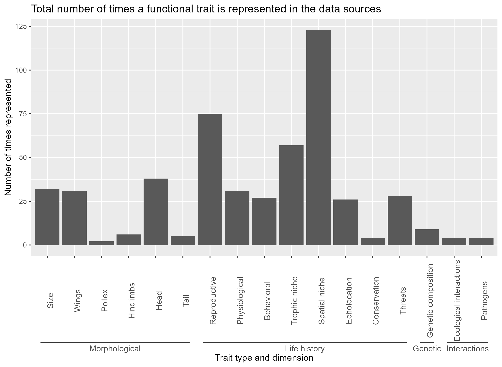

# GlobalBatTraitDatabase: Literature review and trait selection

- [Introduction](#introduction)
- [Methodology](#methodology)
  - [Literature review](#literature-review)
  - [Obtention of functional trait category information, selection of sources, and data manipulation](#obtention-of-functional-trait-category-information-selection-of-sources-and-data-manipulation)
- [File organization](#file-organization)
  - [Data](#data)
  - [Metadata](#metadata)
  - [Output](#output)
  - [Scripts](#scripts)
  - [References](#references)

## Introduction

This document compiles the code and data used for the literature review and functional trait selection for the creation of a Global Bat Trait Database.

This database is part of the first chapter of the PhD thesis "Assessment of knowledge gaps in bats: a macroecological perspective" done by [MSc Roberto Antonio Ruiz-Ramírez](https://maevolab.mx/authors/roberto/) at the [Evolutionary Macroecology Lab](https://maevolab.mx/){style="font-size: 11pt;"} at the Instituto de Ecología, A.C. (INECOL). This chapter focuses on the assessment of knowledge gaps and biases in the information available on bat functional traits at a global level.

This repository is maintained by Roberto A. Ruiz-Ramírez. Any questions or inquiries: [roberto.ruiz\@posgrado.ecologia.edu.mx](mailto:roberto.ruiz@posgrado.ecologia.edu.mx){.email}

## Methodology

### Literature review

A literature search of the Web of Science and Scopus databases, and also the Google Scholar search engine, were conducted with Harzing’s Publish or Perish software using the following keywords: “bat review” OR “bat dataset” OR “bat global assessment” OR “bat traits” OR "bat functional traits" OR “bat meta-analysis” OR “bat data paper”.

The inclusion criteria for publications included was: 1) multi-taxa or specific studies that included information on bat functional traits, 2) secondary data sources (e.g. databases and review articles), 3) publications whose data was taken from biological collections and long term studies, 4) publications reported in the english language, and 5) publications published in a scientific journal with an assigned impact factor. No publications from grey literature were considered.

The next series of steps were implemented in the clean_citations.R script in order to clean the citation data for the first phase of literature review:

1. The three files obtained in the first literature search (scholar.csv, scopus.csv, and wos.csv) were combined into one tibble object (first_phase) in the R environment (n left = 538).
2. Duplicate entries were removed (n left = 514).
3. Entries without any Source, Year, or Publisher information were removed (n left = 325).
4. Entries not related to bats (e.g. brown adipose tissue) were removed (n left = 163).
5. Keywords removed from the Source field: Conference, Forum, Universe, Astrophysical, Astronomy, X-ray, X-Ray, bioRxiv, BioRxiv, arXiv, Medical, Authorea, Electronics, Industrial, Addiction, Law, Children, Patent, Fuel, Epiphany, Legal, Available, Congress, magnetic, EURASIP, Technology, IEEE, Neurocomputing, EPA, Engineering, Theological, Poet, Future, Drug, Energies, policy, Experientia, Nutrients, Intelligence, Physician, Network, Reform, Expert, Administration, Briefings, Pentagon, Computational, Entropy.
6. Keywords removed from the Title field: adipose, fat, poetry, GABA, Basophil, galaxies, gamma-ray, Combustion, UAV, Dances, cigarette, Cigarette, industrial, Brownian, President, magnetic, director, Children, carbon, CO2, Smoking, Court, package, cloning, Twitter, X-ray, Judges, archaeal, engagement, amnesic, adiposity, economic, benzene, policy, Internet, Education, stance, WAN, Diffusion, PasswordsVirtual, TECHNOLOGIES, eyetracking, Eye-Tracking, CCS, cluster.
7. Keywords removed from the Publisher field: donepetro, ebooks.
8. Entries in a language other than english or spanish were removed (n left = 163).

A second phase of literature review was conducted by searching the Web of Science database using the following string search: (bat OR bats OR chiroptera) AND (review OR traits OR functional traits OR meta-analysis) NOT (vaccines OR biomaterial OR bio-medical OR brown adipose tissue OR therapeutics OR biosynthesis). The entries were reviewed up until page number 30 with the following results:

1. 259 entries were obtained
2. Duplicate entries were removed (n left = 232).
3. This dataset (second_phase) was combined with the previous dataset (first_phase) and duplicates were removed (n left = 384).
4. Entries were screened manually to discard any irrelevant publication (i.e. not related to bats) that was left behind by previous steps. (n left = 227).
   - includes_bats_in_title: Does the publication have the “bat” or any variation of the word in the title?
   - includes_traits_in_title: Does the publication have the “trait” or any variation of the word in the title?
   - to_keep: The publication is kept if it is a database, review, or a study which takes its data from biological collections.
5. Each entry was manually screened in order to retain only entries with information on bat functional traits. (n left = 174).
   - includes_trait_info: Does the publication include bat functional trait data?
6. Each entry whose data comes from any other data source considered in this literature search was discarded (n left = 161).
   - fully_included_in_another_source: Is the trait data fully obtained from any other source already included in the literature review?

### Obtention of functional trait category information, selection of sources, and data manipulation

A total of 11 databases and reviews were selected for the selection of the functional traits to be evaluated. Full citation data is contained in the bib/trait_categories folder as .bib and .docx files. Data sources were included if they were:

- A multi-taxa global compilation of functional trait data which includes bats.
- A bat-specific global compilation of functional trait data.
- A dimension-specific global compilation of bat functional trait data.
- The proposal for a trait-based approach for studying bats (Castillo-Figueroa & Pérez-Torres 2021) was used as a starting point (Table XX).

The following information was obtained from each source where available. Names and definitions were obtained from the Ecological Trait-data Standard (Schneider et al., 2019), except where noted:

- trait: A descriptive trait name.
- broaderTerm: One or several terms that enclose the trait definition.
- narrowerTerm: One or several terms that are enclosed by the trait definition.
- relatedTerm: One or several terms that relate to this term.
- valueType: Type of trait values.
- expectedUnit: The unit expected for measurement entries.
- factorLevels: A comma separated list of terms comprising the constrained vocabulary for categorical traits or ordinal binary traits.
- maxAllowedValue: A lower boundary for accepted numerical values.
- minAllowedValue: An upper boundary for accepted numerical values.
- traitDescription: A short, unambiguous definition of the trait as used in the specific study context; may refer to a method of measurement; may copy the description of a public trait ontology;
- comments: Details and Examples for clarification of the trait definition.
- source: The original source of the trait definition.
- fa_y: Indicates the first author and publication year of each source (Own definition).

Once the trait data from each source was obtained, the data sheets were combined by row using the column names specified previously. A new data sheet was generated where each row is a different functional trait and each column is a data source (trait_overlap_FULLZOOSUM). The first two columns are A) the trait type and B) trait complex or functional dimension following Castillo-Figueroa & Pérez-Torres (2021). If any given functional trait is included in two or more publications, they occupy the same row in a different column, each with the name given by the source indicated in the column header. If any given trait is present in a source (A), but absent in another source (B), the row in the B source was assigned a NA value. Following this methodology, any additional functional trait reported in a source will generate a new row without affecting the data sources already included. The number of times in which any given trait was represented in all the data sources was counted, and the descriptors of each trait were obtained from the first publication in which it was identified.

In order to select the trait list to be evaluated, a summary of the trait representativeness by data source was conducted. The trait name, type and dimension, variable type, number of times it is represented in the sources consulted, and the sources’ citations are reported as tables and histograms. There are 3 files per table and histogram tables and histograms in the output/trait_categories folder: 1) the full list of traits obtained, 2) the traits reported in 2 or more data sources, and 3) the traits reported in only one data source. The reasoning behind the output reported is because a trait reported in only one data source is either 1) only present in the proposal made by Castillo-Figueroa & Pérez-Torres (2021) and therefore doesn’t contain any data, or 2) prone to skew the representativeness of the trait to a single data source due to variables only present in one data source. Nevertheless, traits represented only once in a data source, besides Castillo-Figueroa & Pérez-Torres (2021) proposal, should be individually checked as they might be too bat-specific to be well represented in multi-taxa assessments.

Glossary for column names in trait_overlap_summary.csv. The column names label, type, units, allowed_values_min, allowed_values_max, and description were taken from the traits.build package (Wenk et al., 2024). The following trait types and dimensions were obtained from the proposal of Castillo-Figueroa & Pérez-Torres (2021), and complemented by the types and dimensions included the databases AfroBat (Cosentino et al., 2023), EuroBaTrait (Froidevaux et al., 2023), and Bat Eco-Interactions (Geiselman & Ember, 2020).

- label: Name of the variable as reported in the source.
- times_represented: Number of times a unique variable is present in the data sources.
- represented_in: Publications in which a given variable is represented.
- first_represented_in: Publication in which a variable was first identified. First as in, first in the data sheet, not by order of publication.
- type: Type of variable (numeric, categorical, binomial, etc.) as reported in the source in which a variable was first identified.
- allowed_values_levels: Factor levels allowed for a categorical variable.
- units: Standardized value for a functional trait.
- allowed_values_min: Minimal value accepted for a numeric variable.
- allowed_values_max: Maximum value accepted for a numeric variable.
- description: Functional trait description as reported in the publication in which a variable was first identified.

## File organization

Each folder contains two sections: "Literature review" and "Trait categories".

- Literature review: Search of the published data sources where bat functional traits are included.
- Trait categories: This section includes the data and methodology used in order to compile, select, and clean the different functional traits to be evaluated.

### Data

Files in data/raw/literature_review folder:

- Entries obtained using Harzig's Publish or Perish software:
  - scholar.csv: Entries obtained from Google Scholar (n = 493).
  - scopus.csv: Entries obtained from Scopus (n = 31).
  - wos.csv: Entries obtained from Web of Science (n = 14).
- Entries obtained by searching Clarivate's Web of Science manually. Format is ZoteroCollection_ZoteroSubcollection:
  - Bats_Databases.csv:
  - Bats_Reviews.csv:
  - Bats_Traits.csv:
  - Databases_Traits:

Files included in data/raw/trait_categories folder:

- ETS_Bat_Traits.xlsx: Excel file where each sheet contains functional trait data metadata from each source, harmonized following the Ecological Trait-data Standard (Schneider et al., 2019).
  - Definitions: Trait data definitions obtained from Schneider et al., (2019).
  - trait_overlap:
  - trait_everlap_zoosum:
  - trait_info:
  - trait_info_zoosum:
  - Each following sheet is the metadata of the functional traits as reported in any given data source with column names taken from the Ecological trait-data standard (Scheider et al., 2019). Sheet names are reported as FirstAuthor_Year.
- trait_info.csv: Data sheet with functional trait category descriptors from each source, combined by row.
  - Corresponds to trait_info_zoosum sheet in ETS_Bat_Traits.xlsx.
- trait_overlap.csv: Data sheet with trait categories as rows and sources as columns.
  - Corresponds to trait_overlap_zoosum sheet in ETS_Bat_Traits.xlsx.

Files included in data/processed/trait_categories folder:

- trait_type_count.csv: Number of functional traits included by trait type.
- trait_dimension_count.csv: Number of functional traits by complex or functional dimension.
- trait_overlap_summary.csv:
- trait_overlap_summary.csv:

Files included in data/processed/literature_review folder:

- export_clean_citations.csv:
- export_clean_citations_v1.csv:

### Metadata

Files included in the metadata/trait_categories folder:

- Trait_EcologicalTraitStandard_Definitions.csv: Glossary of functional trait definitions as reported in the Ecological trait-data Standard.
- glossary_types_dimensions.csv: Trait types and complex or functional dimensions of bat functional traits with sources.

Files included in the metadata/literature_review folder:

- Glossary of terms.

### Output

Files in output/trait_categories folder:

- table_trait_sources.html: HTML table with trait types, functional dimensions, times a trait is represented in the data sources, type of variable, description and citations.
- type_dimensions_hist.png: PNG image of histograms of times a functional trait is reported in the data sources consulted by trait type and dimension.

Files in output/literature_review folder:

### Scripts

Files in scripts/trait_categories folder:

- *traits.overlap.R*: R code used for data manipulation.
- *traits_summary_sources.R*: R code used for tables and graphs.

Files in scripts/literature_review folder:

- *clean_citations.R*: R code used for first phase of data cleaning, and .bib file exporting.

### References

Files in bib/literature_review folder:

- **literature_review_references_v1**: References obtained from the literature review done for the obtention of bat functional trait data. Reported as . bib and .docx files.

Files in bib/trait_categories folder:

- *trait_categories_references*: References used for the selections of bat functional traits to be evaluated. Reported as . bib and .docx files.
